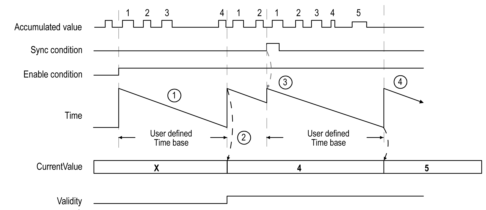

# Event Counting Mode Principle Description

## Overview

The Event Counting mode allows you to count the number of events that occur during a given period of time.

## Principle

The counter assesses the number of pulses applied to the input for a predefined period of time. At the end of each period, the counting register is updated with the number of events received.

Synchronization can be used over the time period. This restarts the counting event for a new predefined time period. The counting restarts at the edge [Sync condition](D-SE-0007189.html#D-SE-0007189).

## Principle Diagram

| Stage | Action |
| --- | --- |
| 1 | When Enable condition = 1, the counter accumulates the number of events (pulses) on the physical input during a predefined period of time.  If Validity = 0, the current value is not relevant. |
| 2 | Once the first period of time has elapsed, the counter value is set to the number of events counted over the period and Validity is set to 1.  The counting restarts for a new period of time. |
| 3 | On the rising edge of the Sync condition:   * the accumulated value is reset to 0 * the current value is not updated * the counting restarts for a new period of time |
| 4 | Once the period of time has elapsed, the counter value is set to the number of events counted over the period.  The counting restarts for a new period of time. |

NOTE: On the Main type, when the Enable condition is:

* Set to 0: the current counting is aborted and `CurrentValue` is maintained at the previous valid value.
* Set to 1: the accumulated value is reset to 0, the `CurrentValue` remains unchanged, and the counting restarts for a new period of time.

EIO0000003071.01

© 2019

Schneider Electric.

All rights reserved.