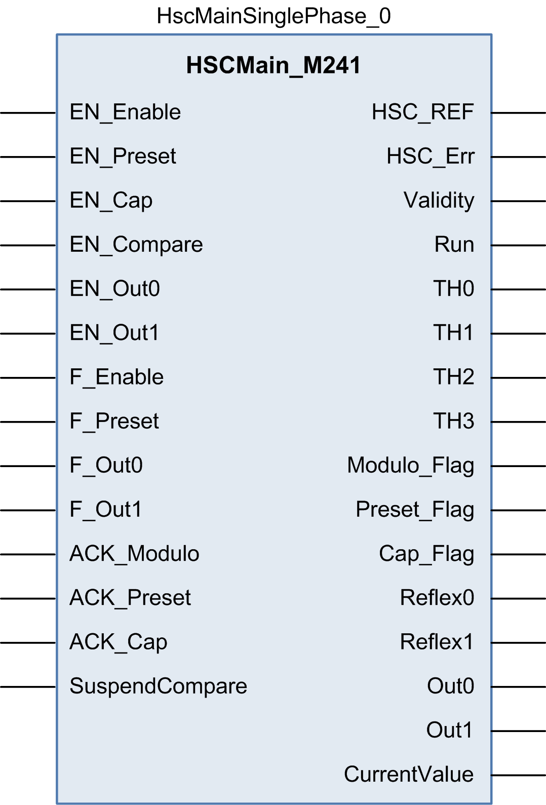

# Programming the Main Type

## Overview

The Main type is always managed by an `HSCMain_M241` function block.

NOTE: At build time, an error is detected if the `HSCMain_M241` function block is used to manage a different HSC type.

## Adding the HSCMain Function Block

| Step | Description |
| --- | --- |
| 1 | Select the Libraries tab in the Software Catalog and click Libraries.  Select Controller > M241 > M241 HSC > HSC > HSCMain\_M241 in the list, drag-and-drop the item onto the POU window. |
| 2 | Type the Main type instance name (defined in configuration) or select the function block instance by clicking:  Using the input assistant, the HSC instance can be selected at the following path: <MyController> > Counters. |

## I/O Variables Usage

These tables describe how the different pins of the function block are used in the mode Event.

This table describes the input variables:

| Input | Type | Description |
| --- | --- | --- |
| `EN_Enable` | `BOOL` | Not used. |
| `EN_Preset` | `BOOL` | When SYNC input is configured: if `TRUE`, authorizes the counter Preset via the [Sync input](D-SE-0007189.html#D-SE-0007189). |
| `EN_Cap` | `BOOL` | Not used. |
| `EN_Compare` | `BOOL` | Not used. |
| `EN_Out0` | `BOOL` | Not used. |
| `EN_Out1` | `BOOL` | Not used. |
| `F_Enable` | `BOOL` | `TRUE` = authorizes changes to the current counter value. |
| `F_Preset` | `BOOL` | On rising edge, restarts the internal timer relative to the time base. |
| `F_Out0` | `BOOL` | Not used. |
| `F_Out1` | `BOOL` | Not used. |
| `ACK_Modulo` | `BOOL` | Not used. |
| `ACK_Preset` | `BOOL` | On rising edge, resets `Preset_Flag`. |
| `ACK_Cap` | `BOOL` | Not used. |
| `SuspendCompare` | `BOOL` | Not used. |

This table describes the output variables:

| Outputs | Type | Comment |
| --- | --- | --- |
| `HSC_REF` | `EXPERT_REF` | Reference to the HSC.  To be used with the `EXPERT_REF_IN` input pin of the Administrative function blocks. |
| `HSC_Err` | `BOOL` | TRUE = indicates that an error was detected.  `EXPERTGetDiag` function block may be used to get more information about this detected error. |
| `Validity` | `BOOL` | `TRUE` = indicates that output values on the function block are valid. |
| `Run` | `BOOL` | Counter is running |
| `TH0` | `BOOL` | Not used. |
| `TH1` | `BOOL` | Not used. |
| `TH2` | `BOOL` | Not used. |
| `TH3` | `BOOL` | Not used. |
| `Modulo_Flag` | `BOOL` | Not used. |
| `Preset_Flag` | `BOOL` | Set to 1 by the [preset of the counter](D-SE-0007189.html#D-SE-0007189). |
| `Cap_Flag` | `BOOL` | Not used. |
| `Reflex0` | `BOOL` | Not used. |
| `Reflex1` | `BOOL` | Not used. |
| `Out0` | `BOOL` | Not used. |
| `Out1` | `BOOL` | Not used. |
| `CurrentValue` | `DINT` | Current value of the counter. |

EIO0000003071.01

© 2019

Schneider Electric.

All rights reserved.