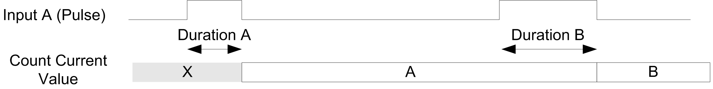
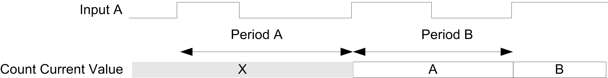
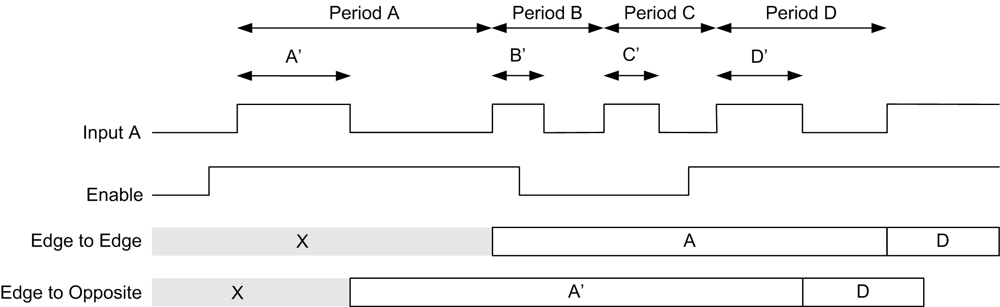

# Description

## Overview

Use the Period meter type to:

* Determine the duration of an event
* Determine the time between two events
* Set and measure the execution time for a process.

The Period meter can be used in two ways:

* Edge to opposite: Allows measurement of the duration of an event.
* Edge to edge: Allows measurement of the time between two events.

The measurement is expressed in the units defined by the Resolution parameter (0.1 µs, 1 µs, 100 µs, 1000 µs).

For example, if the current value `CurrentValue` = 100 and the Resolution parameter is:

| 0.0001 (0.1 µs) | measurement = 0.01 ms |
| 0.001 (1 µs) | measurement = 0.1 ms |
| 0.1 (100 µs) | measurement = 10 ms |
| 1 (1000 µs) | measurement = 100 ms |

A timeout value can be specified in the configuration screen. Measurement is stopped if this timeout value is exceeded. In this case, the counting register is not valid until the next complete measurement.

## Edge to Opposite Mode

The Edge to Opposite mode measures the duration of an event.

When the Enable condition = 1, the measurement is taken between the rising edge and the falling edge of the A input. The counting register is updated as soon as the falling edge is detected.

## Edge to Edge Mode

The Edge to Edge mode measures the elapsed time between two events.

When the Enable condition = 1, the measurement is taken between two rising edges of the A input. The counting register is updated as soon as the second rising edge is detected.

## Enable Condition Interruption Behavior

The trend diagram below describes the behavior of the counting register when the Enable condition is interrupted:

## Operating Limits

The module can perform a maximum of one measurement every 5 ms.

The shortest pulse that can be measured is 100 μs, even if the unit defined in the configuration is 1 μs.

The maximum duration that can be measured is 1,073,741,823 units.

EIO0000003071.01

© 2019

Schneider Electric.

All rights reserved.