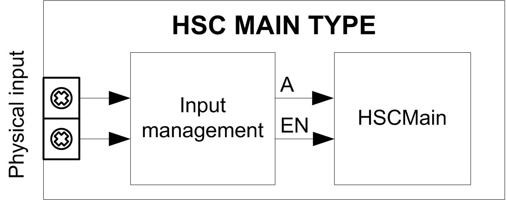

# Synopsis Diagram

## Synopsis Diagram

This diagram provides an overview of the Main type in Period meter type:

A is the counting input of the counter.

EN is the enable input of the counter.

## Optional Function

In addition to the Period meter type, the Main type can provide the following function:

* [Enable function](D-SE-0006709.html#D-SE-0006709)

EIO0000003071.01

© 2019

Schneider Electric.

All rights reserved.