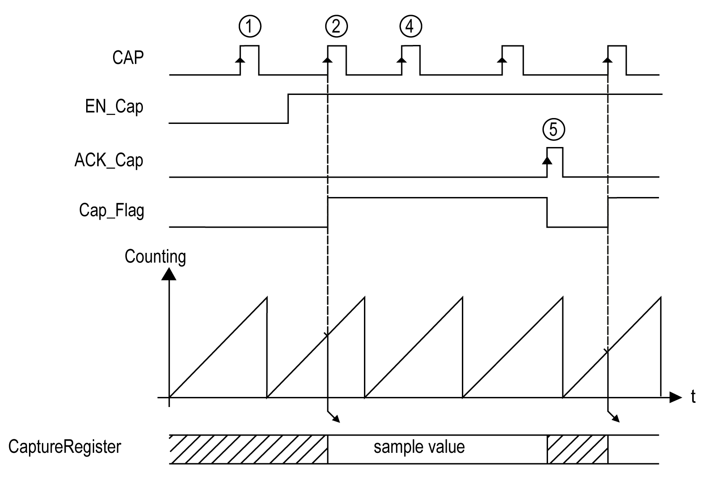

# Capture Principle with a Main Type

## Overview

The capture function stores the current counter value when an external input signal is detected.

The capture function is available in Main type with the following modes:

* [One-shot](D-SE-0006661.html#D-SE-0006661)
* [Modulo-loop](D-SE-0006666.html#D-SE-0006666)
* [Free-large](D-SE-0006670.html#D-SE-0006670)

To use this function:

* configure the optional Capture input CAP
* use the `EXPERTGetCapturedValue` function block to retrieve the captured value in your application.

## Principle of a Capture

This graphic illustrates how the capture works in Modulo-loop mode:

| Stage | Action |
| --- | --- |
| 1 | When `EN_Cap` = 0, the function is not operational. |
| 2 | When `EN_Cap` = 1, the edge on CAP captures the current counter value, puts it into the Capture register, and triggers the rising edge of `Cap_Flag`. |
| 3 | Get the stored value using `EXPERTGetCapturedValue`. |
| 4 | While `Cap_Flag` = 1, any new edge on the physical input CAP is ignored. |
| 5 | The rising edge of `HSCMain_M241` function block input `ACK_Cap` triggers the falling edge `Cap_Flag` output.  A new capture is authorized. |

EIO0000003071.01

© 2019

Schneider Electric.

All rights reserved.