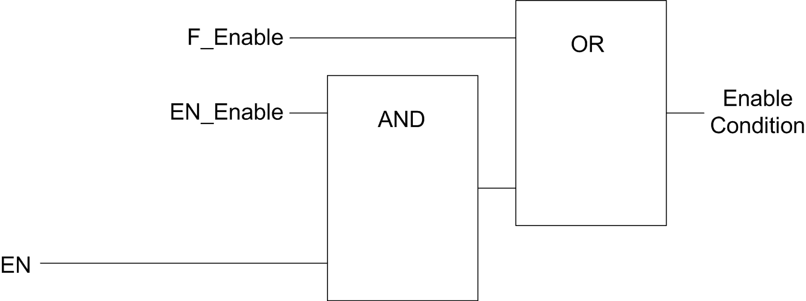

# Enable: Authorize Counting Operation

## Overview

The enable function is used to authorize the counting operation.

The enable function is available in the following HSC modes:

* HSC Main Single Phase (One-shot)
* HSC Main Single Phase (Modulo Loop)
* Frequency Meter
* Period Meter

## Description

This function is used to authorize changes to the current counter value depending on the status of the optional `EN` physical input and the function block inputs `F_Enable` and `EN_Enable`.

The following diagram illustrates the enable conditions:

**EN\_Enable** input of the HSC function block

**F\_Enable** input of the HSC function block

**EN** physical input Enable

As long as the function is not enabled, the counting pulses are ignored.

NOTE: Enable condition for a Simple type corresponds to the function block input `Enable`.

## Configuration

This procedure describes how to configure an Enable function:

| Step | Action |
| --- | --- |
| 1 | In the Devices tree, double-click MyController > Counters. |
| 2 | Select the Counters tab. |
| 3 | Select a Counting function that supports the Enable function:   * HSC Main Single Phase (One-shot or Modulo-loop) * Frequency Meter * Period Meter |
| 4 | Set the value of the Control inputs > EN input > Location parameter. |
| 5 | Select the value of the Control inputs > EN input > Bounce filter parameter to reduce the bounce effect on the input.  The filtering value determines the counter maximum frequency as shown in the [Bounce Filter table](D-SE-0003769.html#D-SE-0003769__D-SE-0003769.3). |

EIO0000003071.01

© 2019

Schneider Electric.

All rights reserved.