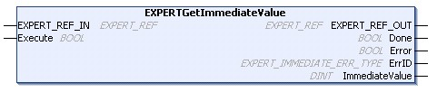

# EXPERTGetImmediateValue: Read Counter Value of HSC

## Function Block Description

This administrative function block permits to read the counter value of an HSC bypassing the controller cycle.

## Graphical Representation

## IL and ST Representation

To see the general representation in IL or ST language, refer to [*Function and Function Block Representation*](D-SE-0002384.html#D-SE-0002384).

## I/O Variables Description

This table describes the input variables:

| Inputs | Type | Comment |
| --- | --- | --- |
| `EXPERT_REF_IN` | `EXPERT_REF` | Reference to the EXPERT function block. |
| `Execute` | `BOOL` | On rising edge, starts the function block execution. On falling edge, resets the outputs of the function block when its execution terminates. |

This table describes the output variables:

| Outputs | Type | Comment |
| --- | --- | --- |
| `EXPERT_REF_OUT` | `EXPERT_REF` | Reference to the EXPERT function block. |
| `Done` | `BOOL` | `TRUE` = indicates that `ExpertDiag` is valid.  Function block execution is finished. |
| `Error` | `BOOL` | `TRUE` = indicates that an error was detected. |
| `ErrID` | `IMMEDIATE_FUNC_ERR_TYPE` | When `Error` is `TRUE`: type of the detected error. |
| `ImmediateValue` | `DINT` | Contains the counter value. |

## Adding the EXPERTGetImmediateValue Function Block

| Step | Description |
| --- | --- |
| 1 | Select the Libraries tab in the Software Catalog and click Libraries.  Select Controller > M241 > M241 HSC > Administrative > EXPERTGetImmediateValue in the list, drag-and-drop the item onto the POU window. |
| 2 | Link the EXPERT\_REF\_IN input to the HSC\_REF output of the HSC. |

EIO0000003071.01

© 2019

Schneider Electric.

All rights reserved.