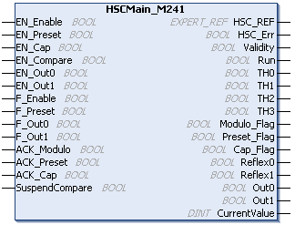

# HSCMain\_M241: Control a Main Type Counter for M241

## Function Block Description

This function block controls a Main type counter with the following functions:

* up/down counting
* frequency meter
* thresholds
* events
* period meter
* dual phase

The HSC Main function block is mandatory when using Main counter.

The function block instance name must match the name defined by configuration. Hardware related information managed by this function block is synchronized with the MAST task cycle.

| WARNING | |
| --- | --- |
|  | UNINTENDED OUTPUT VALUES  * Only use the Function Block instance in the MAST task. * Do not use the same Function Block instance in a different task.  Failure to follow these instructions can result in death, serious injury, or equipment damage. |

NOTE: Forcing the logical output values of the FB is allowed by EcoStruxure Machine Expert but it will have no impact on hardware related outputs if the function is active (executing).

## Graphical Representation

## IL and ST Representation

To see the general representation in IL or ST language, refer to [*Function and Function Block Representation*](D-SE-0002384.html#D-SE-0002384).

## I/O Variables Description

This table describes the input variables:

| Input | Type | Description |
| --- | --- | --- |
| `EN_Enable` | `BOOL` | `TRUE` = authorizes enabling of the counter using the `Enable` input. |
| `EN_Preset` | `BOOL` | `TRUE` = authorizes counter synchronization and start using the Sync input. |
| `EN_Cap` | `BOOL` | `TRUE` = enables the Capture input (if configured in One shot, Modulo loop, Free large modes). |
| `EN_Compare` | `BOOL` | `TRUE` = enables the comparator operation (using Thresholds 0, 1, 2, 3):   * basic comparison (`TH0`, `TH1`, `TH2`, `TH3` output bits) * reflex (`Reflex0`, `Reflex1` output bits) * events (to trigger external tasks on threshold crossing) |
| `EN_Out0` | `BOOL` | `TRUE` = enables Output0 to echo the `Reflex0` value (if configured in One shot, Modulo loop, Free large modes). |
| `EN_Out1` | `BOOL` | `TRUE` = enables Output1 to echo the `Reflex1` value (if configured in One shot, Modulo loop, Free large modes). |
| `F_Enable` | `BOOL` | `TRUE` = authorizes changes to the current counter value. |
| `F_Preset` | `BOOL` | On rising edge, authorizes counting function synchronization and start in the following counting modes:   | One-shot counter: | to preset and start the counter | | Modulo loop counter: | to reset and start the counter | | Free large counter: | to preset and start the counter | | Event counter: | to restart the internal time base at the beginning | | Frequency meter: | to restart the internal timer relative to the time base. | |
| `F_Out0` | `BOOL` | `TRUE` = forces Output0 to 1 (if configured in One-shot, Modulo loop, Free large modes). |
| `F_Out1` | `BOOL` | `TRUE` = forces Output1 to `TRUE` (if configured in One-shot, Modulo loop, Free large modes). |
| `ACK_Modulo` | `BOOL` | On rising edge, resets `Modulo_Flag` (Modulo loop and Free large modes). |
| `ACK_Preset` | `BOOL` | On rising edge, resets `Preset_Flag`. |
| `ACK_Cap` | `BOOL` | On rising edge, resets the `Cap_Flag` (One-shot, Modulo loop, Free large modes). |
| `SuspendCompare` | `BOOL` | `TRUE` = compare results are suspended:   * `TH0`, `TH1`, `TH2`, `TH3` , `Reflex0`, `Reflex1`, `Out0`, `Out1` output bits of the block maintain their last value. * Physical Outputs 0, 1 maintain their last value. * Compare events are masked.   NOTE: `EN_Compare`,  `EN_ReflexO,` `EN_Reflex1,``F_Out0,``F_Out1` remain operational while `SuspendCompare` is set. |

This table describes the output variables:

| Outputs | Type | Comment |
| --- | --- | --- |
| `HSC_REF` | `EXPERT_REF` | Reference to the HSC. |
| `Validity` | `BOOL` | `TRUE` = indicates that output values on the function block are valid.  In the Period Meter Type, if the time-out value is exceeded, Validity = FALSE.  In One-Shot mode, `Validity` is set to `TRUE` when a rising edge of Preset is detected. |
| `HSC_Err` | `BOOL` | `TRUE` = indicates that an error was detected.  Use the `HSCGetDiag` function block to get more information about this detected error. |
| `Run` | `BOOL` | `TRUE` = counter is running.  In One-shot mode, the Run bit switches to 0 when `CurrentValue` reaches 0. |
| `TH0` | `BOOL` | `TRUE` = current counter value > `Threshold 0` (if configured in One shot, Modulo loop, Free large modes).  Only active when `EN_Compare` is set. |
| `TH1` | `BOOL` | `TRUE` = current counter value > `Threshold 1` (if configured in One shot, Modulo loop, Free large modes).  Only active when `EN_Compare` is set. |
| `TH2` | `BOOL` | `TRUE` = current counter value > `Threshold 2` (if configured in One-shot, Modulo loop, Free large modes).  Only active when `EN_Compare` is set. |
| `TH3` | `BOOL` | `TRUE` = current counter value > `Threshold 3` (if configured in One-shot, Modulo loop, Free large modes).  Only active when `EN_Compare` is set. |
| `Modulo_Flag` | `BOOL` | Set to `TRUE` when the counter rolls over its limits in the following modes:   * Modulo loop counter: when the counter rolls over to the modulo or 0 * Free large counter: when the counter roll overs its limits |
| `Preset_Flag` | `BOOL` | Set to `TRUE` by the synchronization of:   * One-shot counter: when the counter presets and starts * Modulo loop counter: when the counter resets * Free large counter: when the counter presets * Event counter: when the internal timer relative to the time base restarts * Frequency meter: when the internal timer relative to the time base restarts |
| `Cap_Flag` | `BOOL` | `TRUE` = indicates that a value has been latched in the capture register.  This flag must be reset before a new capture can occur. |
| `Reflex0` | `BOOL` | State of `Reflex0` (if configured in One shot, Modulo loop, Free large modes).  Only active when `EN_Compare` is set. |
| `Reflex1` | `BOOL` | State of `Reflex1` (if configured in One shot, Modulo loop, Free large modes).  Only active when `EN_Compare` is set. |
| `Out0` | `BOOL` | Indicates the state of Output0. |
| `Out1` | `BOOL` | Indicates the state of Output1. |
| `CurrentValue` | `DINT` | Current value of the counter. |

EIO0000003071.01

© 2019

Schneider Electric.

All rights reserved.