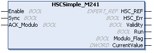

# HSCSimple\_M241: Control a Simple Type Counter for M241

## Function Block Description

This function block controls a Simple type counter with the following reduced functions:

* one-channel counting
* no threshold
* no event
* no capture
* no reflex

The `HSCSimple` function block is mandatory when using a Simple counter type.

The function block instance name must match the name defined by configuration. Hardware related information managed by this function block is synchronized with the MAST task cycle.

| WARNING | |
| --- | --- |
|  | UNINTENDED OUTPUT VALUES  * Only use the Function Block instance in the MAST task. * Do not use the same Function Block instance in a different task.  Failure to follow these instructions can result in death, serious injury, or equipment damage. |

NOTE: Forcing the logical output values of the FB is allowed by EcoStruxure Machine Expert but it will have no impact on hardware related outputs if the function is active (executing).

## Graphical Representation

## IL and ST Representation

To see the general representation in IL or ST language, refer to [*Function and Function Block Representation*](D-SE-0002384.html#D-SE-0002384).

## I/O Variables Description

This table describes the input variables:

| Inputs | Type | Comment |
| --- | --- | --- |
| `Enable` | `BOOL` | `TRUE` = authorizes changes to the current counter value. |
| `Sync` | `BOOL` | On rising edge, presets and starts the counter. |
| `ACK_Modulo` | `BOOL` | Modulo loop mode: On rising edge, resets the modulo flag `Modulo_Flag`. |

This table describes the output variables:

| Outputs | Type | Comment |
| --- | --- | --- |
| `HSC_REF` | `EXPERT_REF` | Reference to the HSC. |
| `HSC_Err` | `BOOL` | `TRUE` = indicates that an error was detected.  Use the `EXPERTGetDiag` function block used to get more information about this detected error. |
| `Validity` | `BOOL` | `TRUE` = indicates that the output values on the function block are valid. |
| `Run` | `BOOL` | `TRUE` = counter is running.  In One-shot mode, switches to 0 when `CurrentValue` reaches 0. A rising edge on `Sync` is needed to restart the counter. |
| `Modulo_Flag` | `BOOL` | Module loop mode: Set to `TRUE` when the counter rolls over the modulo value. |
| `CurrentValue` | `DWORD` | Current count value of the counter. |

EIO0000003071.01

© 2019

Schneider Electric.

All rights reserved.