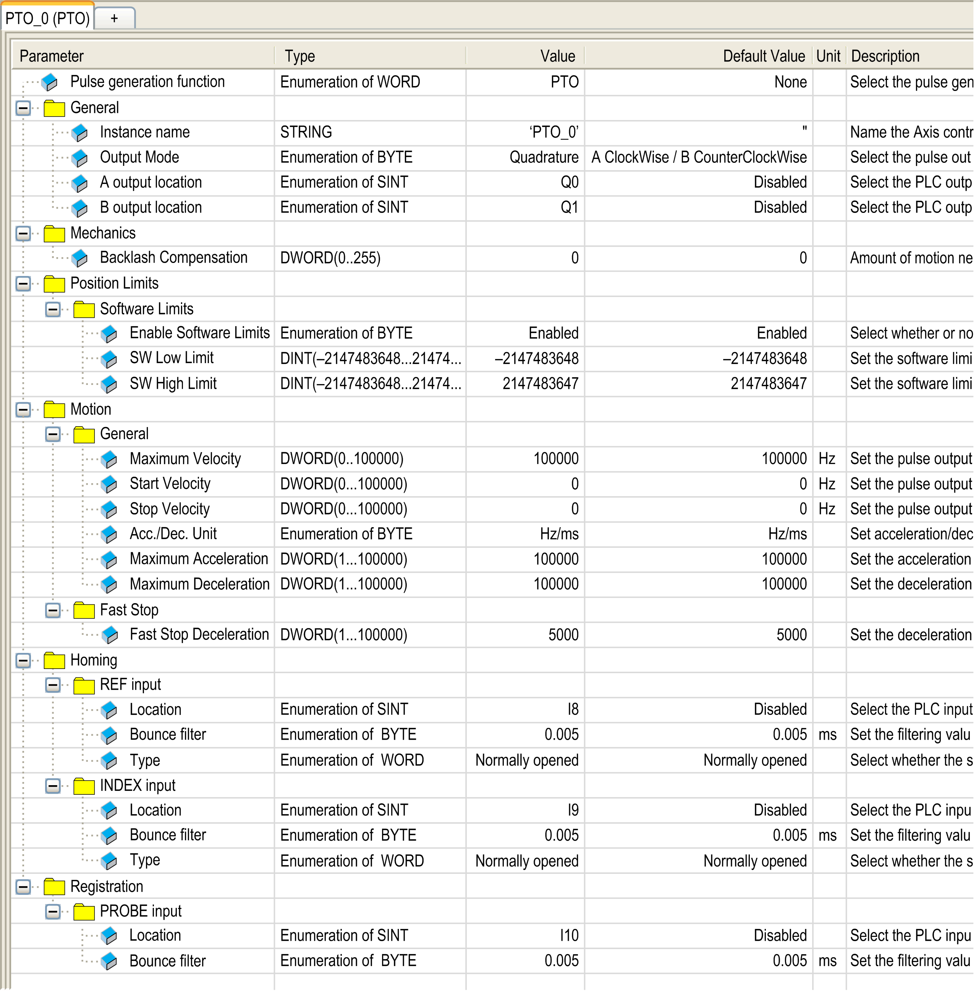

# PTO Configuration

## Hardware Configuration

There are up to six inputs for a PTO channel:

* Three physical inputs are associated to the PTO function through configuration and are taken into account immediately on a rising edge on the input:

  + REF input
  + INDEX input
  + PROBE input
* Three inputs are associated with the MC\_Power\_PTO function block. They have no fixed assignment (they are freely assigned; that is, they are not configured in the configuration screen), and are read as any other input:

  + Drive ready input
  + Limit positive input
  + Limit negative input

NOTE: These inputs are managed as any other input, but are used by the PTO controller when used by the MC\_Power\_PTO function block.

NOTE: The positive and negative limit inputs are required to help prevent over-travel.

| WARNING | |
| --- | --- |
|  | UNINTENDED EQUIPMENT OPERATION  * Ensure that controller hardware limit switches are integrated in the design and logic of your application. * Mount the controller hardware limit switches in a position that allows for an adequate braking distance.  Failure to follow these instructions can result in death, serious injury, or equipment damage. |

There are up to three outputs for a PTO channel:

* Either one physical output to manage pulse only, or two physical outputs to manage both pulse and direction; they must be enabled by configuration:

  + A / CW / Pulse
  + B / CCW / Direction
* The other output, `DriveEnable`, is used through the MC\_Power\_PTO function block.

## Configuration Window Description

The figure provides an example of a configuration window on channel **PTO\_0**:

The table describes each parameter available when the channel is configured in **PTO** mode:

| Parameter | | Value | Default | Description |
| --- | --- | --- | --- | --- |
| General | Instance name | - | PTO\_0...PTO\_3 | Name of the axis controlled by this PTO channel. It is used as input of the PTO function blocks. |
| [Output Mode](D-SE-0033225.html#D-SE-0033225) | A ClockWise / B CounterClockWise  A Pulse / B Direction  A Pulse  Quadrature | A ClockWise / B CounterClockWise | Select the pulse output mode. |
| A output location | Disabled  Q0...Q3 (fast outputs)  Q4...Q7 (regular outputs)(1) | Disabled | Select the controller output used for the signal A. |
| B output location | Disabled  Q0...Q3 (fast outputs)  Q4...Q7 (regular outputs)(1) | Disabled | Select the controller output used for the signal B. |
| Mechanics | [Backlash Compensation](D-SE-0033274.html#D-SE-0033274) | 0...255 | 0 | In quadrature mode, amount of motion needed to compensate the mechanical clearance when movement is reversed. |
| Position Limits / Software Limits | Enable [Software Limits](D-SE-0033275.html#D-SE-0033275__D-SE-0033275.5) | Enabled  Disabled | Enabled | Select whether to use the software limits. |
| SW Low Limit | -2,147,483,648... 2,147,483,647 | -2,147,483,648 | Set the software limit position to be detected in the negative direction. |
| SW High Limit | -2,147,483,648... 2,147,483,647 | 2,147,483,647 | Set the software limit position to be detected in the positive direction. |
| Motion / General | Maximum Velocity | 0...100000 (fast outputs)  0...1000 (regular outputs) | 100000 (fast outputs)  1000 (regular outputs) | Set the pulse output maximum velocity (in Hz). |
| [Start Velocity](D-SE-0033235.html#D-SE-0033235__D-SE-0033235.3) | Start Velocity...100000 (fast outputs)  Start Velocity...1000 (regular outputs) | 0 | Set the pulse output start velocity (in Hz). 0 if not used. |
| [Stop Velocity](D-SE-0033235.html#D-SE-0033235__D-SE-0033235.10) | 0...100000 (fast outputs)  0...1,000 (regular outputs) | 0 | Set the pulse output stop velocity (in Hz). 0 if not used. |
| [Acc./Dec. Unit](D-SE-0033235.html#D-SE-0033235__D-SE-0033235.11) | Hz/ms  ms | Hz/ms | Set acceleration/deceleration as rates (Hz/ms) or as time constants from 0 to **Maximum Velocity** (ms). |
| Maximum Acceleration | 1...100000 | 100000 | Set the acceleration maximum value (in **Acc./Dec. Unit**). |
| Maximum Deceleration | 1...100000 | 100000 | Set the deceleration maximum value (in **Acc./Dec. Unit**). |
| Motion / Fast Stop | Fast Stop Deceleration | 1...100000 | 5000 | Set the deceleration value in case an error is detected (in **Acc./Dec. Unit**) |
| Homing / REF input | Location | Disabled  I0...I7 (fast inputs)  I8...I15 (regular inputs) | Disabled | Select the controller input used for the [REF signal](D-SE-0035720.html#D-SE-0035720). |
| Bounce filter | 0.000  0.001  0.002  0.005  0.010  0.05  0.1  0.5  1  5 | 0.005 | Set the filtering value to reduce the bounce effect on the REF input (in ms). |
| Type | Normally opened  Normally closed | Normally opened | Select whether the switch contact default state is open or closed. |
| Homing / INDEX input | Location | Disabled  I0...I7 (fast inputs)  I8...I15 (regular inputs) | Disabled | Select the controller input used for the [INDEX signal](D-SE-0035720.html#D-SE-0035720). |
| Bounce filter | 0.000  0.001  0.002  0.005  0.010  0.05  0.1  0.5  1  5 | 0.005 | Set the filtering value to reduce the bounce effect on the INDEX input (in ms). |
| Type | Normally opened  Normally closed | Normally opened | Select whether the switch contact default state is open or closed. |
| Registration / PROBE input | Location | Disabled  I0...I7 (fast inputs)  I8...I15 (regular inputs) | Disabled | Select the controller input used for the [PROBE signal](D-SE-0033240.html#D-SE-0033240). |
| Bounce filter | 0.000  0.001  0.002  0.005  0.010  0.05  0.1  0.5  1  5 | 0.005 | Set the filtering value to reduce the bounce effect on the PROBE input (in ms). |
| (1) Not available for M241 Logic Controller references with relay outputs. | | | | |

EIO0000003077.02