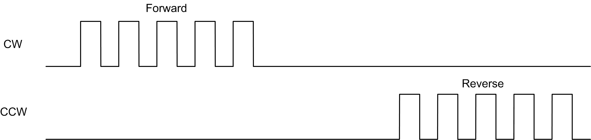
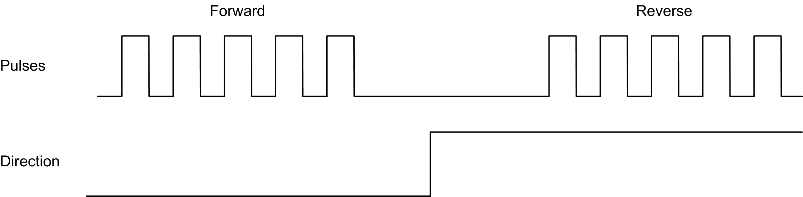
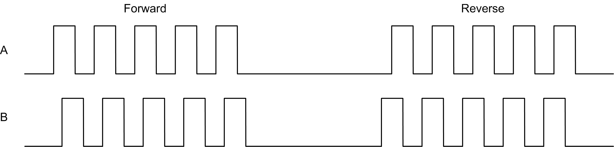

# Pulse Output Modes

## Overview

There are four possible output modes:

* A ClockWise / B CounterClockwise
* A Pulse
* A Pulse / B direction
* Quadrature

## A ClockWise (CW) / B CounterClockwise (CCW) Mode

This mode generates a signal that defines the motor operating speed and direction. This signal is implemented either on the PTO output A or on PTO output B depending on the motor rotation direction.

## A Pulse Mode

This mode generates one signal on the PTO outputs:

* Output A: pulse which provides the motor operating speed.

NOTE: The corresponding function block generates an "Invalid Direction" error if you specify a negative direction value.

## A Pulse / B Direction Mode

This mode generates two signals on the PTO outputs:

* Output A: pulse which provides the motor operating speed.
* Output B: direction which provides the motor rotation direction.

## Quadrature Mode

This mode generates two signals in quadrature phase on the PTO outputs (the phase sign depends on motor direction).

EIO0000003077.02