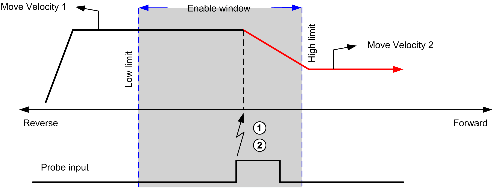
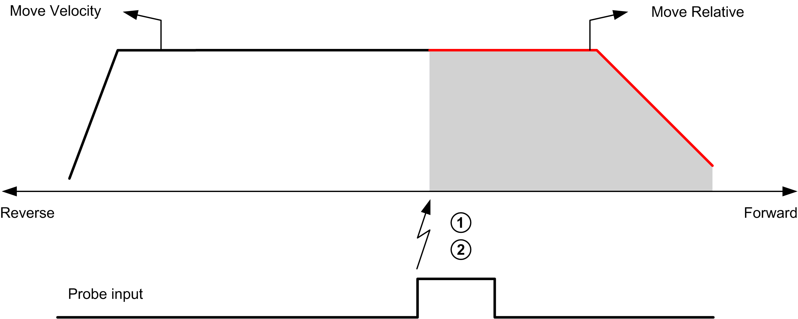
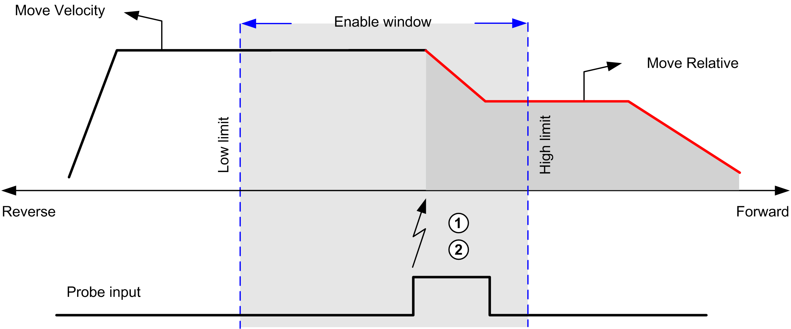
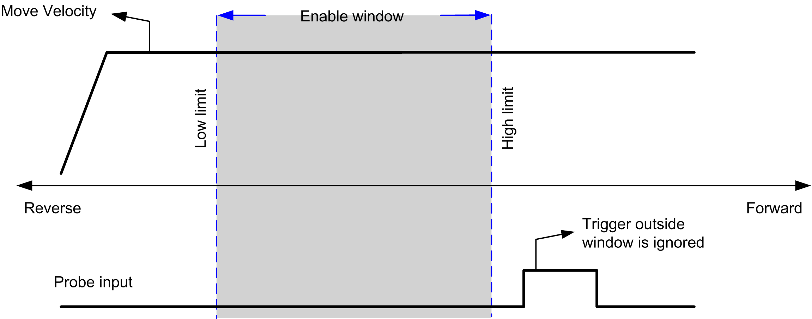

# Probe Event

## Description

The Probe input is enabled by configuration, and activated using the MC\_TouchProbe\_PTO function block.

The Probe input is used as an event to:

* capture the position,
* start a move independently of the task.

Both functions can be active at the same time, that is, the same event captures the position and start a [motion function block](D-SE-0032968.html#D-SE-0032968).

The Probe input event can be defined to be enabled within a predefined window that is demarcated by position limits (refer to MC\_TouchProbe\_PTO.

NOTE: Only the first event after the rising edge at the MC\_TouchProbe\_PTO function block `Busy` pin is valid. Once the `Done` output pin is set, subsequent events are ignored. The function block needs to be reactivated to respond to other events.

## Position Capture

The position captured is available in `MC_TouchProbe_PTO.RecordedPosition`.

## Motion Trigger

The `BufferMode` input of a motion function block must be set to `seTrigger`.

This example illustrates a change target velocity with enable window:

**1** Capture the position counter value

**2** Trigger Move Velocity function block

This example illustrates a move of pre-programmed distance, with simple profile and no enable window:

**1** Capture the position counter value

**2** Trigger Move Relative function block

This example illustrates a move of pre-programmed distance, with complex profile and enable window:

**1** Capture the position counter value

**2** Trigger Move Relative function block

This example illustrates a trigger event out of enable window:

EIO0000003077.02