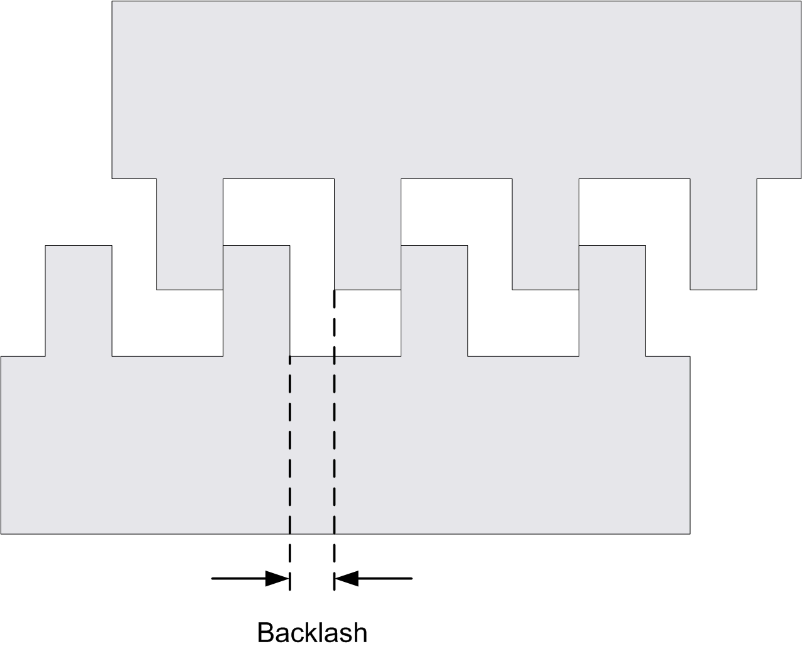
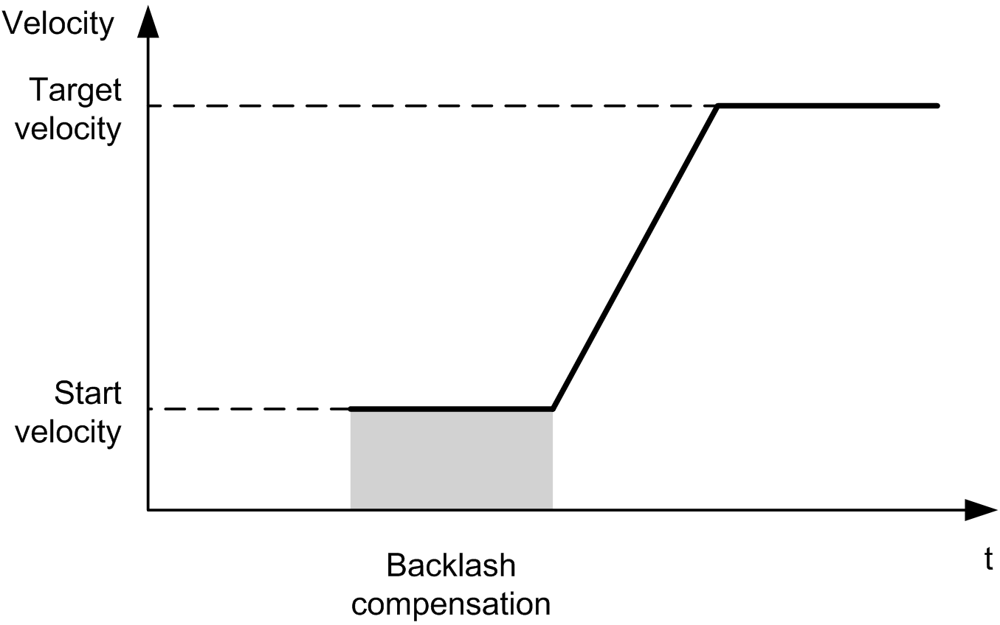

# Backlash Compensation (Only Available in Quadrature Mode)

## Description

The Backlash Compensation parameter is defined as the amount of motion needed to compensate for the mechanical clearance in gears, when movement is reversed and the axis is homed:

NOTE: The function does not take into account any external sources of movement, such as inertia movement or other forms of induced movement.

Backlash compensation is set in number of pulses (0...255, default value is 0). When set, at each direction reversal, the specified number of pulses is first output at start velocity, and then the programmed movement is executed. The backlash compensation pulses are not added to the position counter.

This figure illustrates the backlash compensation:

NOTE:

* Before the initial movement is started, the function cannot determine the amount of backlash to compensate for. Therefore, the backlash compensation is only active after a homing is successfully performed. If the homing is performed without movement, it is assumed that the initial movement applies no compensation, and the compensation is applied at the first direction reversal.
* Once started, the compensation pulses are output until completion, even if an aborting command is received in the meantime. In this case, the aborting command is buffered and will start as soon as compensation pulses are output. No additional buffered command is accepted in this case.
* If the axis is stopped by an error detected before all the compensation pulses are output, the backlash compensation is reset. A new homing procedure is needed to reinitialize the backlash compensation.
* Backlash timeout of 80 s: The system does not accept to configure a movement of more than 80 s. So if a backlash is configured, it may for example not be more than 80 pulses to 1 Hz. The error detected in case of this timeout is "Internal error" (code 1000).

EIO0000003077.02