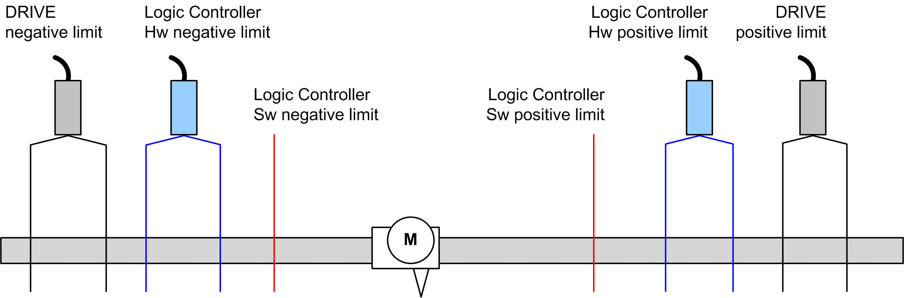
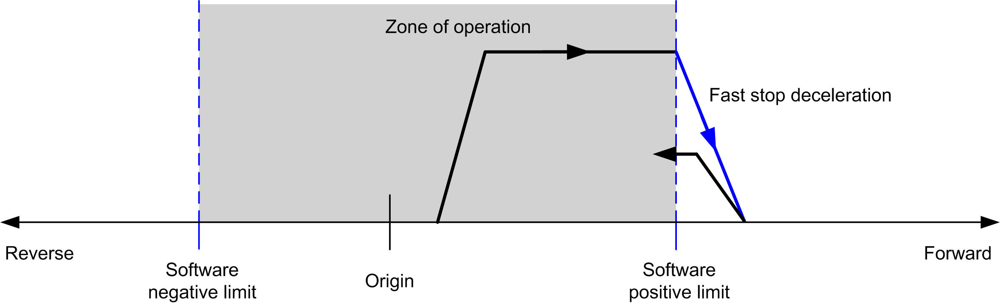

# Positioning Limits

## Introduction

Positive and negative limits can be set to control the movement boundaries in both directions. Both hardware and software limits are managed by the controller.

Hardware and software limit switches are used to manage boundaries in the controller application only. They are not intended to replace any functional safety limit switches wired to the drive. The controller application limit switches must necessarily be activated before the functional safety limit switches wired to the drive. In any case, the type of functional safety architecture, which is beyond the scope of the present document, that you deploy depends on your safety analysis, including, but not limited to:

* risk assessment according to EN/ISO 12100
* FMEA according to EN 60812

| WARNING | |
| --- | --- |
|  | UNINTENDED EQUIPMENT OPERATION  Ensure that a risk assessment is conducted and respected according to EN/ISO 12100 during the design of your machine.  Failure to follow these instructions can result in death, serious injury, or equipment damage. |

The figure illustrates hardware and software limit switches:

Once either the controller hardware or software limits are crossed, an error is detected and a Fast stop deceleration is performed:

* the axis switches to **ErrorStop** state, with `ErrorId` 1002 to 1005 (`PTO_ERROR`),
* the function block under execution detects the error state,
* status bits on other applicable function blocks are set to `CommandAborted`.

To clear the axis error state, and return to a **Standstill** state, execution of MC\_Reset\_PTO is required as any motion command will be rejected (refer to PTO parameters `EnableDirPos` or `EnableDirNeg`) while the axis remains outside the limits (function block terminates with `ErrorId`=`InvalidDirectionValue`). It is only possible to execute a motion command in the opposite direction under these circumstances.

## Software Limits

Software limits can be set to control the movement boundaries in both directions.

Limit values are enabled and set in the configuration screen, such that:

* Positive limit > Negative limit
* Values in the range -2,147,483,648 to 2,147,483,647

They can also be enabled, disabled, or modified in the application program (MC\_WriteParameter\_PTO and [PTO\_PARAMETER](D-SE-0033052.html#D-SE-0033052)).

NOTE: When enabled, the software limits are valid after an initial homing is successfully performed (that is, the axis is homed, MC\_Home\_PTO).

NOTE: An error is only detected when the software limit is physically reached, not at the initiation of the movement.

## Hardware Limits

Hardware limits are required for the homing procedure, and for helping to prevent damage to the machine. The appropriate inputs must be used on the `MC_Power_PTO.LimP` and `MC_Power_PTO.LimN` input bits. The hardware limit devices must be of a normally closed type such that the input to the function block is FALSE when the respective limit is reached.

NOTE: The restrictions over movement are valid while the limit inputs are FALSE and regardless of the sense of direction. When they return to TRUE, movement restrictions are removed and the hardware limits are functionally rearmed. Therefore, use falling edge contacts leading to RESET output instructions prior to the function block. Then use those bits to control these function block inputs. When operations are complete, SET the bits to restore normal operation.

| WARNING | |
| --- | --- |
|  | UNINTENDED EQUIPMENT OPERATION  * Ensure that controller hardware limit switches are integrated in the design and logic of your application. * Mount the controller hardware limit switches in a position that allows for an adequate braking distance.  Failure to follow these instructions can result in death, serious injury, or equipment damage. |

NOTE: Adequate braking distance is dependent on the maximum velocity, maximum load (mass) of the equipment being moved, and the value of the Fast stop deceleration parameter.

EIO0000003077.02