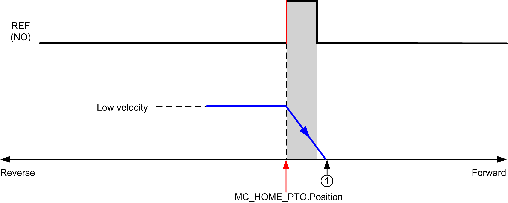
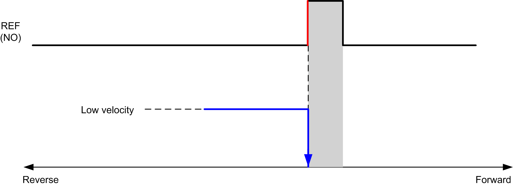

# Homing Modes

## Description

Homing is the method used to establish the reference point or origin for absolute movement.

A homing movement can be made using different methods. The M241 PTO channels provide several standard homing movement types:

* [position setting](D-SE-0035721.html#D-SE-0035721),
* [long reference](D-SE-0035722.html#D-SE-0035722),
* [long reference and index](D-SE-0035723.html#D-SE-0035723),
* [short reference reversal](D-SE-0035724.html#D-SE-0035724),
* [short reference no reversal](D-SE-0035725.html#D-SE-0035725),
* [short reference and index outside](D-SE-0035726.html#D-SE-0035726),
* [short reference and index inside](D-SE-0035727.html#D-SE-0035727).

A homing movement must be terminated without interruption for the new reference point to be valid. If the reference movement is interrupted, it needs to be started again.

Refer to MC\_Home\_PTO and [PTO\_HOMING\_MODE](D-SE-0032874.html#D-SE-0032874).

## Home Position

Homing is done with an external switch and the homing position is defined on the switch edge. Then the motion is decelerated until stop.

The actual position of the axis at the end of the motion sequence may therefore differ from the position parameter set on the function block:

**REF (NO)** Reference point (Normally Open)

**1** Position at the end of motion = `MC_HOME_PTO.Position` + “deceleration to stop” distance.

To simplify the representation of a stop in the homing mode diagrams, the following presentation is made to represent the actual position of the axis:

**REF (NO)** Reference point (Normally Open)

## Limits

Hardware limits are necessary for the correct functioning of the MC\_Home\_PTO function block ([Positioning Limits](D-SE-0033275.html#D-SE-0033275) and MC\_Power\_PTO). Depending on the movement type you request with the homing mode, the hardware limits help assure that the end of travel is respected by the function block.

When a homing action is initiated in a direction away from the reference switch, the hardware limits serve to either:

* indicate a reversal of direction is required to move the axis toward the reference switch or,
* indicate that an error has been detected as the reference switch was not found before reaching the end of travel.

For homing movement types that allow for reversal of direction, when the movement reaches the hardware limit the axis stops using the configured deceleration, and resumes motion in a reversed direction.

In homing movement types that do not allow for the reversal of direction, when the movement reaches the hardware limit, the homing procedure is aborted and the axis stops with the Fast stop deceleration.

| WARNING | |
| --- | --- |
|  | UNINTENDED EQUIPMENT OPERATION  * Ensure that controller hardware limit switches are integrated in the design and logic of your application. * Mount the controller hardware limit switches in a position that allows for an adequate braking distance.  Failure to follow these instructions can result in death, serious injury, or equipment damage. |

NOTE: Adequate braking distance is dependent on the maximum velocity, maximum load (mass) of the equipment being moved, and the value of the Fast stop deceleration parameter.

EIO0000003077.02