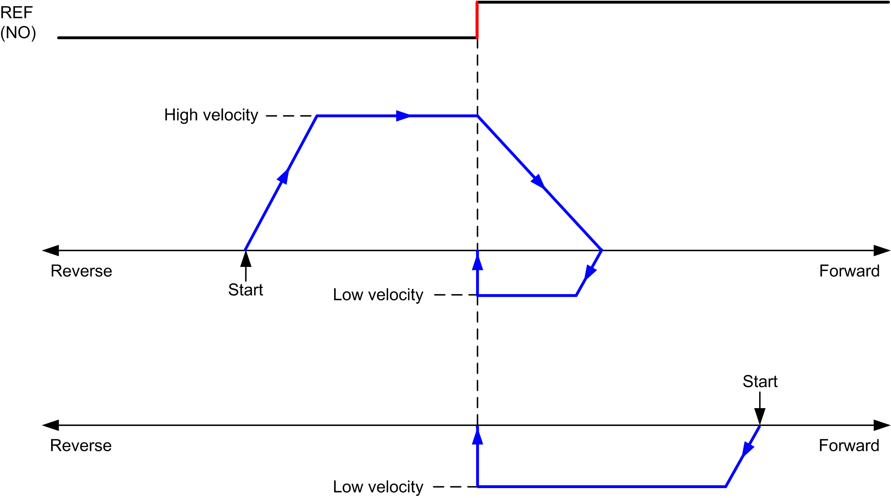
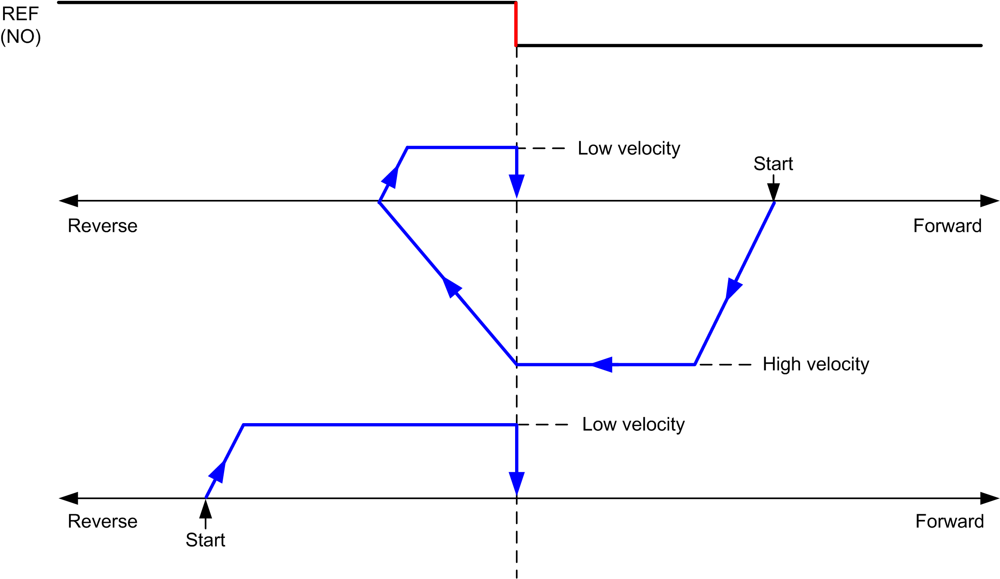

# Long Reference

## Long Reference: Positive Direction

Homes to the reference switch falling edge in reverse direction.

The initial direction of motion is dependent on the state of the reference switch:

**REF (NO)** Reference point (Normally Open)

## Long Reference: Negative Direction

Homes to the reference switch falling edge in forward direction.

The initial direction of motion is dependent on the state of the reference switch:

**REF (NO)** Reference point (Normally Open)

EIO0000003077.02