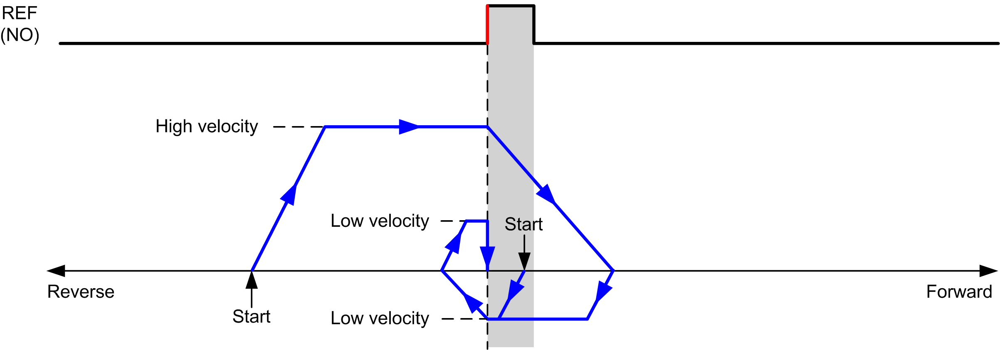
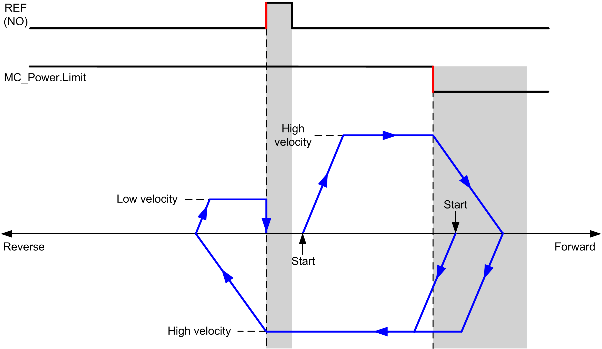
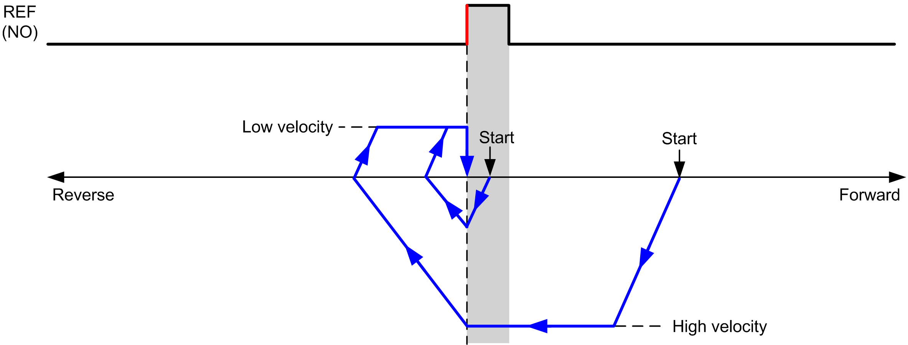
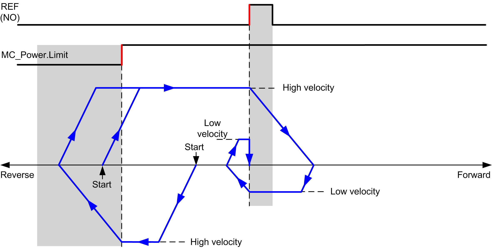

# Short Reference Reversal

## Short Reference Reversal: Positive Direction

Homes to the reference switch rising edge in forward direction.

The initial direction of motion is dependent on the state of the reference switch:

**REF (NO)** Reference point (Normally Open)

**REF (NO)** Reference point (Normally Open)

## Short Reference Reversal: Negative Direction

Homes to the reference switch rising edge in forward direction.

The initial direction of motion is dependent on the state of the reference switch:

**REF (NO)** Reference point (Normally Open)

**REF (NO)** Reference point (Normally Open)

EIO0000003077.02