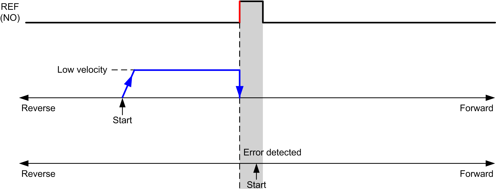
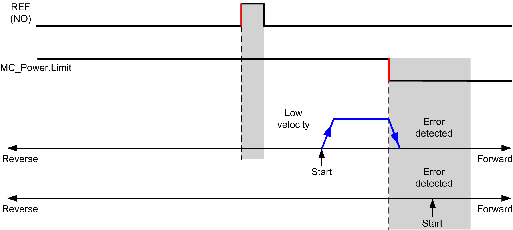
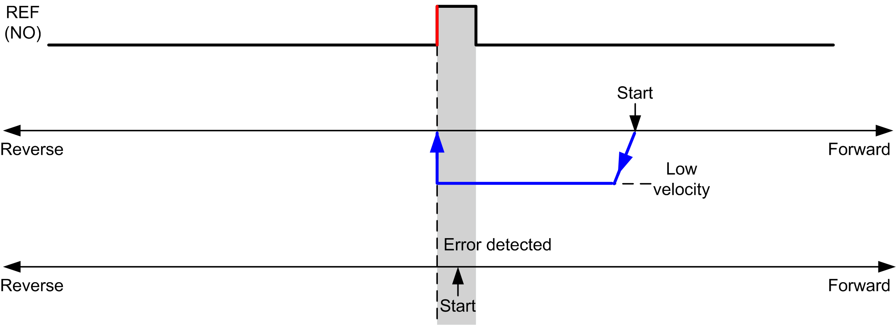
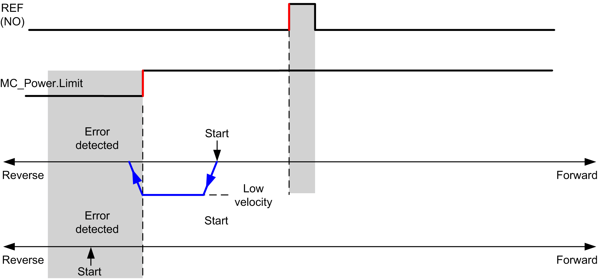

# Short Reference No Reversal

## Short Reference No Reversal: Positive Direction

Homes at low speed to the reference switch rising edge in forward direction, with no reversal:

**REF (NO)** Reference point (Normally Open)

**REF (NO)** Reference point (Normally Open)

## Short Reference No Reversal: Negative Direction

Homes at low speed to the reference switch falling edge in reverse direction, with no reversal:

**REF (NO)** Reference point (Normally Open)

**REF (NO)** Reference point (Normally Open)

EIO0000003077.02