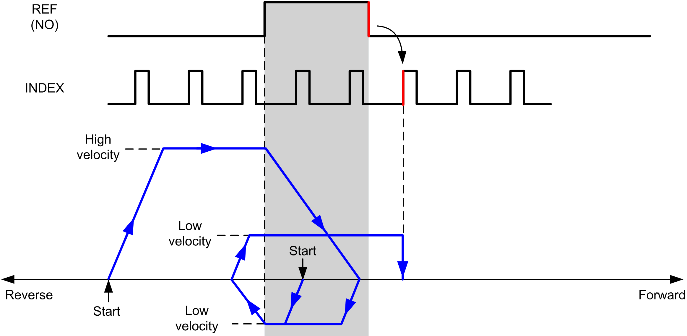
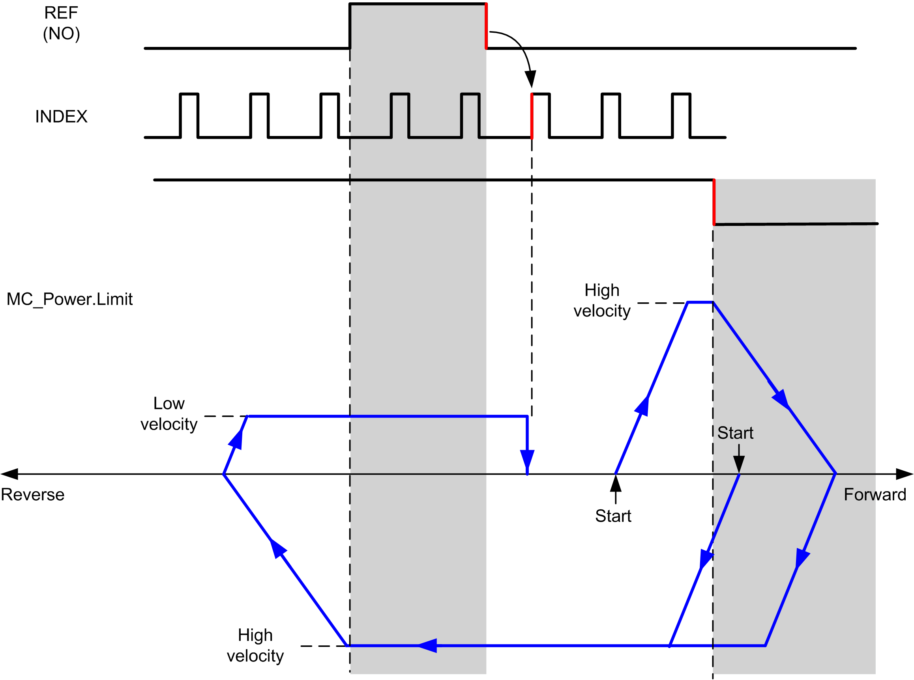
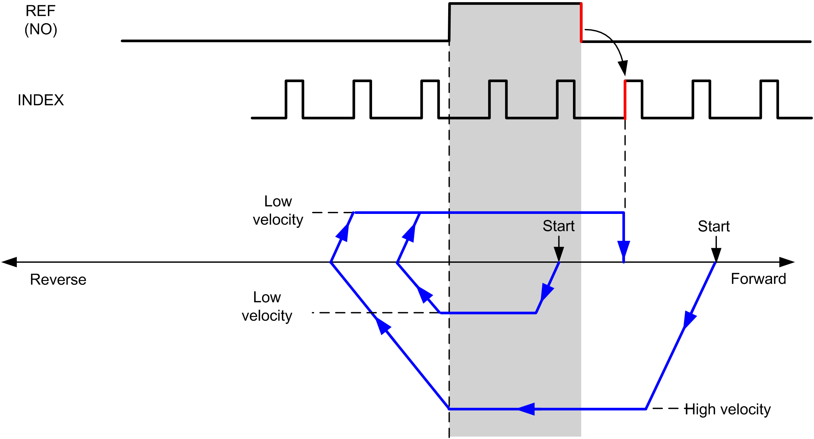
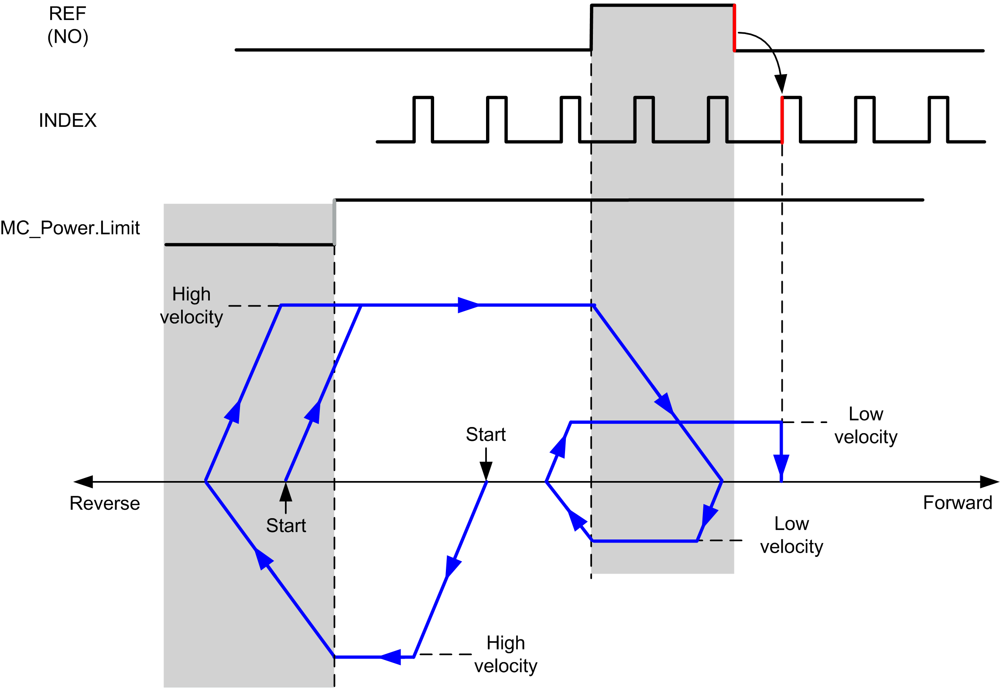

# Short Reference & Index Outside

## Short Reference & Index Outside: Positive Direction

Homes to the first index, after the reference switch transitions on and off in forward direction.

The initial direction of motion is dependent on the state of the reference switch:

**REF (NO)** Reference point (Normally Open)

**REF (NO)** Reference point (Normally Open)

## Short Reference & Index Outside: Negative Direction

Homes to the first index, after the reference switch transitions on and off in forward direction.

The initial direction of motion is dependent on the state of the reference switch:

**REF (NO)** Reference point (Normally Open)

**REF (NO)** Reference point (Normally Open)

EIO0000003077.02