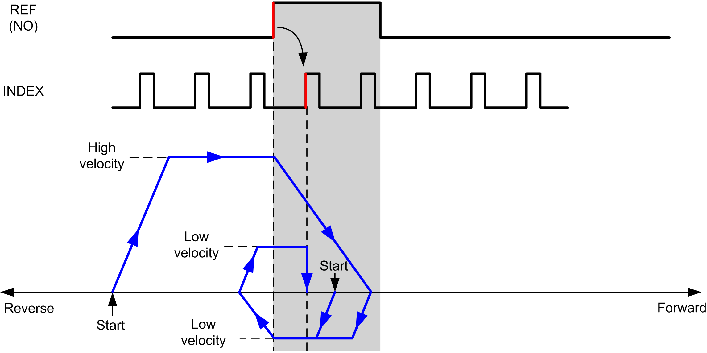
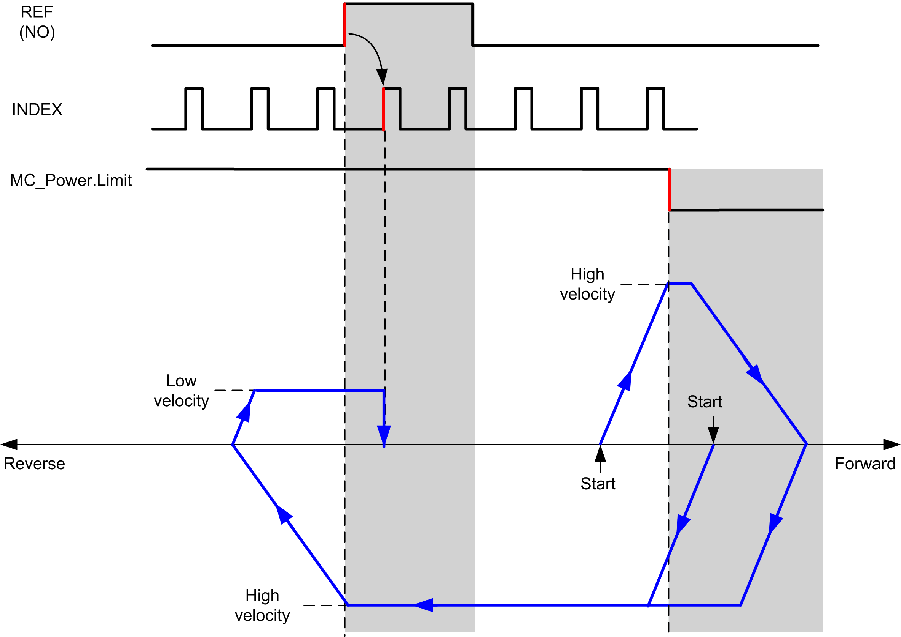
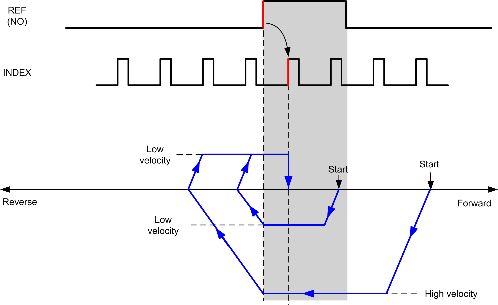
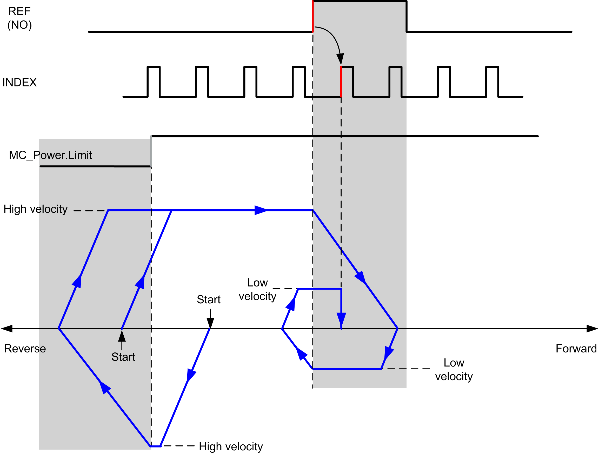

# Short Reference & Index Inside

## Short Reference & Index Inside: Positive Direction

Homes to the first index, after the reference switch rising edge in forward direction.

The initial direction of motion is dependent on the state of the reference switch:

**REF (NO)** Reference point (Normally Open)

**REF (NO)** Reference point (Normally Open)

## Short Reference & Index Inside: Negative Direction

Homes to the first index, after the reference switch rising edge in forward direction.

The initial direction of motion is dependent on the state of the reference switch:

**REF (NO)** Reference point (Normally Open)

**REF (NO)** Reference point (Normally Open)

EIO0000003077.02