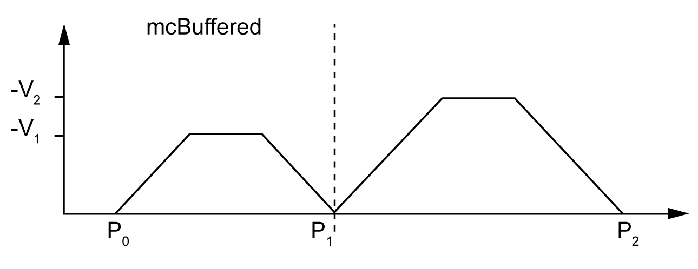
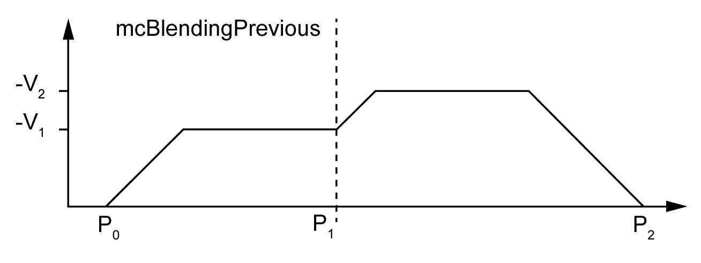

# MC\_BUFFER\_MODE

## Buffer Mode Enumeration

This table lists the values for the MC\_BUFFER\_MODE enumeration:

| Enumerator | Value | Description |
| --- | --- | --- |
| `mcAborting` | 0 | Start FB immediately (default mode).  Any ongoing motion is aborted. The move queue is cleared. |
| `mcBuffered` | 1 | Start FB after current move has finished (`Done` or `InVelocity` bit is set). There is no blending. |
| `mcBlendingPrevious` | 3 | The velocity is blended with the velocity of the first FB (blending with the velocity of `FB1` at end-position of `FB1`). |
| `seTrigger` | 10 | Start FB immediately when an event on the probe input is detected.  Any ongoing motion is aborted. The move queue is cleared. |
| `seBufferedDelay` | 11 | Start FB after current motion has finished (`Done` or `InVelocity` bit is set) and the time delay has elapsed. There is no blending.  The `Delay` parameter is set using MC\_WriteParameter\_PTO, with `ParameterNumber` 1000. |

## Examples

The examples below show a movement executed by two motion commands. The axis moves from the position P0 to P1 and then P2. The second command is passed while the axis is executing the first command but before the stopping ramp is reached. For each motion profile below, P1 is the reference point for the blending calculation. The buffer mode determines whether velocity V1 or V2 is reached at position P1.

EIO0000003077.02