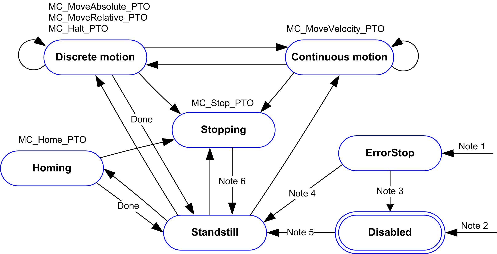

# Motion State Diagram

## State Diagram

The axis is always in one of the defined states in this diagram:

**Note 1** From any state, when an error is detected.

**Note 2** From any state except **ErrorStop**, when `MC_Power_PTO.Status` = FALSE.

**Note 3** `MC_Reset_PTO.Done` = TRUE and `MC_Power_PTO.Status` = FALSE.

**Note 4** `MC_Reset_PTO.Done` = TRUE and `MC_Power_PTO.Status` = TRUE.

**Note 5** `MC_Power_PTO.Status` = TRUE.

**Note 6** `MC_Stop_PTO.Done` = TRUE and `MC_Stop_PTO.Execute` = FALSE.

The table describes the axis states:

| State | Description |
| --- | --- |
| **Disabled** | Initial state of the axis, no motion command is allowed. The axis is not homed. |
| **Standstill** | Power is on, there is no error detected, and there are no motion commands active on the axis. Motion command is allowed. |
| **ErrorStop** | Highest priority, applicable when an error is detected on the axis or in the controller. Any ongoing move is aborted by a Fast Stop Deceleration. `Error` pin is set on applicable function blocks, and an `ErrorId` sets the error code. No further motion command is accepted until a reset has been done using MC\_Reset\_PTO. |
| **Homing** | Applicable when MC\_Home\_PTO controls the axis. |
| **Discrete** | Applicable when MC\_MoveRelative\_PTO, MC\_MoveAbsolute\_PTO, or MC\_Halt\_PTO controls the axis. |
| **Continuous** | Applicable when MC\_MoveVelocity\_PTO controls the axis. |
| **Stopping** | Applicable when MC\_Stop\_PTO controls the axis. |

NOTE: Function blocks which are not listed in the state diagram do not affect a change of state of the axis.

The entire motion command including acceleration and deceleration ramps cannot exceed 4,294,967,295 pulses. At the maximum frequency of 100 kHz, the acceleration and deceleration ramps are limited to 80 seconds.

## Motion Transition Table

The PTO channel can respond to a new command while executing (and before completing) the ongoing command according to the following table:

| Command | | Next | | | | | |
| --- | --- | --- | --- | --- | --- | --- | --- |
| Home | MoveVelocity | MoveRelative | MoveAbsolute | Halt | Stop |
| **Ongoing** | **Standstill** | Allowed | Allowed (1) | Allowed (1) | Allowed (1) | Allowed | Allowed |
| **Home** | Rejected | Rejected | Rejected | Rejected | Rejected | Allowed |
| **MoveVelocity** | Rejected | Allowed | Allowed | Allowed | Allowed | Allowed |
| **MoveRelative** | Rejected | Allowed | Allowed | Allowed | Allowed | Allowed |
| **MoveAbsolute** | Rejected | Allowed | Allowed | Allowed | Allowed | Allowed |
| **Halt** | Rejected | Allowed | Allowed | Allowed | Allowed | Allowed |
| **Stop** | Rejected | Rejected | Rejected | Rejected | Rejected | Rejected |
| **(1)** When the axis is at standstill, for the buffer modes `mcAborting/mcBuffered/mcBlendingPrevious`, the move starts immediately.  **Allowed** the new command begins execution even if the previous command has not completed execution.  **Rejected** the new command is ignored and results in the declaration of an error. | | | | | | | |

NOTE: When an error is detected in the motion transition, the axis goes into **ErrorStop** state. The `ErrorId` is set to `InvalidTransition`.

EIO0000003077.02