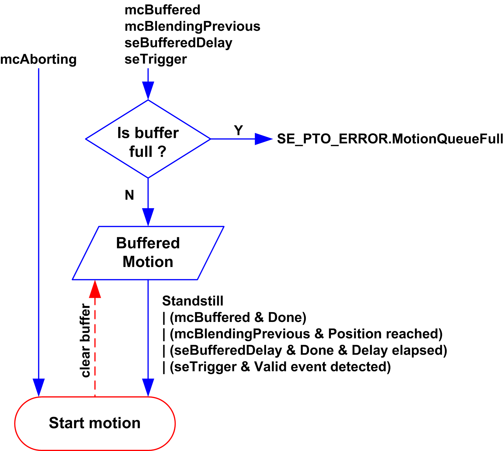

# Buffer Mode

## Description

Some of the motion function blocks have an input called `BufferMode`. With this input, the function block can either start immediately, start on probe event, or be buffered.

The available options are defined in the enumeration of type [MC\_BUFFER\_MODE](D-SE-0032839.html#D-SE-0032839):

* An aborting motion (`mcAborting`) starts immediately, aborting any ongoing move, and clearing the motion queue.
* A buffered motion (`mcBuffered`, `mcBlendingPrevious`, `seBufferedDelay`) is queued, that is, appended to any moves currently executing or waiting to execute, and will start when the previous motion is done.
* An event motion (`seTrigger`) is a buffered motion, starting on [probe event](D-SE-0033240.html#D-SE-0033240).

## Motion Queue Diagram

The figure illustrates the motion queue diagram:

The buffer can contain only one motion function block.

The execution condition of the motion function block present in the buffer is:

* `mcBuffered`: when the current continuous motion is `InVelocity`, resp. when the current discrete motion stops.
* `seBufferedDelay`: when the specified delay has elapsed, from the current continuous motion is `InVelocity`, resp. from the current discrete motion stops.
* `mcBlendingPrevious`: when the position and velocity targets of current function block are reached.
* `seTrigger`: when a valid event is detected on the probe input.

The motion queue is cleared (all buffered motions are deleted):

* When an aborting move is triggered (`mcAborting`): `CommandAborted` pin is set on buffered function blocks.
* When a MC\_Stop\_PTO function is executed: `Error` pin is set on cleared buffered function blocks, with `ErrorId`=`StoppingActive`.
* When a transition to **ErrorStop** state is detected: `Error` pin is set on buffered function blocks, with `ErrorId`=`ErrorStopActive`.

NOTE:

* Only a valid motion can be queued. If the function block execution terminates with the `Error` output set, the move is not queued, any move currently executing is not affected, and the queue is not cleared.
* When the queue is already full, the `Error` output is set on the applicable function block, and `ErrorId` output returns the error `MotionQueueFull`.

EIO0000003077.02