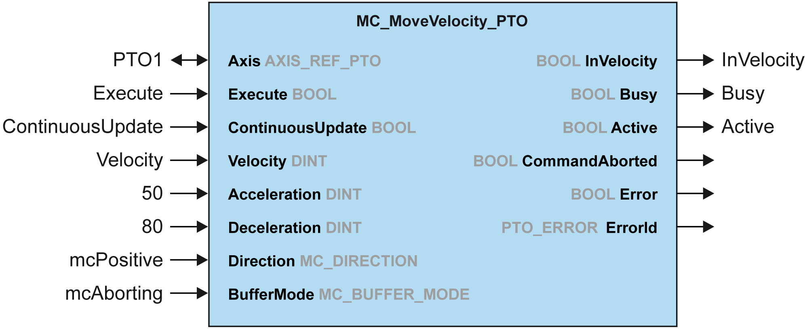
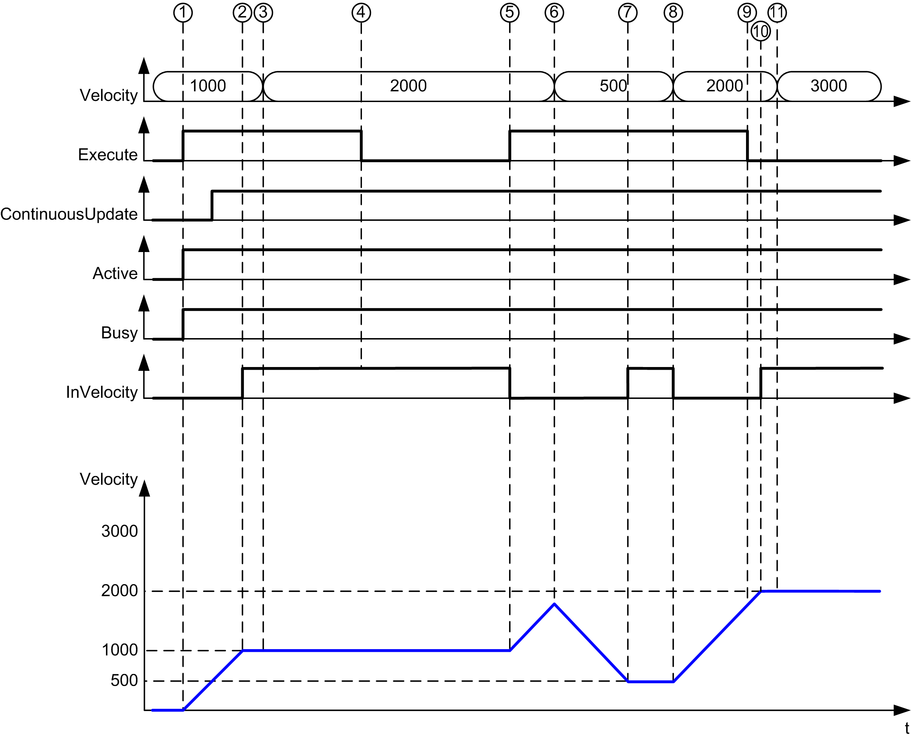
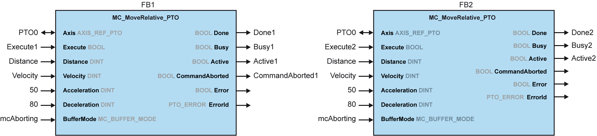
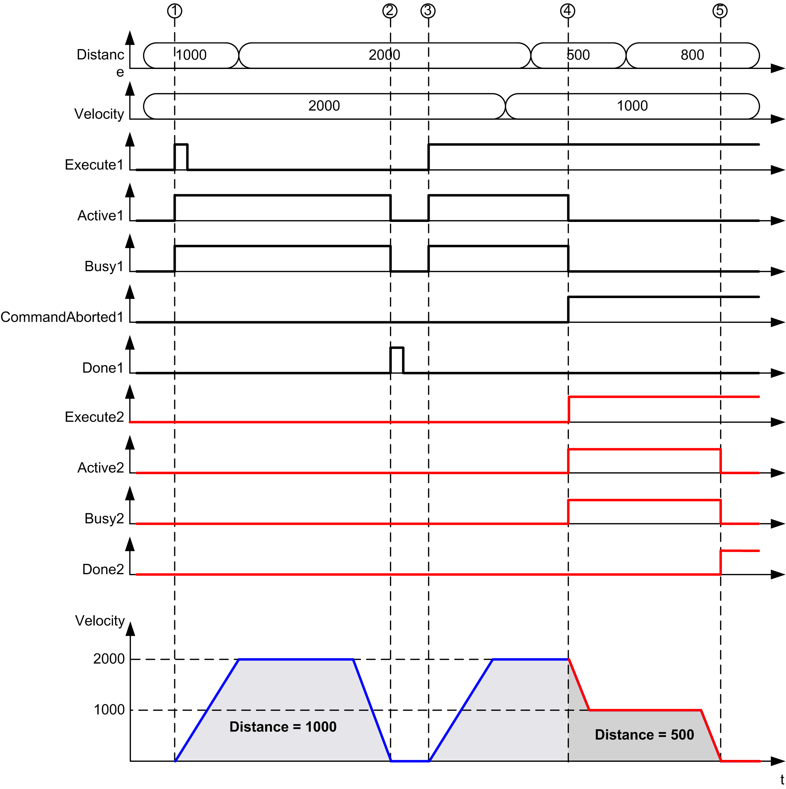
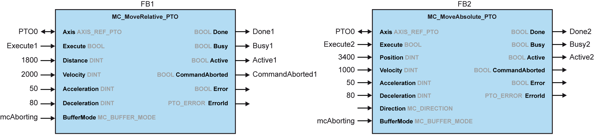
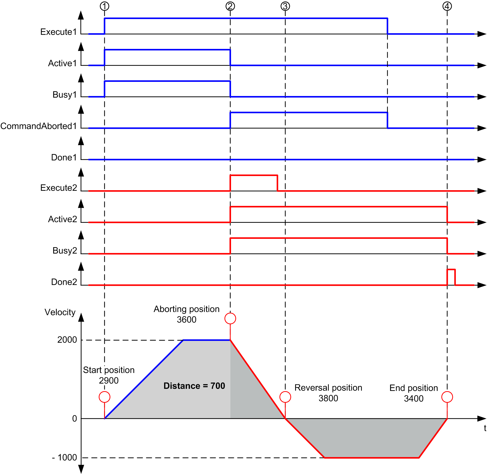
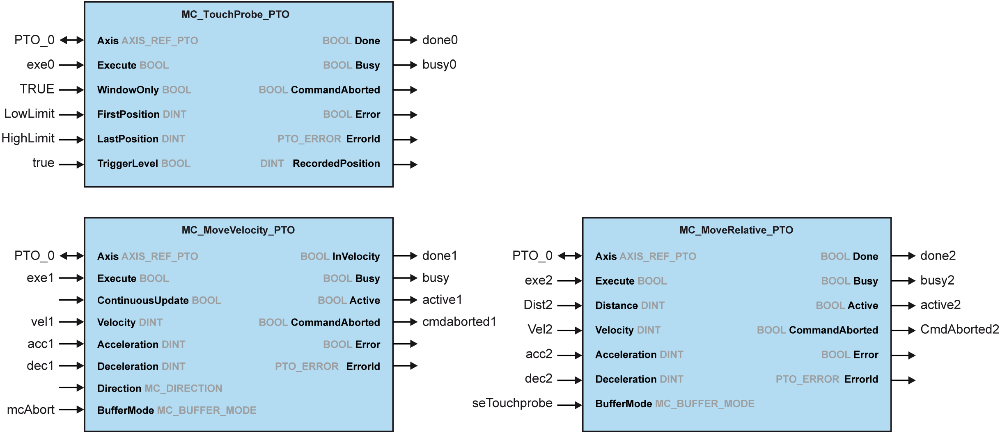
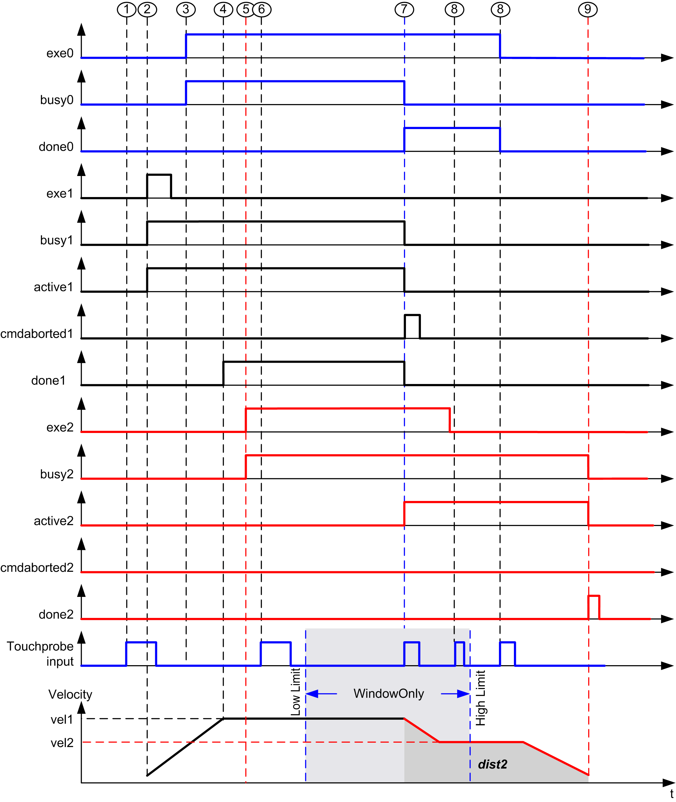

# Timing Diagram Examples

## Move Velocity to Move Velocity with mcAborting

**1** `Execute` rising edge: command parameters are latched, movement is started with target `velocity` 1000.

**2** Target `velocity` 1000 is reached.

**3** `Velocity` parameter changed to 2000: not applied (no rising edge on `Execute` input, and `ContinuousUpdate` was latched with value 0 at start of the movement).

**4** `Execute` falling edge: status bits are cleared.

**5** `Execute` rising edge: command parameters are latched, movement is started with target `velocity` 2000 and `ContinuousUpdate` active.

**6** Velocity parameter changed to 500: applied `ContinuousUpdate` is true). Note: previous target `velocity` 2000 is not reached.

**7** Target `velocity` 500 is reached.

**8** `Velocity` parameter changed to 2000: applied `ContinuousUpdate` is true).

**9** `Execute` falling edge: status bits are cleared.

**10** Target `velocity` 2000 is reached, `InVelocity` is set for 1 cycle (`Execute` pin is reset).

**11** `Velocity` parameter changed to 3000: not applied (movement is still active, but no longer busy).

## Move Relative to Move Relative with mcAborting

**1** FB1 `Execute` rising edge: command parameters are latched, movement is started with target `velocity` 2000 and `distance` 1000.

**2** Movement ends: distance traveled is 1000.

**3** FB1 `Execute` rising edge: command parameters are latched, movement is started with target `velocity` 2000 and `distance` 2000.

**4** FB2 `Execute` rising edge: command parameters are latched, movement is started with target `velocity` 1000 and `distance` 500. Note: FB1 is aborted.

**5** Movement ends.

## Move Relative to Move Absolute with mcAborting

**1** FB1 `Execute` rising edge: command parameters are latched, movement is started with target `velocity` 2000 and `distance` 1800.

**2** FB2 `Execute` rising edge: command parameters are latched, FB1 is aborted, and movement continues with target `velocity` 1000 and target`position` 3400. Automatic direction management: direction reversal is needed to reach target position, move to stop at `deceleration` of FB2.

**3** Velocity 0, direction reversal, movement resumes with target `velocity` 1000 and target `position` 3400.

**4** Movement ends: target position 3400 reached.

## Move Velocity to Move Relative with seTrigger

**1** MC\_TouchProbe\_PTO not executed yet: probe input is not active.

**2** MC\_MoveVelocity\_PTO `Execute` rising edge: command parameters are latched, movement is started with target `velocity` vel1.

**3** MC\_TouchProbe\_PTO `Execute` rising edge: probe input is active.

**4** vel1 is reached.

**5** MC\_MoveRelative\_PTO `Execute` rising edge: command parameters are latched, waiting for probe event to start.

**6** Probe event outside of enable windows: event is ignored.

**7** A valid event is detected. MC\_MoveRelative\_PTO aborts MC\_MoveVelocity\_PTO, and probe input is deactivated.

**8** Following events are ignored.

**9** Movement ends.

EIO0000003077.02