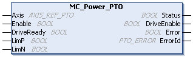
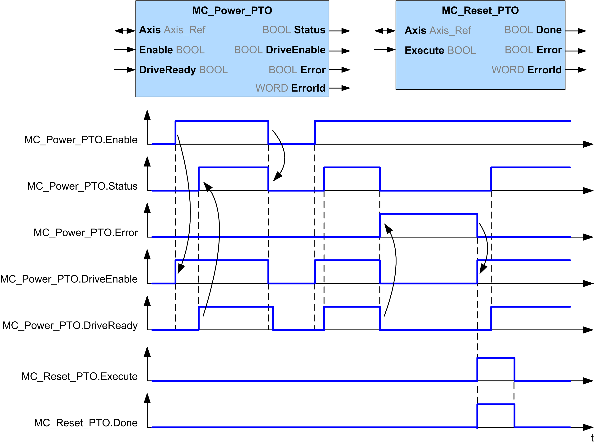

# MC\_Power\_PTO: Manage the Power of the Axis State

## Graphical Representation

## IL and ST Representation

To see the general representation in IL or ST language, refer to the chapter [Function and Function Block Representation](D-SE-0002384.html#D-SE-0002384).

## Input Variables

This table describes the input variables:

| Input | Type | Initial Value | Description |
| --- | --- | --- | --- |
| `Axis` | AXIS\_REF\_PTO | - | Name of the axis (instance) for which the function block is to be executed. In the devices tree, the name is declared under the controller configuration. |
| `Enable` | BOOL | FALSE | When TRUE, the function block is executed. The values of the function block inputs can be modified and the outputs updated continuously.  When FALSE, terminates the function block execution and resets its outputs. |
| `DriveReady`(1) | BOOL | FALSE | Drive ready information from the drive. Must be TRUE when the drive is ready to start executing motion.  If the drive signal is connected to the controller, use the appropriate %Ix input. If the drive does not provide this signal, you can select the value TRUE for this input. |
| `LimP`(1) | BOOL | TRUE | Hardware limit switch information, in positive direction. It must be FALSE when the hardware limit switch is reached.  If the hardware limit switch signal is connected to the controller, use the appropriate %Ix input. If this signal is not available, you can leave this input unused or set to TRUE. |
| `LimN`(1) | BOOL | TRUE | Hardware limit switch information, in negative direction. It must be FALSE when the hardware limit switch is reached.  If the hardware limit switch signal is connected to the controller, use the appropriate %Ix. If this signal is not available, you can leave this input unused or set to TRUE. |

(1) `DriveReady`, `LimP`, and `LimN` are read at the task cycle time.

## Output Variables

This table describes the output variables:

| Output | Type | Initial Value | Description |
| --- | --- | --- | --- |
| `Status` | BOOL | FALSE | When TRUE, power is enabled, motion commands are possible. |
| `DriveEnable` | BOOL | FALSE | Enables the drive to accept commands.  If the drive does not use this signal, you can leave this output unused. |
| `Error` | BOOL | FALSE | If TRUE, indicates that an error was detected. Function block execution is finished. |
| `ErrorId` | PTO\_ERROR | `PTO_ERROR.NoError` | When `Error` is TRUE: code of the [error detected](D-SE-0033053.html#D-SE-0033053). |

## Timing Diagram Example

The diagram illustrates the function block operation:

EIO0000003077.02