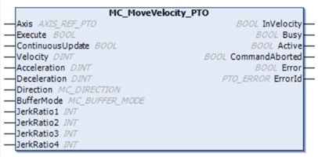
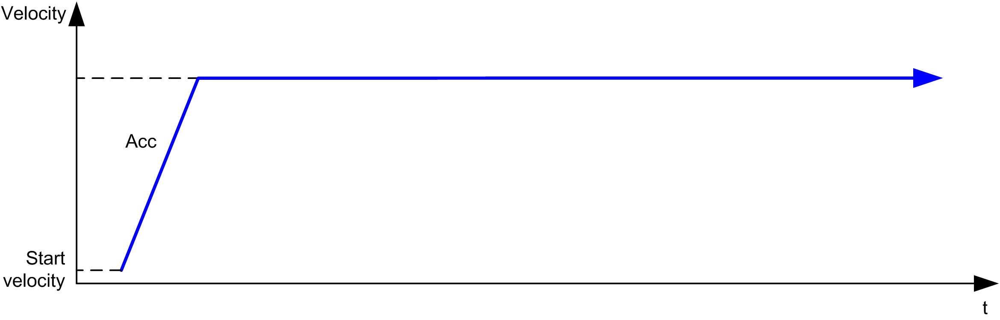
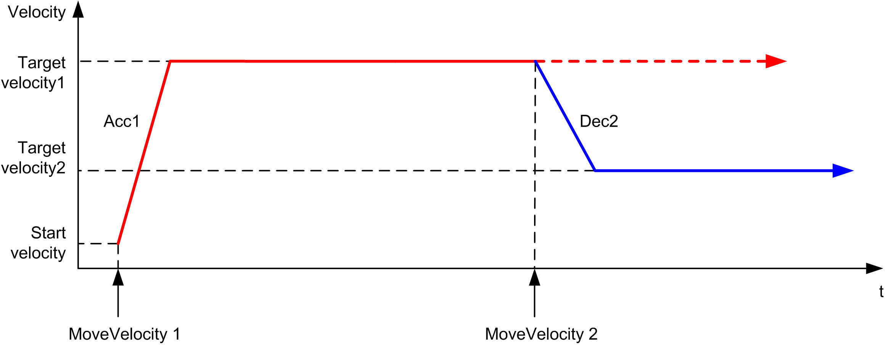
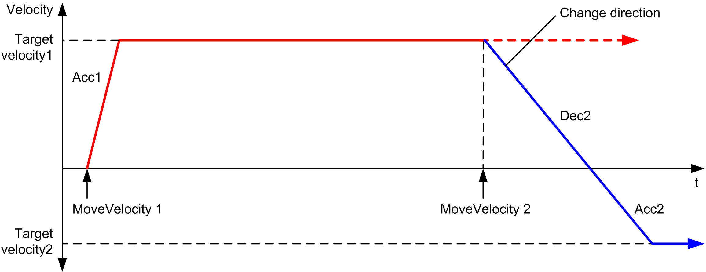
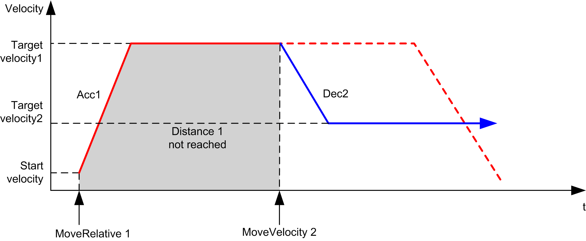

# MC\_MoveVelocity\_PTO: Control the Speed of the Axis

## Graphical Representation

## IL and ST Representation

To see the general representation in IL or ST language, refer to the chapter [Function and Function Block Representation](D-SE-0002384.html#D-SE-0002384).

## Input Variables

This table describes the input variables:

| Input | Type | Initial Value | Description |
| --- | --- | --- | --- |
| `Axis` | AXIS\_REF\_PTO | - | Name of the axis (instance) for which the function block is to be executed. In the devices tree, the name is declared in the controller configuration. |
| `Execute` | BOOL | FALSE | On rising edge, starts the function block execution.  On falling edge, resets the outputs of the function block when its execution terminates.  Later changes in the function block input parameters do not affect the ongoing command, unless the input `ContinuousUpdate` is used.  If a second rising edge is detected during the execution of the function block, the ongoing execution is aborted and the function block is restarted with the values of the parameters at the time. |
| `ContinuousUpdate` | BOOL | FALSE | At TRUE, makes the function block use the values of the input variables (`Velocity`, `Acceleration`, `Deceleration`, and `Direction`), and apply it to the ongoing command regardless of their original values.  The impact of the input `ContinuousUpdate` begins when the function block is triggered by a rising edge on the `Execute` pin, and ends as soon as the function block is no longer `Busy` or the input `ContinuousUpdate` is set to FALSE. |
| `Velocity` | DINT | 0 | Target velocity in Hz, not necessarily reached.  Range: 0...`MaxVelocityAppl` |
| `Acceleration` | DINT | 0 | Acceleration in Hz/ms or in ms (according to configuration).  Range (Hz/ms): 1...`MaxAccelerationAppl`  Range (ms): `MaxAccelerationAppl`...100,000 |
| `Deceleration` | DINT | 0 | Deceleration in Hz/ms or in ms (according to configuration).  Range (Hz/ms): 1...`MaxDecelerationAppl`  Range (ms): `MaxDecelerationAppl`...100,000 |
| `Direction` | MC\_DIRECTION | `mcPositiveDirection` | [Direction of the movement](D-SE-0032873.html#D-SE-0032873). |
| `BufferMode` | MC\_BUFFER\_MODE | `mcAborting` | [Transition mode from ongoing move](D-SE-0032839.html#D-SE-0032839). |
| `JerkRatio1` | INT | 0 | Percentage of acceleration from standstill used to create the [S-curve profile](D-SE-0033235.html#D-SE-0033235__D-SE-0033235.12). |
| `JerkRatio2` | INT | 0 | Percentage of acceleration to constant velocity used to create the [S-curve profile](D-SE-0033235.html#D-SE-0033235__D-SE-0033235.12). |
| `JerkRatio3` | INT | 0 | Percentage of deceleration from constant velocity used to create the [S-curve profile](D-SE-0033235.html#D-SE-0033235__D-SE-0033235.12). |
| `JerkRatio4` | INT | 0 | Percentage of deceleration to standstill used to create the [S-curve profile](D-SE-0033235.html#D-SE-0033235__D-SE-0033235.12). |

## Output Variables

This table describes the output variables:

| Output | Type | Initial Value | Description |
| --- | --- | --- | --- |
| `InVelocity` | BOOL | FALSE | If TRUE, indicates that the target velocity is reached. |
| `Busy` | BOOL | FALSE | If TRUE, indicates that the function block execution is in progress. |
| `Active` | BOOL | FALSE | The function block controls the `Axis`. Only one function block at a time can set `Active` TRUE for a defined `Axis`. |
| `CommandAborted` | BOOL | FALSE | Function block execution is finished, by aborting due to another move command or an error detected. |
| `Error` | BOOL | FALSE | If TRUE, indicates that an error was detected. Function block execution is finished. |
| `ErrorId` | PTO\_ERROR | `PTO_ERROR.NoError` | When `Error` is TRUE: code of the [error detected](D-SE-0033053.html#D-SE-0033053). |

NOTE:

* To stop the motion, the function block has to be interrupted by another function block issuing a new command.
* If a motion is ongoing, and the direction is reversed, first the motion is halted with the deceleration of the MC\_MoveVelocity\_PTO function block, and then the motion resumes backwards.
* The acceleration/deceleration duration of the segment block must not exceed 80 seconds.

## Timing Diagram Example

The diagram illustrates a simple profile from **Standstill** state:

The diagram illustrates a complex profile from **Continuous** state:

The diagram illustrates a complex profile from **Continuous** state with change of direction:

The diagram illustrates a complex profile from **Discrete** state:

EIO0000003077.02