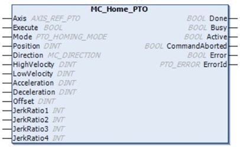

# MC\_Home\_PTO: Command the Axis to Move to a Reference Position

## Graphical Representation

## IL and ST Representation

To see the general representation in IL or ST language, refer to the chapter [Function and Function Block Representation](D-SE-0002384.html#D-SE-0002384).

## Input Variables

This table describes the input variables:

| Input | Type | Initial Value | Description |
| --- | --- | --- | --- |
| `Axis` | AXIS\_REF\_PTO | - | Name of the axis (instance) for which the function block is to be executed. In the devices tree, the name is declared in the controller configuration. |
| `Execute` | BOOL | FALSE | On rising edge, starts the function block execution.  On falling edge, resets the outputs of the function block when its execution terminates. |
| `Mode` | PTO\_HOMING\_MODE | `mcPositionSetting` | Predefined [home mode](D-SE-0032874.html#D-SE-0032874) type. |
| `Position` | DINT | 0 | Position value is set as absolute position at the reference point switch detection, when the homing has been successfully executed. |
| `Direction` | MC\_DIRECTION | `mcPositiveDirection` | Starting direction. For Homing, only `mcPositiveDirection` and `mcNegativeDirection` are valid. |
| `HighVelocity` | DINT | 0 | Target homing velocity for searching the limit or reference switch.  Range Hz: 1...`MaxVelocityAppl` |
| `LowVelocity` | DINT | 0 | Target homing velocity for searching the reference switch or index signal. The movement stop when switching point is detected.  Range Hz: 1...`HighVelocity` |
| `Acceleration` | DINT | 0 | Acceleration in Hz/ms or in ms (according to configuration).  Range (Hz/ms): 1...`MaxAccelerationAppl`  Range (ms): `MaxAccelerationAppl`...100,000 |
| `Deceleration` | DINT | 0 | Deceleration in Hz/ms or in ms (according to configuration).  Range (Hz/ms): 1...`MaxDecelerationAppl`  Range (ms): `MaxDecelerationAppl`...100,000 |
| `Offset` | DINT | 0 | Distance from origin point. When the origin point is reached, the motion resumes until the distance is covered. Direction depends on the sign ([Home offset](D-SE-0033011.html#D-SE-0033011)).  Range: -2,147,483,648...2,147,483,647 |
| `JerkRatio1` | INT | 0 | Percentage of acceleration from standstill used to create the [S-curve profile](D-SE-0033235.html#D-SE-0033235__D-SE-0033235.12). |
| `JerkRatio2` | INT | 0 | Percentage of acceleration to constant velocity used to create the [S-curve profile](D-SE-0033235.html#D-SE-0033235__D-SE-0033235.12). |
| `JerkRatio3` | INT | 0 | Percentage of deceleration from constant velocity used to create the [S-curve profile](D-SE-0033235.html#D-SE-0033235__D-SE-0033235.12). |
| `JerkRatio4` | INT | 0 | Percentage of deceleration to standstill used to create the [S-curve profile](D-SE-0033235.html#D-SE-0033235__D-SE-0033235.12). |

## Output Variables

This table describes the output variables:

| Output | Type | Initial Value | Description |
| --- | --- | --- | --- |
| `Done` | BOOL | FALSE | If TRUE, indicates that the function block execution is finished with no error detected. |
| `Busy` | BOOL | FALSE | If TRUE, indicates that the function block execution is in progress. |
| `Active` | BOOL | FALSE | The function block controls the `Axis`. Only one function block at a time can set `Active` TRUE for a defined `Axis`. |
| `CommandAborted` | BOOL | FALSE | Function block execution is finished, by aborting due to another move command or an error detected. |
| `Error` | BOOL | FALSE | If TRUE, indicates that an error was detected. Function block execution is finished. |
| `ErrorId` | PTO\_ERROR | `PTO_ERROR.NoError` | When `Error` is TRUE: code of the [error detected](D-SE-0033053.html#D-SE-0033053) . |

NOTE: The acceleration/deceleration duration of the segment block must not exceed 80 seconds.

## Timing Diagram Example

See [Home modes](D-SE-0033276.html#D-SE-0033276).

EIO0000003077.02