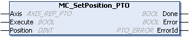

# MC\_SetPosition\_PTO: Force the Reference Position of the Axis

## Graphical Representation

## IL and ST Representation

To see the general representation in IL or ST language, refer to the chapter [Function and Function Block Representation](D-SE-0002384.html#D-SE-0002384).

## Input Variables

This table describes the input variables:

| Input | Type | Initial Value | Description |
| --- | --- | --- | --- |
| `Axis` | AXIS\_REF\_PTO | - | Name of the axis (instance) for which the function block is to be executed. In the devices tree, the name is declared in the controller configuration. |
| `Execute` | BOOL | FALSE | On rising edge, starts the function block execution.  On falling edge, resets the outputs of the function block when its execution terminates. |
| `Position` | DINT | 0 | New value of absolute position of the `Axis`. |

## Output Variables

This table describes the output variables:

| Output | Type | Initial Value | Description |
| --- | --- | --- | --- |
| `Done` | BOOL | FALSE | If TRUE, indicates that the function block execution is finished with no error detected. |
| `Error` | BOOL | FALSE | If TRUE, indicates that an error was detected. Function block execution is finished. |
| `ErrorId` | PTO\_ERROR | `PTO_ERROR.NoError` | When `Error` is TRUE: type of the [error detected](D-SE-0033053.html#D-SE-0033053) . |

EIO0000003077.02