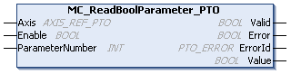

# MC\_ReadBoolParameter\_PTO: Get BOOL Parameters from the PTO

## Function Block Description

This function block is used to get BOOL parameters from the PTO.

## Graphical Representation

## IL and ST Representation

To see the general representation in IL or ST language, refer to the chapter [Function and Function Block Representation](D-SE-0002384.html#D-SE-0002384).

## Input Variables

This table describes the input variables:

| Input | Type | Initial Value | Description |
| --- | --- | --- | --- |
| `Axis` | AXIS\_REF\_PTO | - | Name of the axis (instance) for which the function block is to be executed. In the devices tree, the name is declared in the controller configuration. |
| `Enable` | BOOL | FALSE | When TRUE, the function block is executed. The values of the other function block inputs can be modified continuously, and the function block outputs are updated continuously.  When FALSE, terminates the function block execution and resets its outputs. |
| `ParameterNumber` | INT | 0 | ID of the requested parameter ([PTO\_PARAMETER](D-SE-0033052.html#D-SE-0033052)) |

## Output Variables

This table describes the output variables:

| Output | Type | Initial Value | Description |
| --- | --- | --- | --- |
| `Valid` | BOOL | FALSE | Valid data is available at the function block output pin. |
| `Error` | BOOL | FALSE | If TRUE, indicates that an error was detected. Function block execution is finished. |
| `ErrorId` | PTO\_ERROR | `PTO_ERROR.NoError` | When `Error` is TRUE: code of the [error detected](D-SE-0033053.html#D-SE-0033053). |
| `Value` | BOOL | FALSE | Value of the requested parameter. |

EIO0000003077.02