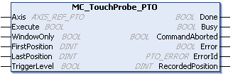

# MC\_TouchProbe\_PTO: Activate a Trigger Event

## Function Block Description

This function block is used to activate a trigger event on the probe input. This trigger event allows to record the axis position, and/or to start a buffered move.

## Graphical Representation

## IL and ST Representation

To see the general representation in IL or ST language, refer to the chapter [Function and Function Block Representation](D-SE-0002384.html#D-SE-0002384).

## Input Variables

This table describes the input variables:

| Input | Type | Initial Value | Description |
| --- | --- | --- | --- |
| `Axis` | AXIS\_REF\_PTO | - | Name of the axis (instance) for which the function block is to be executed. In the devices tree, the name is declared in the controller configuration. |
| `Execute` | BOOL | FALSE | On rising edge, starts the function block execution.  On falling edge, resets the outputs of the function block when its execution terminates. |
| `WindowOnly` | BOOL | FALSE | If TRUE, only use the window defined by `FirstPosition` and `LastPosition` to accept trigger events. |
| `FirstPosition` | DINT | 0 | Start absolute position from where (positive direction) trigger events are accepted (value included in window). |
| `LastPosition` | DINT | 0 | Stop absolute position until where (positive direction) trigger events are accepted (value included in window). |
| `TriggerLevel` | BOOL | FALSE | If FALSE, position capture at falling edge.  If TRUE, position capture at rising edge. |

## Output Variables

This table describes the output variables:

| Output | Type | Initial Value | Description |
| --- | --- | --- | --- |
| `Done` | BOOL | FALSE | If TRUE, indicates that the function block execution is finished with no error detected. |
| `Busy` | BOOL | FALSE | If TRUE, indicates that the function block execution is in progress. |
| `CommandAborted` | BOOL | FALSE | Function block execution is finished, by aborting due to another move command or a error detected. |
| `Error` | BOOL | FALSE | If TRUE, indicates that an error was detected. Function block execution is finished. |
| `ErrorId` | PTO\_ERROR | `PTO_ERROR.NoError` | When `Error` is TRUE: code of the [error detected](D-SE-0033053.html#D-SE-0033053). |
| `RecordedPosition` | DINT | 0 | Position where trigger event was detected. |

NOTE: Only the first event after the rising edge at the MC\_TouchProbe\_PTO function block `Busy` pin is valid. Once the `Done` output pin is set, subsequent events are ignored. The function block needs to be reactivated to respond to other events.

EIO0000003077.02