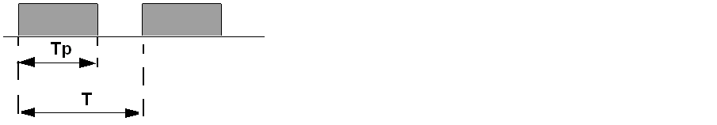
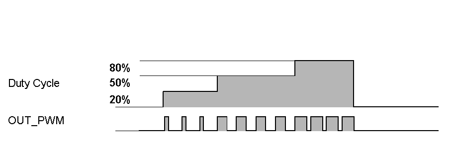
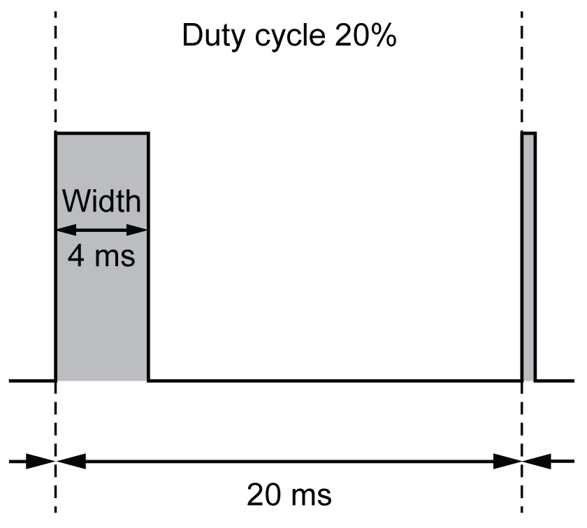

# Description

## Overview

The pulse width modulation function generates a programmable pulse wave signal on a dedicated output with adjustable duty cycle and frequency.

## Signal Form

The signal form depends on the following input parameters:

* **Frequency** configurable:

  + from 0.1 Hz to 20 kHz with a 0.1 Hz step (fast outputs: Q0...Q3)
  + from 0.1 Hz to 1 kHz with a 0.1 Hz step (regular outputs: Q4...Q7)
* **Duty Cycle** of the output signal from 0% to 100% with 1% step or 0.1% step with HighPrecision.

Duty Cycle=Tp/T

**Tp** pulse width

**T** pulse period (1/Frequency)

Modifying the duty cycle in the program modulates the width of the signal. Below is an illustration of an output signal with varying duty cycles.

The following illustration shows a duty cycle of 20%:

EIO0000003077.02