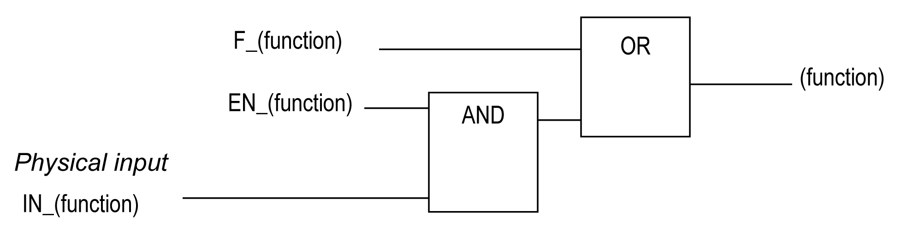
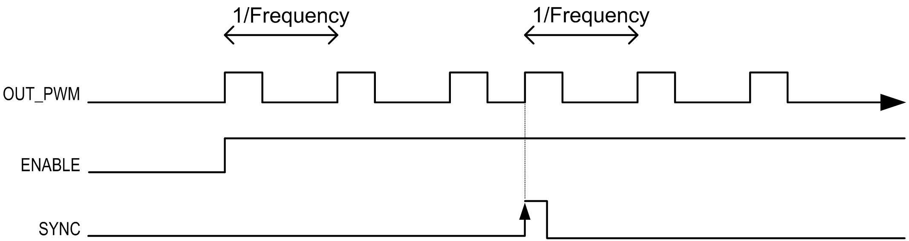

# Synchronization and Enable Functions

## Introduction

This section presents the functions used by the FreqGen/PWM:

* Synchronization function
* Enable function

Each function uses the 2 following function block bits:

* **EN\_(function) bit:** Setting this bit to 1 allows the (function) to operate on an external physical input if configured.
* **F\_(function) bit:** Setting this bit to 1 forces the (function).

The following diagram explains how the function is managed:

NOTE: (function) stands either for **Enable** (for Enable function) or **Sync** (for Synchronization function).

If the physical input is required, enable it in the [configuration screen](D-SE-0003567.html#D-SE-0003567__D-SE-0003567.3).

## Synchronization Function

The Synchronization function is used to interrupt the current FreqGen/PWM cycle and then restart a new cycle.

## Enable Function

The Enable function is used to activate the FreqGen/PWM:

EIO0000003077.02