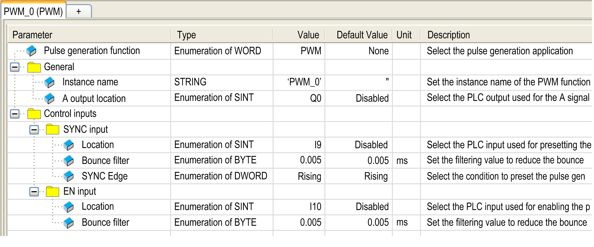

# Configuration

## Overview

Four pulse width modulation functions can be configured on the controller.

## Adding a Pulse Width Modulation Function

To add a pulse width modulation function, proceed as follows:

| Step | Action |
| --- | --- |
| 1 | Double-click the Pulse Generators node of your controller in the Devices Tree. |
| 2 | Double-click the Pulse generation function value and select PWM.  **Result:** The PWM configuration parameters appear. |

## Parameters

The figure provides an example of a PWM configuration window:

The pulse width modulation function has the following parameters:

| Parameter | | Value | Default | Description |
| --- | --- | --- | --- | --- |
| General | Instance name | - | PWM\_0...PWM\_3 | Set the instance name of the PWM function. |
| A output location | Disabled  Q0...Q3 (fast outputs)  Q4...Q7 (regular outputs)(1) | Disabled | Select the controller output used for the A signal. |
| Control inputs / SYNC input | Location | Disabled  I0...I7 (fast inputs)  I8...I13 (TM241•24• regular inputs)  I8...I15 (TM241•40• regular inputs) | Disabled | Select the controller input used for presetting the PWM function. |
| Bounce filter | 0.000  0.001  0.002  0.005  0.010  0.1  1.5  1  5 | 0.005 | Set the filtering value to reduce the bounce effect on the SYNC input (in ms). |
| SYNC Edge | Rising  Falling  Both | Rising | Select the condition to preset the PWM function with the SYNC input. |
| Control inputs / EN input | Location | Disabled  I0...I7 (fast inputs)  I8...I15 (TM241•40• regular inputs)  I8...I13 (TM241•24• regular inputs) | Disabled | Select the controller input used for enabling the PWM function. |
| Bounce filter | 0.000  0.001  0.002  0.005  0.010  0.1  1.5  1  5 | 0.005 | Set the filtering value to reduce the bounce effect on the EN input (in ms). |
| (1) Not available for M241 Logic Controller references with relay outputs. | | | | |

## Synchronizing with an External Event

On a rising edge on the IN\_SYNC physical input (with EN\_Sync = 1), the current cycle is interrupted and the PWM restarts a new cycle.

This illustration provides a pulse diagram for the Pulse Width Modulation function block with use of IN\_SYNC input:

EIO0000003077.02