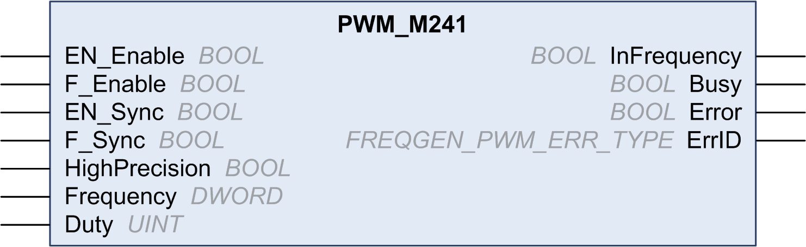

# PWM\_M241: Command a Pulse Width Modulation Signal

## Overview

The Pulse Width Modulation function block commands a pulse width modulated signal output at the specified frequency and duty cycle.

## Graphical Representation

This illustration is a Pulse Width Modulation function block:

## IL and ST Representation

To see the general representation in IL or ST language, refer to the [*Differences Between a Function and a Function Block*](D-SE-0002383.html#D-SE-0002383) chapter.

## Input Variables

This table describes the input variables:

| Inputs | Type | Comment |
| --- | --- | --- |
| `EN_Enable` | `BOOL` | `TRUE` = authorizes the PWM enable via the `IN_EN` input (if configured). |
| `F_Enable` | `BOOL` | `TRUE` = enables the Pulse Width Modulation. |
| `EN_SYNC` | `BOOL` | `TRUE` = authorizes the restart via the `IN_Sync` input of the internal timer relative to the time base (if configured). |
| `F_SYNC` | `BOOL` | On a rising edge, forces a restart of the internal timer relative to the time base. |
| `HighPrecision` | `BOOL` | If `FALSE` (the default), the duty cycle is specified in units of 1%. See Duty below.  If `TRUE`, the [duty cycle](D-RU-0004961.html#D-RU-0004961) is specified in units of 0.1%.  NOTE: The value of the Duty parameter is automatically updated to 0...100 or 0...1000 according to the value selected. |
| `Frequency` | `DWORD` | Frequency of the Pulse Width Modulation output signal in tenths of Hz (range: 1 (0.1 Hz)...200,000 (20 kHz)). |
| `Duty` | `UINT` | Duty cycle of the Pulse Width Modulation output signal, in units of 1% (range: 0...100 (0%...100%)).  NOTE: If the HighPrecision input is set to `TRUE`, the duty cycle is in units of 0.1% (range: 0...1000 (0%...100%)). |

## Output Variables

This table describes the output variables:

| Outputs | Type | Comment |
| --- | --- | --- |
| `InFrequency` | `BOOL` | `TRUE` = the Pulse Width Modulation signal is currently being output at the specified frequency and duty cycle.  `FALSE` =   * The required frequency cannot be reached for any reason. * `F_Enable` is set to `False`. * `EN_Enable` is set to `False` or no signal detected on the physical input EN Input (if configured). |
| `Busy` | `BOOL` | Busy is used to indicate that a command change is in progress: the frequency is changed.  Set to `TRUE` when the Enable command is set and the frequency or duty is changed.  Reset to `FALSE` when `InFrequency` or `Error` is set, or when the Enable command is reset. |
| `Error` | `BOOL` | `TRUE` = indicates that an error was detected. |
| `ErrID` | `FREQGEN_PWM_ERR_TYPE` | When `Error` is set: type of the detected error. |

NOTE: When the required frequency cannot be reached for any reason, the `InFrequency` output is not set to `TRUE`, but `Error` stays to `FALSE`.

EIO0000003077.02