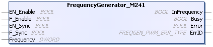

# FrequencyGenerator\_M241: Commanding a Square Wave Signal

## Overview

The Frequency Generator function block commands a square wave signal output at the specified frequency.

## Graphical Representation (LD/FBD)

This illustration is a Frequency Generator function block:

## IL and ST Representation

To see the general representation in IL or ST language, refer to the [*Differences Between a Function and a Function Block*](D-SE-0002383.html#D-SE-0002383) chapter.

## Input Variables

This table describes the input variables:

| Inputs | Type | Comment |
| --- | --- | --- |
| `EN_Enable` | `BOOL` | `TRUE` = authorizes the Frequency Generator enable via the IN\_EN input (if configured). |
| `F_Enable` | `BOOL` | `TRUE` = enables the Frequency Generator. |
| `EN_SYNC` | `BOOL` | `TRUE` = authorizes the restart via the IN\_SYNC input of the internal timer relative to the time base (if configured). |
| `F_SYNC` | `BOOL` | On rising edge, forces a restart of the internal timer relative to the time base. |
| `Frequency` | `DWORD` | Frequency of the Frequency Generator output signal in tenths of Hz.  Range: minimum 1 (0.1 Hz)...maximum 1,000,000 (100 kHz) |

## Output Variables

This table describes the output variables:

| Outputs | Type | Comment |
| --- | --- | --- |
| `InFrequency` | `BOOL` | `TRUE` = the Frequency Generator signal is output at the specified Frequency.  `FALSE` =   * The required frequency cannot be reached for any reason. * `F_Enable` is set to `FALSE`. * `EN_Enable` is set to `FALSE` or no signal detected on the physical input EN Input (if configured). |
| `Busy` | `BOOL` | `Busy` is used to indicate that a command change is in progress: the frequency is changed.  Set to `TRUE` when the `Enable` command is set and the Frequency Generator signal is not output at the specified Frequency.  Reset to `FALSE` when `InFrequency` or `Error` is set, or when the `Enable` command is reset.  When a command change execution is immediate, `Busy` remains `FALSE`. |
| `Error` | `BOOL` | `TRUE` = indicates that an error was detected. |
| `ErrID` | `FREQGEN_PWM_ERR_TYPE` | When `Error` is set: type of the detected error. |

NOTE: When the required frequency cannot be reached for any reason, the `InFrequency` output is not set to `TRUE`, but `Error` stays to `FALSE`.

NOTE: Outputs are forced to 0 when the logic controller is in the STOPPED state.

EIO0000003077.02