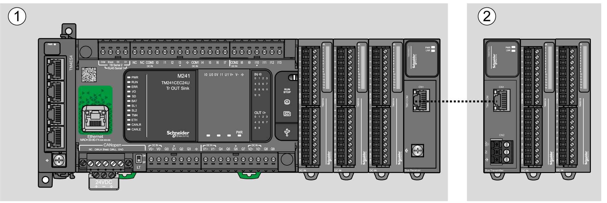
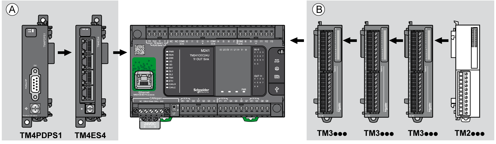
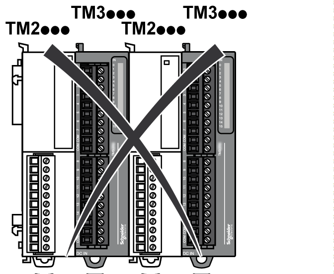
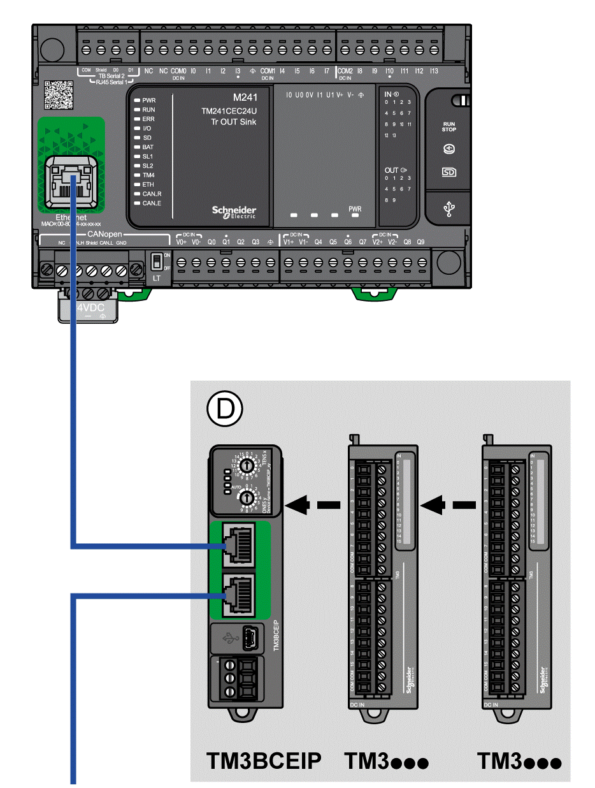

# Maximum Hardware Configuration

## Introduction

The M241 Logic Controller is a control system that offers an all-in-one solution with optimized configurations and an expandable architecture.

## Local and Remote Configuration Principle

The following figure defines the local and remote configurations:

**(1)** Local configuration

**(2)** Remote configuration

## M241 Logic Controller Local Configuration Architecture

Optimized local configuration and flexibility are provided by the association of:

* M241 Logic Controller
* TM4 expansion modules
* TM3 expansion modules
* TM2 expansion modules

Application requirements determine the architecture of your M241 Logic Controller configuration.

The following figure represents the components of a local configuration:

**(A)** Expansion modules (3 maximum)

**(B)** Expansion modules (7 maximum)

NOTE: It is prohibited to mount a TM2 module before any TM3 module as indicated in the following figure:

## M241 Logic Controller Remote Configuration Architecture

Optimized remote configuration and flexibility are provided by the association of:

* M241 Logic Controller
* TM4 expansion modules
* TM3 expansion modules
* TM3 transmitter and receiver modules

Application requirements determine the architecture of your M241 Logic Controller configuration.

NOTE: You cannot use TM2 modules in configurations that include the TM3 transmitter and receiver modules.

The following figure represents the components of a remote configuration:

**(1)** Logic controller and modules

**(C)** TM3 expansion modules (7 maximum)

## M241 Logic Controller Distributed Configuration Architecture

Optimized remote configuration and flexibility are provided by the association of:

* M241 Logic Controller
* [TM3 bus couplers](D-SE-0093341.html)
* [TM5 fieldbus interface](D-SE-0093414.html)

This figure shows the components of a distributed architecture:

**(D)** TM3 distributed modules

## Maximum Number of Modules

The following table shows the maximum configuration supported:

| References | Maximum | Type of Configuration |
| --- | --- | --- |
| TM241•••• | 7 TM3 / TM2 expansion modules | Local |
| TM241•••• | 3 TM4 expansion modules | Local |
| TM3XREC1 | 7 TM3 expansion modules | Remote |
| TM3BCEIP  TM3BCSL  TM3BCCO | 7 TM3 expansion modules without transmitter and receiver  14 TM3 expansion modules with transmitter and receiver | Distributed |
| NOTE: TM3 transmitter and receiver modules and the TM3 Bus Couplers are not included in a count of the maximum number of expansion modules. | | |

NOTE: The configuration with its TM4, TM3, and TM2 expansion modules is validated by the software in the Configuration window.

NOTE: In some environments, the maximum configuration populated by high consummation modules, coupled with the maximum distance allowable between the TM3 transmitter and receiver modules, may present bus communication issues although the software allows for the configuration. In such a case you will need to analyze the power consumption of the modules chosen for your configuration, as well as the minimum cable distance required by your application, and possibly seek to optimize your choices.

EIO0000003083.08