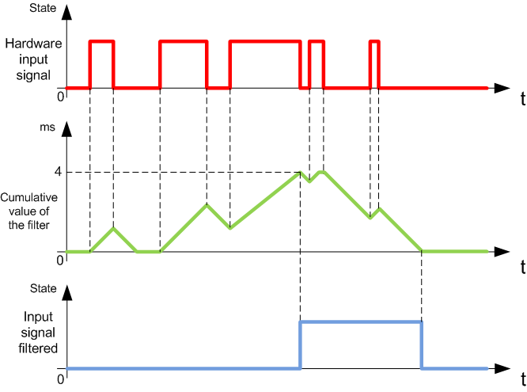
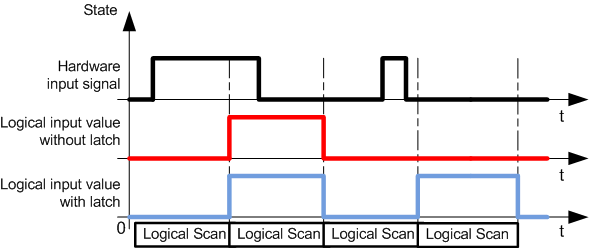

# Input Management

## Overview

The M241 Logic Controller features digital inputs, including 8 fast inputs.

The following functions are configurable:

* Filters (depends on the function associated with the input).
* All inputs can be used for the Run/Stop function.
* 8 fast inputs can be either latched or used for events (rising edge, falling edge, or both) and thus be linked to an external task.

NOTE: All inputs can be used as regular inputs.

## Input Management Functions Availability

Embedded digital inputs can be configured as functions (Run/Stop, events, HSC).

Inputs not configured as functions are used as regular inputs.

The following table shows the possible usage of the M241 Logic Controller digital inputs:

| Function | | Input Function | | | | HSC |
| --- | --- | --- | --- | --- | --- | --- |
| None | RUN/STOP | Latch | Event |
| Filter type | | Integrator | Integrator | Bounce | Bounce |
| **Fast inputs** 1 | | I0...I7 | | | | |
| **Regular inputs** | | I8...I13 2  I8...I23 3 | I8...I13 2  I8...I23 3 | – | – | I8...I13 2, 4  I8...I15 3, 4 |
| **–** No  **1** Can also be used as regular inputs  **2** For M241 with 24 I/O channels  **3** For M241 with 40 I/O channels  **4** Limited to 1 kHz | | | | | | |

## Integrator Filter Principle

The integrator filter is designed to reduce the effect of noise. Setting a filter value allows the logic controller to ignore some sudden changes of input levels caused by noise.

The following timing diagram illustrates the integrator filter effects for a value of 4 ms:

NOTE: The value selected for the filter's time parameter specifies the cumulative time in ms that must elapse before the input can be 1.

## Bounce Filter Principle

The bounce filter is designed to reduce the bouncing effect at the inputs. Setting a bounce filter value allows the controller to ignore some sudden changes of input levels caused by electrical noise. The bounce filter is only available on the fast inputs.

The following timing diagram illustrates the anti-bounce filter effects:

## Bounce Filter Availability

The bounce filter can be used on a fast input when:

* Using a latch or event
* HSC is enabled

## Latching

Latching is a function that can be assigned to the M241 Logic Controller fast inputs. This function is used to memorize (or latch) any pulse with a duration that is less than the M241 Logic Controller scan time.

When a pulse is shorter than one scan, the controller latches the pulse, which is then updated in the next scan. This latching mechanism only recognizes rising edges. Falling edges cannot be latched. Assigning inputs to be latched is done in the software I/O Configuration tab.

The following timing diagram illustrates the latching effects:

## Event

An input configured for Event can be associated with an [External Task](../../../../../api/crossBook?lang=en-US&virtualBookName=m241prg&topicID=D_SE_0008842).

## Run/Stop

The Run/Stop function is used to start or stop an application program using an input. In addition to the embedded Run/Stop switch, it is allowed to configure one (and only one) input as an additional Run/Stop command.

For more information, refer to [Run/Stop](D-SE-0034418.html#D-SE-0034418).

| WARNING | |
| --- | --- |
|  | UNINTENDED MACHINE OR PROCESS START-UP  * Verify the state of security of your machine or process environment before applying power to the Run/Stop input. * Use the Run/Stop input to help prevent the unintentional start-up from a remote location.  Failure to follow these instructions can result in death, serious injury, or equipment damage. |

| WARNING | |
| --- | --- |
|  | UNINTENDED EQUIPMENT OPERATION  Use the sensor and actuator power supply only for supplying power to sensors or actuators connected to the module.  Failure to follow these instructions can result in death, serious injury, or equipment damage. |

EIO0000003083.08