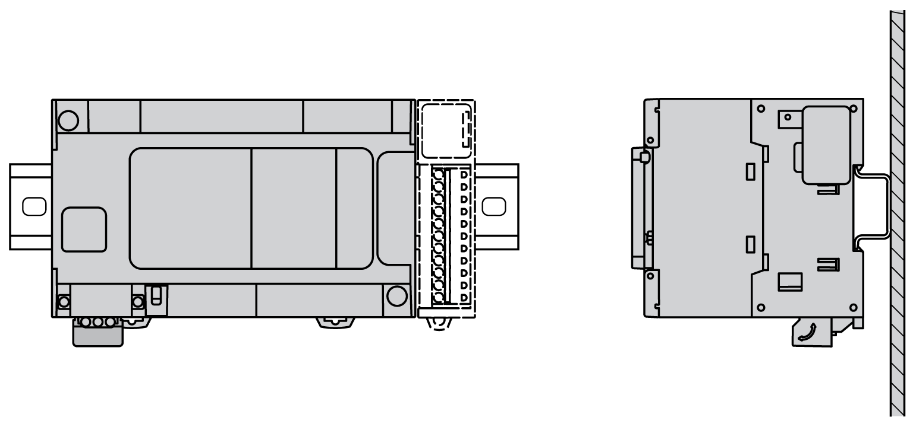
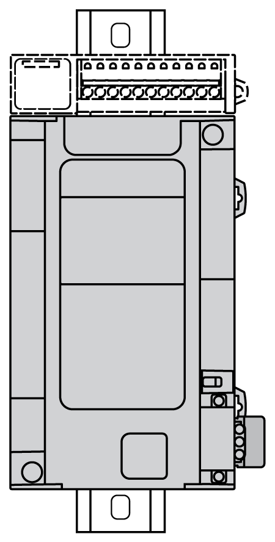
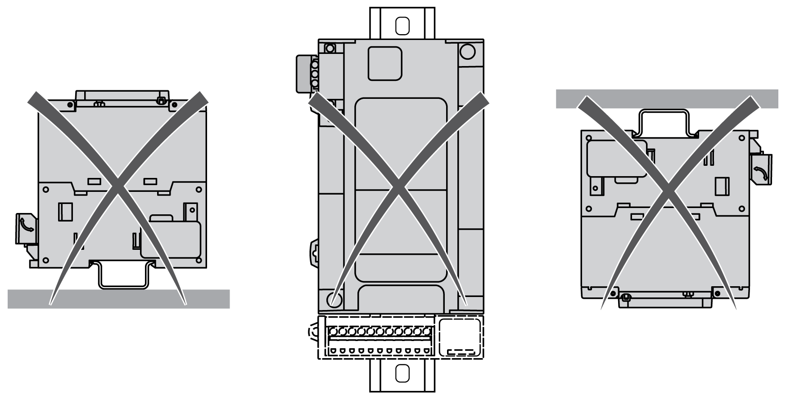
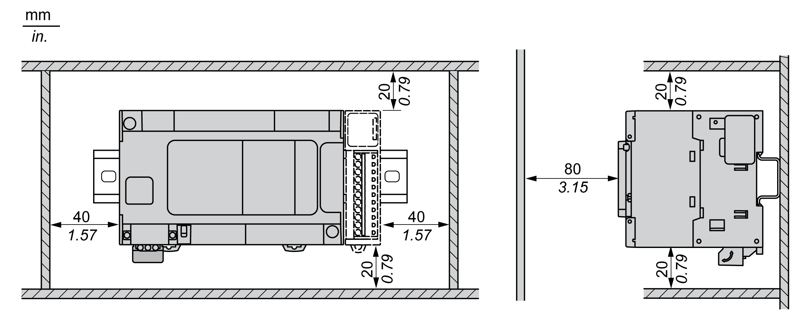

# M241 Logic Controller Mounting Positions and Clearances

## Introduction

This section describes the mounting positions for the M241 Logic Controller.

NOTE: Keep adequate spacing for proper ventilation and to maintain the operating temperature specified in the [Environmental Characteristics](D-SE-0025088.html#D-SE-0025088__D-SE-0025088.8).

## Correct Mounting Position

Whenever possible, the M241 Logic Controller should be mounted horizontally on a vertical plane as shown in the figure below:

## Acceptable Mounting Position

The M241 Logic Controller can also be mounted vertically with a temperature derating on a vertical plane as shown below:

NOTE: In a vertical installation, TM3 expansion modules must be mounted above the logic controller.

## Incorrect Mounting Positions

The M241 Logic Controller should only be positioned as shown in [Correct Mounting Position](#D-SE-0025968__D-SE-0025968.4) figure. The figures below show the incorrect mounting positions:

## Minimum Clearances

| WARNING | |
| --- | --- |
|  | UNINTENDED EQUIPMENT OPERATION  * Place devices dissipating the most heat at the top of the cabinet and ensure adequate ventilation. * Avoid placing this equipment next to or above devices that might cause overheating. * Install the equipment in a location providing the minimum clearances from all adjacent structures and equipment as directed in this document. * Install all equipment in accordance with the specifications in the related documentation.  Failure to follow these instructions can result in death, serious injury, or equipment damage. |

The M241 Logic Controller has been designed as an IP20 product and must be installed in an enclosure. Clearances must be respected when installing the product.

There are 3 types of clearances between:

* The M241 Logic Controller and all sides of the cabinet (including the panel door).
* The M241 Logic Controller terminal blocks and the wiring ducts. This distance reduces electromagnetic interference between the controller and the wiring ducts.
* The M241 Logic Controller and other heat generating devices installed in the same cabinet.

The following figure shows the minimum clearances that apply to all M241 Logic Controller references:

EIO0000003083.08