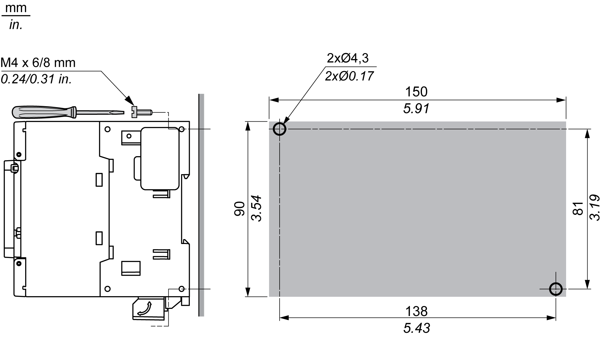
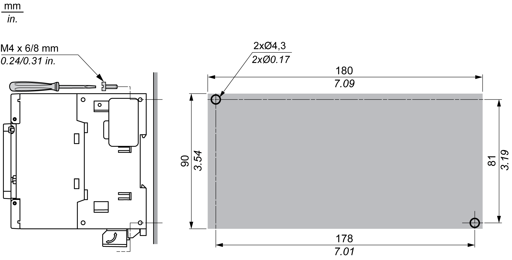

# Direct Mounting on a Panel Surface

## Mounting Hole Layout

The following diagram shows the mounting hole layout for M241 Logic Controller with 24 I/O channels:

The following diagram shows the mounting hole layout for M241 Logic Controller with 40 I/O channels:

EIO0000003083.08