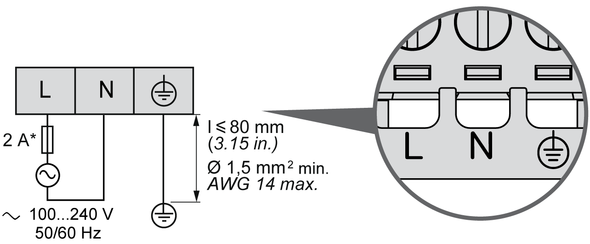

# AC Power Supply Characteristics and Wiring

## Overview

This section provides the wiring diagrams and the characteristics of the AC power supply.

## AC Power Supply Voltage Range

If the specified voltage range is not maintained, outputs may not switch as expected. Use appropriate safety interlocks and voltage monitoring circuits.

| DANGER | |
| --- | --- |
|  | FIRE HAZARD  * Use only the correct wire sizes for the maximum current capacity of the I/O channels and power supplies. * For relay output (2 A) wiring, use conductors of at least 0.5 mm2 (AWG 20) with a temperature rating of at least 80 °C (176 °F). * For common conductors of relay output wiring (7 A), or relay output wiring greater than 2 A, use conductors of at least 1.0 mm2 (AWG 16) with a temperature rating of at least 80 °C (176 °F).  Failure to follow these instructions will result in death or serious injury. |

| WARNING | |
| --- | --- |
|  | UNINTENDED EQUIPMENT OPERATION  Do not exceed any of the rated values specified in the environmental and electrical characteristics tables.  Failure to follow these instructions can result in death, serious injury, or equipment damage. |

## Controller AC Characteristics

The following table shows the AC power supply characteristics:

| Characteristic | | Value | |
| --- | --- | --- | --- |
| Voltage | rated | 100...240 Vac | |
| limit (including ripple) | 85...264 Vac | |
| Frequency | | 50/60 Hz | |
| Power interruption time | at 100 Vac | 10 ms | |
| Maximum inrush current | at 240 Vac | 56.2 A | |
| Typical power consumption | at 100 Vac | 93.7 VA | |
| at 240 Vac | 122.6 VA | |
| Isolation | between AC power supply and internal logic | 1780 Vac | |
| between AC power supply and protective earth ground (PE) | 2500 Vdc | |
| NOTE: The controller is intended for the connection of single phase TN, TT or IT power system (star networks), input voltage derived from the Line-to-Neutral Voltage. | | | |

NOTE: Surface temperatures may exceed 120 °C (248 °F).

| WARNING | |
| --- | --- |
|  | HOT SURFACES  * Avoid unprotected contact with hot surfaces. * Do not allow flammable or heat-sensitive parts in the immediate vicinity of hot surfaces. * Verify that the heat dissipation is sufficient by performing a test run under maximum load conditions.  Failure to follow these instructions can result in death, serious injury, or equipment damage. |

## Power interruption

The duration of power interruptions where the M241 Logic Controller is able to continue normal operation varies depending upon the load to the power supply of the controller, but generally a minimum of 10 ms is maintained as specified by IEC standards.

When planning the management of the power supplied to the controller, you must consider the duration due to the fast cycle time.

There could potentially be many scans of the logic and consequential updates to the I/O image table during the power interruption, while there is no external power supplied to the inputs, the outputs or both depending on the power system architecture and power interruption circumstances.

| WARNING | |
| --- | --- |
|  | UNINTENDED EQUIPMENT OPERATION  * Individually monitor each source of power used in the Modicon M241 Logic Controller system including input power supplies, output power supplies and the power supply to the controller to allow appropriate system shutdown during power system interruptions. * The inputs monitoring each of the power supply sources must be unfiltered inputs.  Failure to follow these instructions can result in death, serious injury, or equipment damage. |

## AC Power Supply Wiring Diagram

The following figure shows the wiring of the AC power supply:

**\*** Use an external, slow-blow, type T fuse.

EIO0000003083.08