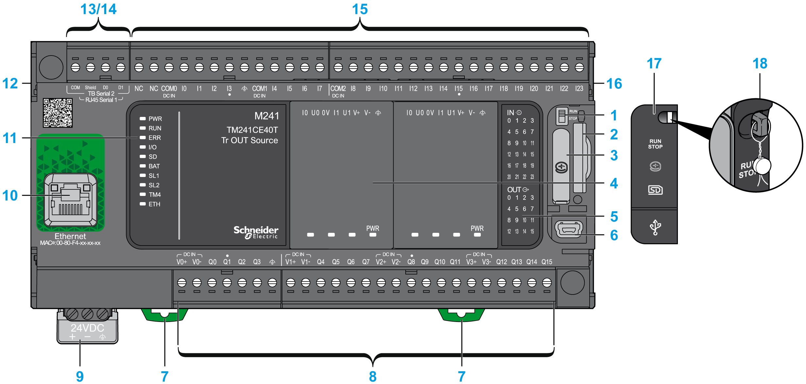
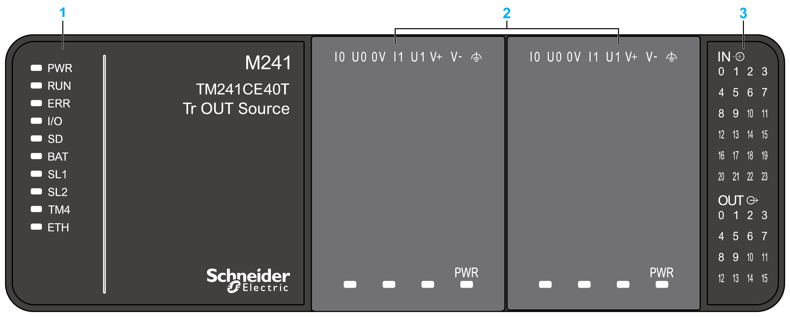
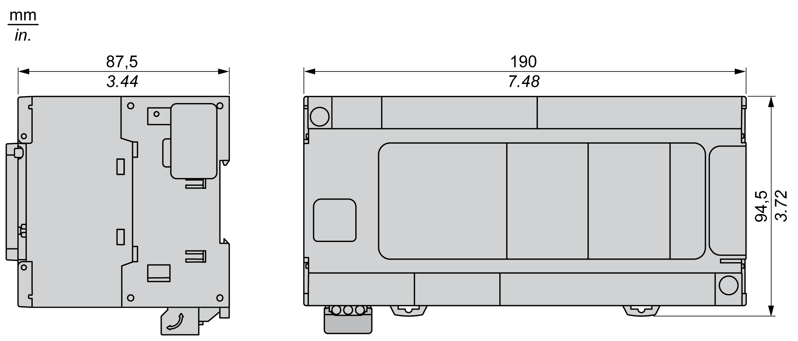

# TM241CE40T Presentation

## Overview

The TM241CE40T logic controller has:

* 24 digital inputs:

  + 8 fast inputs
  + 16 regular inputs
* 16 digital outputs:

  + 4 fast outputs
  + 12 regular outputs
* Communication ports:

  + 2 serial line ports
  + 1 Ethernet port
  + 1 USB mini-B programming port

## Description

The following figure shows the different components of the TM241CE40T logic controller:

| N° | Description | Refer to |
| --- | --- | --- |
| 1 | Run/Stop switch | [Run/Stop](D-SE-0034418.html#D-SE-0034418) |
| 2 | SD card slot | [SD Card](D-SE-0027501.html#D-SE-0027501) |
| 3 | Battery holder | [Real Time Clock (RTC)](D-SE-0025710.html#D-SE-0025710) |
| 4 | Cartridge slot | [TMC4 Cartridges](D-SE-0036337.html) |
| 5 | LEDs for indicating I/O states | [Digital Inputs Status LEDs](D-SE-0032247.html#D-SE-0032247__D-SE-0032247.7) |
| [Transistor Outputs Status LEDs](D-SE-0032248.html#D-SE-0032248__D-SE-0032248.9)  [Fast Outputs Status LEDs](D-SE-0032259.html#D-SE-0032259__D-SE-0032259.12) |
| 6 | USB mini-B programming port (for terminal connection to a programming PC) | [USB Mini-B Programming Port](D-SE-0029629.html#D-SE-0029629) |
| 7 | Clip-on lock for 35 mm (1.38 in.) top hat section rail (DIN-rail) | [Top Hat Section Rail (DIN rail)](TopHatSectionRailDINRail-8CC2B316.html) |
| 8 | Embedded regular transistor outputs | [Regular Transistor Outputs](D-SE-0032248.html#D-SE-0032248) |
| Embedded fast transistor outputs | [Fast Transistor Outputs](D-SE-0032259.html#D-SE-0032259) |
| Output removable terminal block | [Rules for Removable Screw Terminal Block](D-SE-0025949.html#D-SE-0025949__D-SE-0025949.8) |
| 9 | 24 Vdc power supply | [DC Power supply Characteristics and Wiring](D-SE-0034419.html#D-SE-0034419) |
| 10 | Ethernet port (type RJ45 (RS-232 or RS-485)) | [Ethernet Port](D-SE-0034492.html#D-SE-0034492) |
| 11 | Status LEDs | – |
| 12 | TM4 bus connector | [TM4 Expansion Modules](D-SE-0036324.html#D-SE-0036324) |
| 13 | Serial line port 1 (type RJ45 (RS-232 or RS-485)) | [Serial Line 1](D-SE-0025808.html#D-SE-0025808) |
| 14 | Serial line port 2 (screw terminal block type (RS-485)) | [Serial Line 2](D-SE-0034493.html#D-SE-0034493) |
| 15 | Embedded digital inputs | [Embedded Digital Inputs](D-SE-0032247.html#D-SE-0032247) |
| Input removable terminal block | [Rules for Removable Screw Terminal Block](D-SE-0025949.html#D-SE-0025949__D-SE-0025949.8) |
| 16 | TM3 / TM2 bus connector | [TM3 Expansion Modules](D-SE-0025087.html#D-SE-0025087) |
| 17 | Protective cover (SD card slot, Run/Stop switch and USB mini-B programming port) | – |
| 18 | Locking hook (optional lock not included) | – |

## Status LEDs

The following figure shows the status LEDs:

**1** System status LEDs

**2** Cartridge status LEDs (optional)

**3** I/Os status LEDs

The following table describes the system status LEDs:

| Label | Function Type | Color | Status | Description | | |
| --- | --- | --- | --- | --- | --- | --- |
| PWR | Power | Green | On | Indicates that power is applied. | | |
| Off | Indicates that power is removed. | | |
| RUN | Machine status | Green | On | Indicates that the controller is running a valid application. | | |
| Regular flash | Indicates that the controller has a valid application that is stopped. | | |
| Single flash | Indicates that the controller has paused at BREAKPOINT. | | |
| Off | Indicates that the controller is not programmed. | | |
| ERR | Error | Red | On | An operating system error has been detected. (1) | | |
| Fast flash | The controller has detected an internal error. (1) | | |
| Regular flash | Indicates either that a minor error has been detected, if the **RUN** LED is illuminated, or that no application has been detected. (2) | | |
| I/O | I/O error | Red | On | Indicates device errors on the embedded I/Os, serial line 1 or 2, SD card, cartridge, TM4 bus, TM3 bus, or Ethernet port. | | |
| SD | SD card access | Green | On | Indicates that the SD card is being accessed. | | |
| BAT | Battery | Red | On | Indicates that the battery needs to be replaced. | | |
| Regular flash | Indicates that the battery charge is low. | | |
| SL1 | Serial line 1 | Green | Flashing | Indicates the [status of serial line 1](D-SE-0025808.html#D-SE-0025808__D-SE-0025808.8). | | |
| Off | Indicates no serial communication. | | |
| SL2 | Serial line 2 | Green | Flashing | Indicates the [status of serial line 2](D-SE-0034493.html#D-SE-0034493__D-SE-0034493.8). | | |
| Off | Indicates no serial communication. | | |
| TM4 | Error on TM4 bus | Red | On | Indicates that an error has been detected on the TM4 bus. | | |
| Off | Indicates that no error has been detected on the TM4 bus. | | |
| ETH | Ethernet port status | Green | On | Indicates that the Ethernet port is connected and the IP address is defined. | | |
| 3 flashes | Indicates that the Ethernet port is not connected. | | |
| 4 flashes | Indicates that the IP address is already in used. | | |
| 5 flashes | Indicates that the module is waiting for BOOTP or DHCP sequence. | | |
| 6 flashes | Indicates that the configured IP address is not valid. | | |
| **(1)** The Prg Port Communication is restricted and there is no application execution.  **(2)** The Prg Port Communication is enabled, but there is no application execution. | | | | | | |

This timing diagram shows the difference between the fast flash, regular flash and single flash:

## Dimensions

The following figure shows the external dimensions of the TM241CE40T logic controller:

EIO0000003083.08