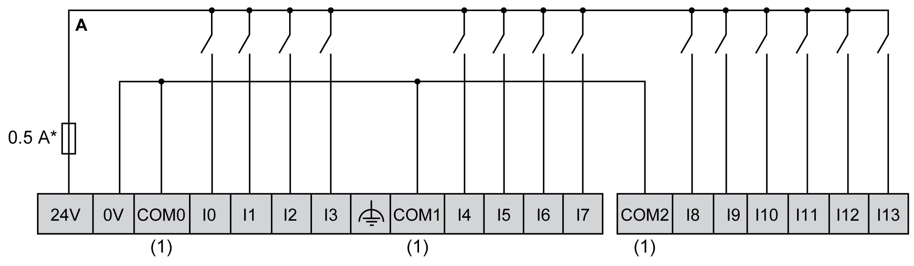
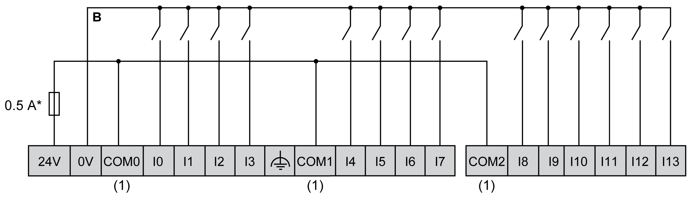
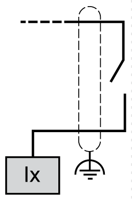
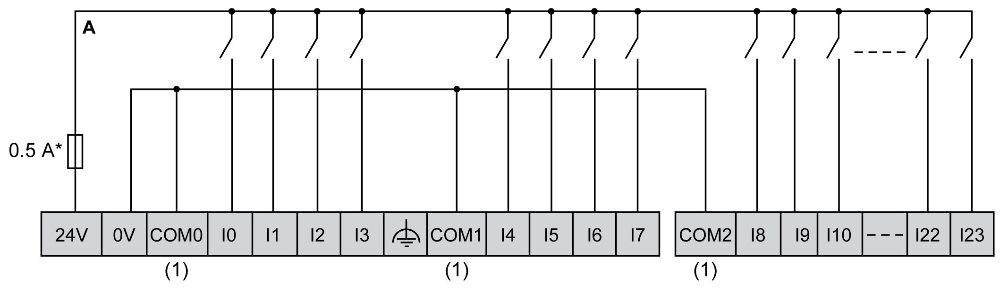
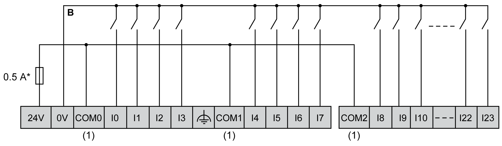
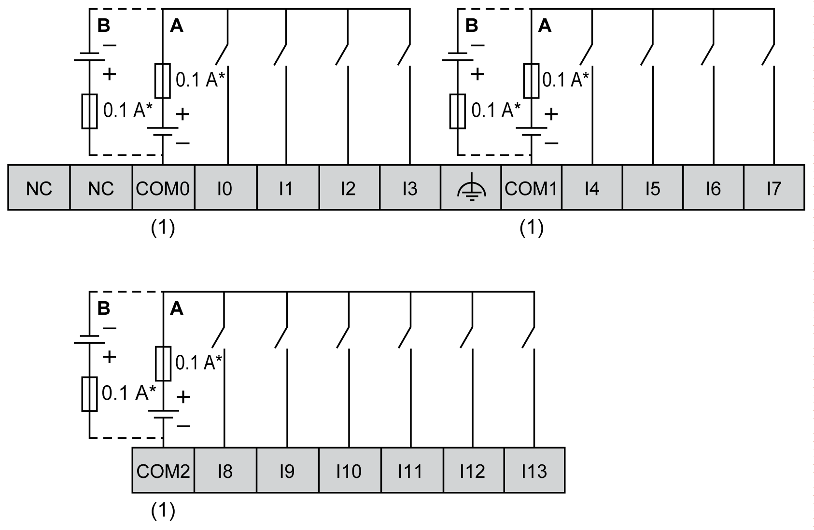
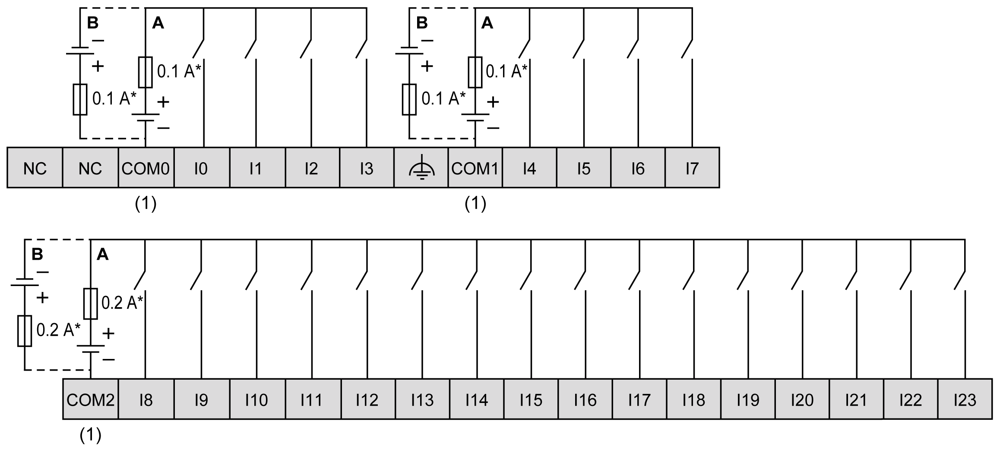

# Digital Inputs

## Overview

The Modicon M241 Logic Controller has digital inputs embedded:

| Reference | Total number of digital inputs | Fast inputs which can be used as 200 kHz HSC inputs | Total number of regular inputs | Regular inputs which can be used as 1 kHz HSC inputs |
| --- | --- | --- | --- | --- |
| TM241C••24R  TM241C••24T  TM241C••24U | 14 | 8 | 6 | 6 |
| TM241C•40R  TM241C•40T  TM241C•40U | 24 | 8 | 16 | 8 |

For more information, refer to [Input Management](D-SE-0034335.html#D-SE-0034335).

| DANGER | |
| --- | --- |
|  | FIRE HAZARD  * Use only the correct wire sizes for the maximum current capacity of the I/O channels and power supplies. * For relay output (2 A) wiring, use conductors of at least 0.5 mm2 (AWG 20) with a temperature rating of at least 80 °C (176 °F). * For common conductors of relay output wiring (7 A), or relay output wiring greater than 2 A, use conductors of at least 1.0 mm2 (AWG 16) with a temperature rating of at least 80 °C (176 °F).  Failure to follow these instructions will result in death or serious injury. |

| WARNING | |
| --- | --- |
|  | UNINTENDED EQUIPMENT OPERATION  Do not exceed any of the rated values specified in the environmental and electrical characteristics tables.  Failure to follow these instructions can result in death, serious injury, or equipment damage. |

## Digital Input Status LEDs

The following figure shows the status LEDs for the TM241C••24• controller (the TM241C•40• controllers are similar with 40 LEDs):

| LED | Color | Status | Description |
| --- | --- | --- | --- |
| 0...13 | Green | On | The input channel is activated |
| Off | The input channel is deactivated |

## Regular Input Characteristics

The table below describes the characteristics of the M241 Logic Controller with regular inputs:

| Characteristic | | Values | |
| --- | --- | --- | --- |
| TM241C••24• | TM241C•40• |
| Number of regular inputs | | 6 inputs (I8...I13) | 16 inputs (I8...I23) |
| Number of channel groups | | 1 common line for I8...I13 | 1 common line for I8...I23 |
| Input type | | Type 1 (IEC 61131-2 Edition 3) | |
| Logic type | | Sink/Source | |
| Input voltage range | | 24 Vdc | |
| Rated input voltage | | 0...28.8 Vdc | |
| Rated input current | | 5 mA | 7 mA |
| Input impedance | | 4.7 kΩ | |
| Input limit values | Voltage at state 1 | > 15 Vdc (15...28.8 Vdc) | |
| Voltage at state 0 | < 5 Vdc (0...5 Vdc) | |
| Current at state 1 | > 2.5 mA | |
| Current at state 0 | < 1.0 mA | |
| Derating | | No derating | |
| Turn on time | | 50 µs + filter value1 | |
| Turn off time | | 50 µs + filter value1 | |
| Isolation | Between input and internal logic | 500 Vac | |
| Between input terminals | Not Isolated | |
| Connection type | | Removable screw terminal block | |
| Connector insertion/removal durability | | Over 100 times | |
| Cable | Type | Unshielded | |
| Length | Maximum 50 m (164 ft) | |
| **1** For more information, refer to [Integrator Filter Principle](D-SE-0034335.html#D-SE-0034335__D-SE-0034335.11) | | | |

## Fast Input Characteristics

The table below describes the characteristics of the M241 Logic Controller with fast inputs:

| Characteristic | | Value | |
| --- | --- | --- | --- |
| Number of fast transistor inputs | | 8 inputs (I0...I7) | |
| Number of channel groups | | 1 common line for I0...I3  1 common line for I4...I7 | |
| Input type | | Type 1 (IEC 61131-2 Edition 3) | |
| Logic type | | Sink/Source | |
| Rated input voltage | | 24 Vdc | |
| Input voltage range | | 0...28.8 Vdc | |
| Rated input current | | 10.7 mA | |
| Input impedance | | 2.81 kΩ | |
| Input limit values | Voltage at state 1 | > 15 Vdc (15...28.8 Vdc) | |
| Voltage at state 0 | < 5 Vdc (0...5 Vdc) | |
| Current at state 1 | > 5 mA | |
| Current at state 0 | < 1.5 mA | |
| Derating | | No derating | |
| Turn on time | | 2 µs + filter value1 | |
| Turn off time | | 2 µs + filter value1 | |
| HSC maximum frequency | A/B phase | 100 kHz | |
| Pulse/Direction | 200 kHz | |
| Single phase | 200 kHz | |
| HSC supported operation mode | | * A/B phase counter * Pulse/Direction counter * Single/Dual phase counter | |
| Isolation | Between input and internal logic | 500 Vac | |
| Between input terminals | Not isolated | |
| Connection type | | Removable screw terminal block | |
| Connector insertion/removal durability | | Over 100 times | |
| Cable | Type | Shielded, including the 24 Vdc power supply | |
| Length | Maximum 10 m (32.8 ft) | |
|  | | | |
| **1** For more information, refer to [Integrator Filter Principle](D-SE-0034335.html#D-SE-0034335__D-SE-0034335.11) | | | |

## Removing Terminal Block

Refer to [Removing Terminal Block](D-SE-0025949.html#D-SE-0025949__D-SE-0025949.10).

## TM241C••24R Wiring Diagrams

The following figure shows the sink wiring (positive logic) of the controller digital inputs:

**\*** Type T fuse

**(1)** The COM0, COM1 and COM2 terminals are **not** connected internally.

The following figure shows the source wiring (negative logic) of the controller digital inputs:

**\*** Type T fuse

**(1)** The COM0, COM1 and COM2 terminals are **not** connected internally.

Fast input wiring for I0... I7:

## TM241C•40R Wiring Diagrams

The following figure shows the sink wiring (positive logic) of the controller digital inputs:

**\*** Type T fuse

**(1)** The COM0, COM1 and COM2 terminals are **not** connected internally.

The following figure shows the source wiring (negative logic) of the controller digital inputs:

**\*** Type T fuse

**(1)** The COM0, COM1 and COM2 terminals are **not** connected internally.

Fast input wiring for I0... I7:

## TM241C••24T / TM241C••24U Wiring Diagrams

The following figure shows the connection of the controller digital inputs:

**\*** Type T fuse

**(1)** The COM0, COM1 and COM2 terminals are **not** connected internally.

**A** Sink wiring (positive logic).

**B** Source wiring (negative logic).

Fast input wiring for I0... I7:

| WARNING | |
| --- | --- |
|  | UNINTENDED EQUIPMENT OPERATION  Do not connect wires to unused terminals and/or terminals indicated as “No Connection (N.C.)”.  Failure to follow these instructions can result in death, serious injury, or equipment damage. |

## TM241C•40T / TM241C•40U Wiring Diagrams

The following figure shows the connection of the controller digital inputs:

**\*** Type T fuse

**(1)** The COM0, COM1 and COM2 terminals are **not** connected internally.

**A** Sink wiring (positive logic).

**B** Source wiring (negative logic).

Fast input wiring for I0... I7:

| WARNING | |
| --- | --- |
|  | UNINTENDED EQUIPMENT OPERATION  Do not connect wires to unused terminals and/or terminals indicated as “No Connection (N.C.)”.  Failure to follow these instructions can result in death, serious injury, or equipment damage. |

EIO0000003083.08