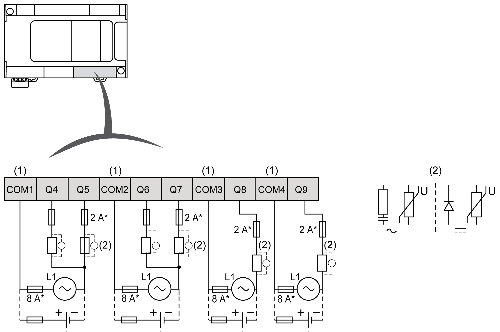
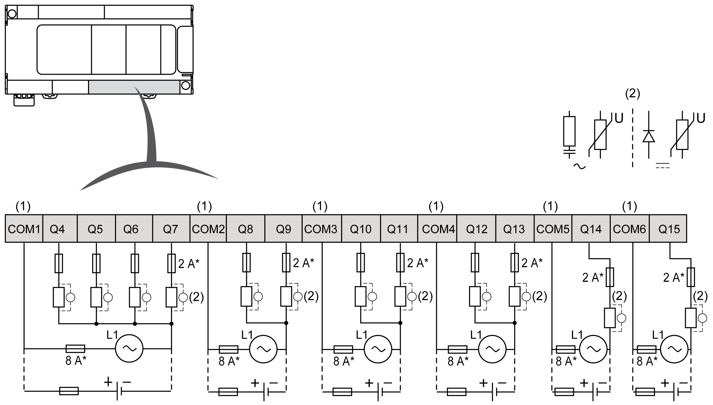

# Relay Outputs

## Overview

The Modicon M241 Logic Controller has digital outputs embedded:

| Reference | Total number of digital outputs | [Fast transistor outputs](D-SE-0032259.html#D-SE-0032259__D-SE-0032259.12) (1) | [Relay outputs](D-SE-0036599.html#D-SE-0036599__D-SE-0036599.5) | [Regular transistor outputs](D-SE-0032248.html#D-SE-0032248__D-SE-0032248.9) |
| --- | --- | --- | --- | --- |
| TM241C••24R | 10 | 4 | 6 | 0 |
| TM241C••24T  TM241C••24U | 10 | 4 | 0 | 6 |
| TM241C•40R | 16 | 4 | 12 | 0 |
| TM241C•40T  TM241C•40U | 16 | 4 | 0 | 12 |
| **(1)** Fast transistor outputs which can be used as 100 kHz PTO outputs | | | | |

For more information, refer to [Output Management](D-SE-0025722.html#D-SE-0025722).

| DANGER | |
| --- | --- |
|  | FIRE HAZARD  * Use only the correct wire sizes for the maximum current capacity of the I/O channels and power supplies. * For relay output (2 A) wiring, use conductors of at least 0.5 mm2 (AWG 20) with a temperature rating of at least 80 °C (176 °F). * For common conductors of relay output wiring (7 A), or relay output wiring greater than 2 A, use conductors of at least 1.0 mm2 (AWG 16) with a temperature rating of at least 80 °C (176 °F).  Failure to follow these instructions will result in death or serious injury. |

| WARNING | |
| --- | --- |
|  | UNINTENDED EQUIPMENT OPERATION  Do not exceed any of the rated values specified in the environmental and electrical characteristics tables.  Failure to follow these instructions can result in death, serious injury, or equipment damage. |

## Relay Outputs Status LEDs

The following figure shows the status LEDs for the TM241C••24• controller (the TM241C•40• controllers are similar with 40 LEDs):

| LED | Color | Status | Description |
| --- | --- | --- | --- |
| 0...9 | Green | On | The output channel is activated |
| Off | The output channel is deactivated |

## Relay Outputs Characteristics

The following table describes the characteristics of the M241 Logic Controller relay outputs:

| Characteristic | | Value | |
| --- | --- | --- | --- |
| TM241C••24R | TM241C•40R |
| Number of relay output channels | | 6 outputs (Q4...Q9) | 12 outputs (Q4...Q15) |
| Number of channel groups | | 1 common line for Q4, Q5  1 common line for Q6, Q7  1 line for Q8  1 line for Q9 | 1 common line for Q4...Q7  1 common line for Q8, Q9  1 common line for Q10, Q11  1 common line for Q12, Q13  1 line for Q14  1 line for Q15 |
| Output type | | Relay | |
| Contact type | | NO (Normally Open) | |
| Rated output voltage | | 24 Vdc, 240 Vac | |
| Maximum voltage | | 30 Vdc, 264 Vac | |
| Minimum switching load | | 5 Vdc at 10 mA | |
| Derating | | No derating | Derating on Q4...Q7, refer to the note 2. |
| Rated output current | | 2 A | |
| Maximum output current | | 2 A per output | |
| 4 A per common | |
| Maximum output frequency with maximum load | | 20 operations per minute | |
| Turn on time | | Max. 10 ms | |
| Turn off time | | Max. 10 ms | |
| Contact resistance | | 30 mΩ max | |
| Mechanical life | | 20 million operations | |
| Electrical life | Under resistive load | See power limitation | |
| Under inductive load |
| Protection against short circuit | | No | |
| Isolation | Between output and internal logic | 500 Vac | |
| Between channel groups | 1500 Vac | |
| Connection type | | Removable screw terminal blocks | |
| Connector insertion/removal durability | | Over 100 times | |
| Cable | Type | Unshielded | |
| Length | Max. 30 m (98 ft) | |
| **(1)** Refer to [Protecting Outputs from Inductive Load Damage](D-SE-0025949.html#D-SE-0025949__D-SE-0025949.6) for additional information concerning output protection.  **(2)** When Q4, Q5, Q6 and Q7 are on the same common line (max output current 4 A), those 4 outputs used simultaneously have a derating of 50%. | | | |

## Power Limitation

The following table describes the power limitation of the relay outputs depending on the voltage, the type of load, and the number of operations required.

These controllers do not support capacitive loads.

| WARNING | |
| --- | --- |
|  | RELAY OUTPUTS WELDED CLOSED  * Always protect relay outputs from inductive alternating current load damage using an appropriate external protective circuit or device. * Do not connect relay outputs to capacitive loads.  Failure to follow these instructions can result in death, serious injury, or equipment damage. |

| Power Limitations | | | | |
| --- | --- | --- | --- | --- |
| **Voltage** | **24 Vdc** | **120 Vac** | **240 Vac** | **Number of operations** |
| Power of resistive loads  AC-12 | – | 240 VA  80 VA | 480 VA  160 VA | 100,000  300,000 |
| Power of inductive loads  AC-15 (cos ϕ = 0.35) | – | 60 VA  18 VA | 120 VA  36 VA | 100,000  300,000 |
| Power of inductive loads  AC-14 (cos ϕ = 0.7) | – | 120 VA  36 VA | 240 VA  72 VA | 100,000  300,000 |
| Power of resistive loads  DC-12 | 48 W  16 W | – | – | 100,000  300,000 |
| Power of inductive loads  DC-13 L/R = 7 ms | 24 W  7.2 W | – | – | 100,000  300,000 |

## Removing Terminal Block

Refer to [Removing Terminal Block](D-SE-0025949.html#D-SE-0025949__D-SE-0025949.10).

## TM241C••24R Relay Outputs Wiring Diagrams

The following figure shows the wiring of the outputs:

**\*** Type T fuse

**(1)** The terminals COM1 to COM4 are **not** connected internally.

**(2)** To improve the life time of the contacts, and to protect from potential inductive load damage, you must connect a free wheeling diode in parallel to each inductive DC load or an RC snubber in parallel of each inductive AC load.

Refer to [Protecting Outputs from Inductive Load Damage](D-SE-0025949.html#D-SE-0025949__D-SE-0025949.6) for additional information concerning output protection.

NOTE: The assigned fuse values have been specified for the maximum current characteristics of the controller I/O and associated commons. You may have other considerations that are applicable based on the unique types of input and output devices you connect, and you should size your fuses accordingly.

## TM241C•40R Relay Outputs Wiring Diagrams

The following figure shows the wiring of the outputs:

**\*** Type T fuse

**(1)** The terminals COM1 to COM6 are **not** connected internally.

**(2)** To improve the life time of the contacts, and to protect from potential inductive load damage, you must connect a free wheeling diode in parallel to each inductive DC load or an RC snubber in parallel of each inductive AC load.

Refer to [Protecting Outputs from Inductive Load Damage](D-SE-0025949.html#D-SE-0025949__D-SE-0025949.6) for additional information concerning output protection.

NOTE: The assigned fuse values have been specified for the maximum current characteristics of the controller I/O and associated commons. You may have other considerations that are applicable based on the unique types of input and output devices you connect, and you should size your fuses accordingly.

EIO0000003083.08