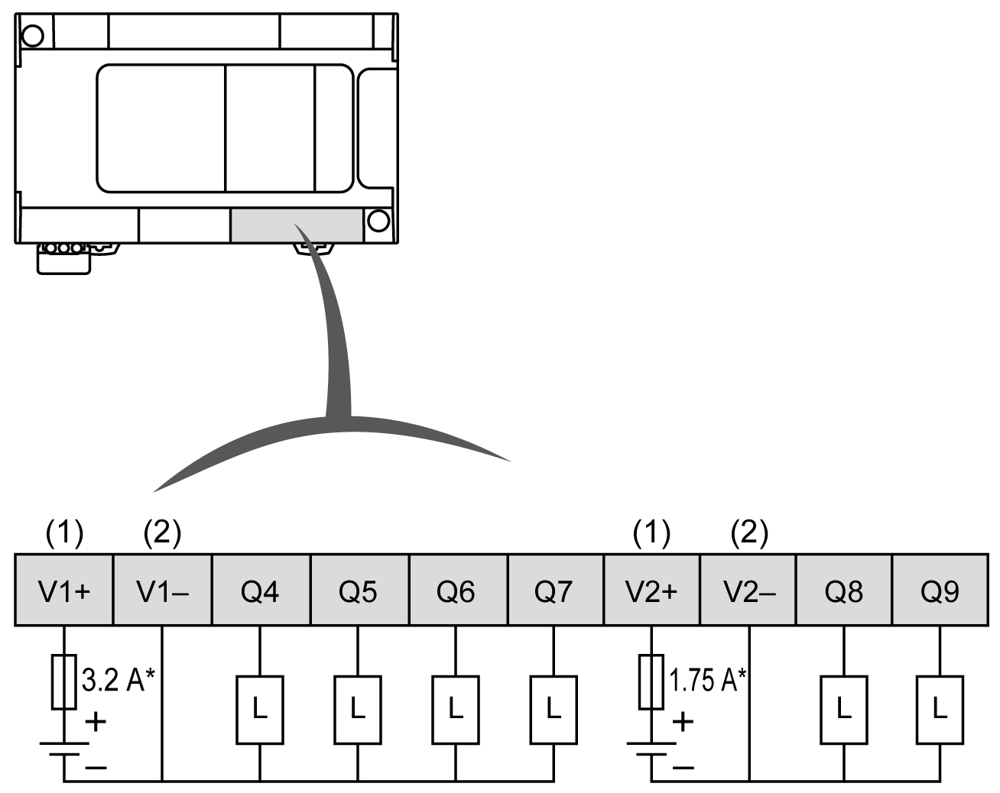
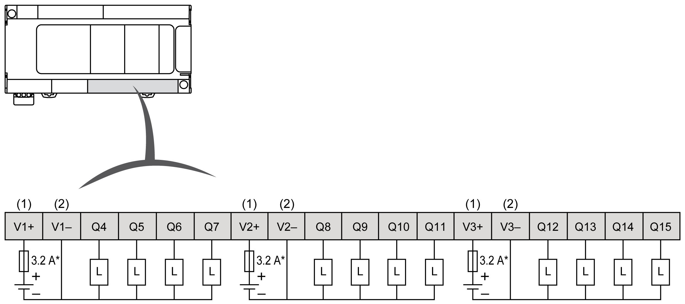
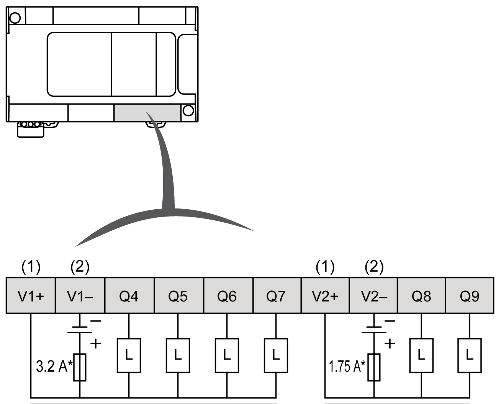
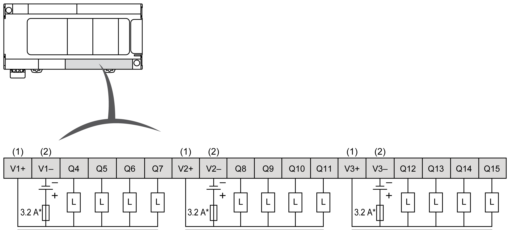

# Regular Transistor Outputs

## Overview

The Modicon M241 Logic Controller has digital outputs embedded:

| Reference | Total number of digital outputs | [Fast transistor outputs](D-SE-0032259.html#D-SE-0032259__D-SE-0032259.12) (1) | [Relay outputs](D-SE-0036599.html#D-SE-0036599__D-SE-0036599.5) | [Regular transistor outputs](D-SE-0032248.html#D-SE-0032248__D-SE-0032248.9) |
| --- | --- | --- | --- | --- |
| TM241C••24R | 10 | 4 | 6 | 0 |
| TM241C••24T  TM241C••24U | 10 | 4 | 0 | 6 |
| TM241C•40R | 16 | 4 | 12 | 0 |
| TM241C•40T  TM241C•40U | 16 | 4 | 0 | 12 |
| **(1)** Fast transistor outputs which can be used as 100 kHz PTO outputs | | | | |

For more information, refer to [Output Management](D-SE-0025722.html#D-SE-0025722).

| DANGER | |
| --- | --- |
|  | FIRE HAZARD  * Use only the correct wire sizes for the maximum current capacity of the I/O channels and power supplies. * For relay output (2 A) wiring, use conductors of at least 0.5 mm2 (AWG 20) with a temperature rating of at least 80 °C (176 °F). * For common conductors of relay output wiring (7 A), or relay output wiring greater than 2 A, use conductors of at least 1.0 mm2 (AWG 16) with a temperature rating of at least 80 °C (176 °F).  Failure to follow these instructions will result in death or serious injury. |

| WARNING | |
| --- | --- |
|  | UNINTENDED EQUIPMENT OPERATION  Do not exceed any of the rated values specified in the environmental and electrical characteristics tables.  Failure to follow these instructions can result in death, serious injury, or equipment damage. |

## Regular Transistor Outputs Status LEDs

The following figure shows the status LEDs for the TM241C••24• controller (the TM241C•40• controllers are similar with 40 LEDs):

| LED | Color | Status | Description |
| --- | --- | --- | --- |
| 0...9 | Green | On | The output channel is activated |
| Off | The output channel is deactivated |

## Regular Transistor Outputs Characteristics

The following table describes the characteristics of the M241 Logic Controller regular transistor outputs:

| Characteristic | | TM241C••24T | TM241C••24U | TM241C•40T | TM241C•40U |
| --- | --- | --- | --- | --- | --- |
| Number of regular transistor outputs | | 6 outputs (Q4...Q9) | | 12 outputs (Q4...Q15) | |
| Number of channel groups | | 1 common line for Q4...Q7  common line for Q8, Q9 | | 1 common line for Q4...Q7  common line for Q8...Q11  common line for Q12...Q15 | |
| Output type | | Transistor | | | |
| Logic type | | Source | Sink | Source | Sink |
| Rated output voltage | | 24 Vdc | | | |
| Output voltage range | | 19.2...28.8 Vdc | | | |
| Rated output current | | 0.5 A | | | |
| Total output current per group | | 0.5A x number of outputs of the group | | | |
| Voltage drop | | 1 Vdc max | | | |
| Leakage current when switched off | | < 5 µA | | | |
| Maximum power of filament lamp | | 2.4 W max | | | |
| Derating | | No derating | | | |
| Turn on time | | Max. 34 µs | | | |
| Turn off time | | Max. 250 µs | | | |
| Protection against short circuit | | Yes | | | |
| Short circuit output peak current | | 1.3 A | | | |
| Automatic rearming after short circuit or overload | | Yes, every 10 ms | | | |
| Clamping voltage | | Max. 39 Vdc +/- 1 Vdc | | | |
| Maximum output frequency | | 1 kHz | | | |
| Isolation | Between output and internal logic | 500 Vac | | | |
| Between output terminals | Not isolated | | | |
| Connection type | | Removable screw terminal block | | | |
| Connector insertion/removal durability | | Over 100 times | | | |
| Cable | Type | Unshielded | | | |
| Length | Max 50 m (164 ft) | | | |

## Removing Terminal Block

Refer to [Removing Terminal Block](D-SE-0025949.html#D-SE-0025949__D-SE-0025949.10).

## TM241C••24T Regular Transistor Outputs Source Wiring Diagram

The following figure shows the source wiring (positive logic) of the outputs:

**\*** Type T fuse

**(1)** The V1+ and V2+ terminals are **not** connected internally.

**(2)** The V1– and V2– terminals are **not** connected internally.

| WARNING | |
| --- | --- |
|  | UNINTENDED EQUIPMENT OPERATION  Ensure that the physical wiring respects the connections indicated in the wiring diagram, and, in particular, that both V•+ and V•- are connected, and that only 24Vdc is connected to the V•+ terminal(s) and only 0Vdc is connected to the V•- terminal(s).  Failure to follow these instructions can result in death, serious injury, or equipment damage. |

## TM241C•40T Regular Transistor Outputs Source Wiring Diagram

The following figure shows the source wiring (positive logic) of the outputs:

**\*** Type T fuse

**(1)** The V1+, V2+ and V3+ terminals are **not** connected internally.

**(2)** The V1–, V2– and V3– terminals are **not** connected internally.

| WARNING | |
| --- | --- |
|  | UNINTENDED EQUIPMENT OPERATION  Ensure that the physical wiring respects the connections indicated in the wiring diagram, and, in particular, that both V•+ and V•- are connected, and that only 24Vdc is connected to the V•+ terminal(s) and only 0Vdc is connected to the V•- terminal(s).  Failure to follow these instructions can result in death, serious injury, or equipment damage. |

## TM241C••24U Regular Transistor Outputs Sink Wiring Diagrams

The following figure shows the sink wiring (negative logic) of the outputs:

**\*** Type T fuse

**(1)** The V1+ and V2+ terminals are **not** connected internally.

**(2)** The V1– and V2– terminals are **not** connected internally.

| WARNING | |
| --- | --- |
|  | UNINTENDED EQUIPMENT OPERATION  Ensure that the physical wiring respects the connections indicated in the wiring diagram, and, in particular, that both V•+ and V•- are connected, and that only 24Vdc is connected to the V•+ terminal(s) and only 0Vdc is connected to the V•- terminal(s).  Failure to follow these instructions can result in death, serious injury, or equipment damage. |

## TM241C•40U Regular Transistor Outputs Sink Wiring Diagrams

The following figure shows the sink wiring (negative logic) of the outputs:

**\*** Type T fuse

**(1)** The V1+, V2+ and V3+ terminals are **not** connected internally.

**(2)** The V1–, V2– and V3– terminals are **not** connected internally.

| WARNING | |
| --- | --- |
|  | UNINTENDED EQUIPMENT OPERATION  Ensure that the physical wiring respects the connections indicated in the wiring diagram, and, in particular, that both V•+ and V•- are connected, and that only 24Vdc is connected to the V•+ terminal(s) and only 0Vdc is connected to the V•- terminal(s).  Failure to follow these instructions can result in death, serious injury, or equipment damage. |

EIO0000003083.08