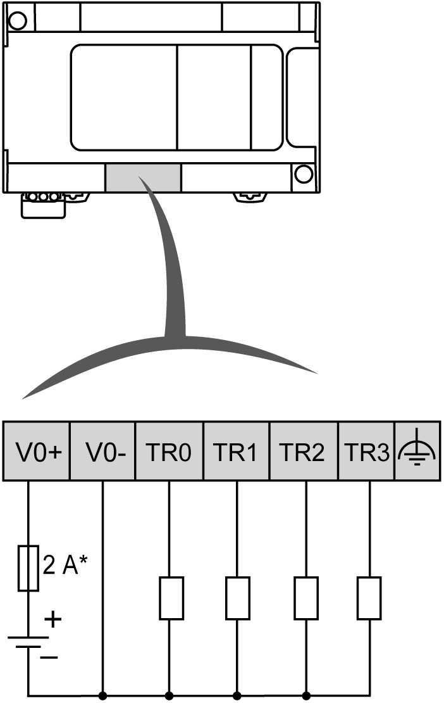
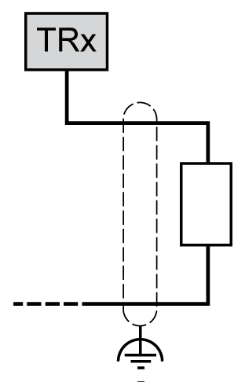
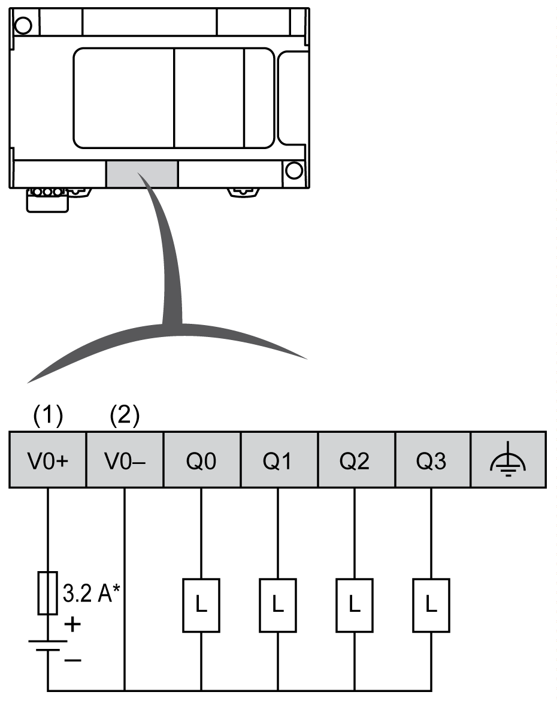
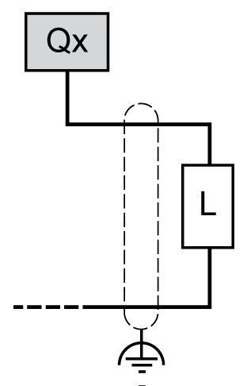
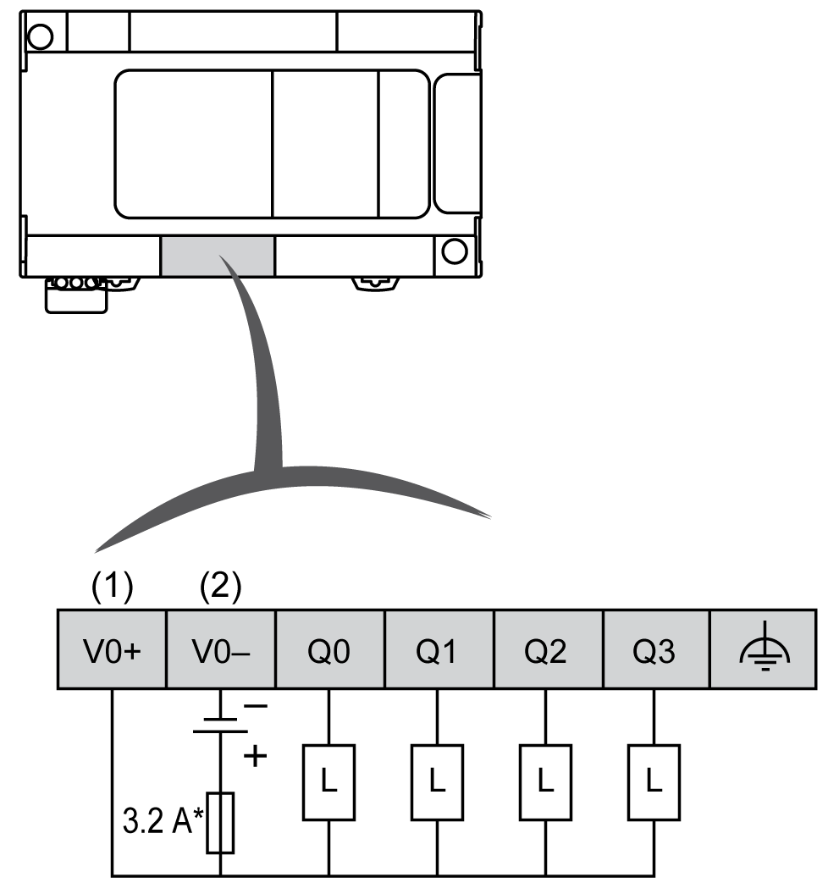

# Fast Transistor Outputs

## Overview

The Modicon M241 Logic Controller has digital outputs embedded:

| Reference | Total number of digital outputs | [Fast transistor outputs](D-SE-0032259.html#D-SE-0032259__D-SE-0032259.12) (1) | [Relay outputs](D-SE-0036599.html#D-SE-0036599__D-SE-0036599.5) | [Regular transistor outputs](D-SE-0032248.html#D-SE-0032248__D-SE-0032248.9) |
| --- | --- | --- | --- | --- |
| TM241C••24R | 10 | 4 | 6 | 0 |
| TM241C••24T  TM241C••24U | 10 | 4 | 0 | 6 |
| TM241C•40R | 16 | 4 | 12 | 0 |
| TM241C•40T  TM241C•40U | 16 | 4 | 0 | 12 |
| **(1)** Fast transistor outputs which can be used as 100 kHz PTO outputs | | | | |

For more information, refer to [Output Management](D-SE-0025722.html#D-SE-0025722).

| DANGER | |
| --- | --- |
|  | FIRE HAZARD  * Use only the correct wire sizes for the maximum current capacity of the I/O channels and power supplies. * For relay output (2 A) wiring, use conductors of at least 0.5 mm2 (AWG 20) with a temperature rating of at least 80 °C (176 °F). * For common conductors of relay output wiring (7 A), or relay output wiring greater than 2 A, use conductors of at least 1.0 mm2 (AWG 16) with a temperature rating of at least 80 °C (176 °F).  Failure to follow these instructions will result in death or serious injury. |

| WARNING | |
| --- | --- |
|  | UNINTENDED EQUIPMENT OPERATION  Do not exceed any of the rated values specified in the environmental and electrical characteristics tables.  Failure to follow these instructions can result in death, serious injury, or equipment damage. |

## Fast Transistor Outputs Status LEDs

The following figure shows the status LEDs for the TM241C••24• controller (the TM241C•40• controllers are similar with 40 LEDs):

| LED | Color | Status | Description |
| --- | --- | --- | --- |
| 0...9 | Green | On | The output channel is activated |
| Off | The output channel is deactivated |

## Fast Transistor Outputs Characteristics

The following table describes the characteristics of the M241 Logic Controller fast transistor outputs:

| Characteristic | | Value | | |
| --- | --- | --- | --- | --- |
| TM241C•••R | TM241C•••T | TM241C•••U |
| Number of fast transistor outputs | | 4 outputs (TR0...TR3) | 4 outputs (Q0...Q3) | |
| Number of channel groups | | 1 common line for TR0...TR3 | 1 common line for Q0...Q3 | |
| Output type | | Transistor | | |
| Logic type | | Source | Source | Sink |
| Rated output voltage | | 24 Vdc | | |
| Output voltage range | | 19.2...28.8 Vdc | | |
| Rated output current | | 0.1 A when configured for a fast function | | |
| 0.5 A when used as a regular output | | |
| Leakage current | Source | ≤ 0.3 mA | | |
| Sink | ≤ 2 mA | | |
| Total output current per group | | 2 A | | |
| Maximum power of filament lamp | | 2.4 W max | | |
| Derating | | No Derating | | |
| Turn on time | | Max. 2 µs | | |
| Turn off time | | Max. 2 µs | | |
| Protection against short circuit | | Yes | | |
| Short circuit output peak current | | 1.3 A max. | | |
| Automatic rearming after short circuit or overload | | Yes, 12 s | | |
| Protection against reverse polarity | | Yes | | |
| Clamping voltage | | Typically 39 Vdc +/- 1 Vdc | | |
| Maximum output frequency | PTO | 100 kHz | | |
| PWM | 20 kHz | | |
| PWM mode duty rate step | | 0.1% at 20...1 kHz | | |
| Duty rate range | | 1...99 % | | |
| Isolation | Between output and internal logic | 500 Vac | | |
| Between channel groups | 500 Vac | | |
| Connection type | | Removable screw terminal block | | |
| Connector insertion/removal durability | | Over 100 times | | |
| Cable | Type | Shielded, including 24 Vdc power supply | | |
| Length | Maximum 3 m (9.84 ft) | | |

## Removing Terminal Block

Refer to [Removing Terminal Block](D-SE-0025949.html#D-SE-0025949__D-SE-0025949.10).

## TM241C••24R / TM241C•40R Fast Transistor Outputs Wiring Diagrams

The following figure shows the connection of the fast transistor outputs:

**\*** 2 A fast-blow fuse

Fast output wiring for TR0... TR3:

| WARNING | |
| --- | --- |
|  | UNINTENDED EQUIPMENT OPERATION  Ensure that the physical wiring respects the connections indicated in the wiring diagram, and, in particular, that both V•+ and V•- are connected, and that only 24Vdc is connected to the V•+ terminal(s) and only 0Vdc is connected to the V•- terminal(s).  Failure to follow these instructions can result in death, serious injury, or equipment damage. |

## TM241C••••T Fast Transistor Outputs Wiring Diagrams

The following figure shows the connection of the fast transistor outputs:

**\*** Type T fuse

**(1)** The V0+, V1+, V2+ and V3+ terminals are **not** connected internally.

**(2)** The V0-, V1-, V2- and V3- terminals are **not** connected internally.

Fast output wiring for Q0... Q3:

| WARNING | |
| --- | --- |
|  | UNINTENDED EQUIPMENT OPERATION  Ensure that the physical wiring respects the connections indicated in the wiring diagram, and, in particular, that both V•+ and V•- are connected, and that only 24Vdc is connected to the V•+ terminal(s) and only 0Vdc is connected to the V•- terminal(s).  Failure to follow these instructions can result in death, serious injury, or equipment damage. |

## TM241C••••U Fast Transistor Outputs Wiring Diagrams

The following figure shows the connection of the fast transistor outputs:

**\*** Type T fuse

**(1)** The V0+, V1+, V2+ and V3+ terminals are **not** connected internally.

**(2)** The V0-, V1-, V2- and V3- terminals are **not** connected internally.

Fast output wiring for Q0... Q3:

| WARNING | |
| --- | --- |
|  | UNINTENDED EQUIPMENT OPERATION  Ensure that the physical wiring respects the connections indicated in the wiring diagram, and, in particular, that both V•+ and V•- are connected, and that only 24Vdc is connected to the V•+ terminal(s) and only 0Vdc is connected to the V•- terminal(s).  Failure to follow these instructions can result in death, serious injury, or equipment damage. |

EIO0000003083.08