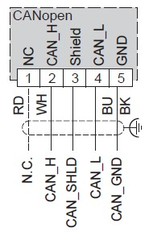

# CANopen Port

## CANopen Capabilities

The Modicon M241 Logic Controller CANopen master has the following features:

| Feature | Description |
| --- | --- |
| Maximum number of slaves on the bus | 63 CANopen slave devices |
| Maximum length of CANopen fieldbus cables | According to the CAN specification (see [Transmission Speed and Cable Length](#D-SE-0032568__D-SE-0032568.35)). |
| Maximum number of PDOs managed by the master | 252 TPDOs + 252 RPDOs |

For each additional CANopen slave:

* the application size increases by an average of 10 kbytes, which conceivably could result in exceeding memory limits.
* the configuration initialization time at the startup increases, which conceivably could result in watchdog timeout.

Although the software does not restrict you from doing so, do not exceed more than 63 CANopen slave modules (and/or 252 TPDOs and 252 RPDOs) in order to have a sufficient performance tolerance and avoid any performance degradation.

| WARNING | |
| --- | --- |
|  | UNINTENDED EQUIPMENT OPERATION  Do not connect more than 63 CANopen slave devices to the controller to avoid system overload watchdog condition.  Failure to follow these instructions can result in death, serious injury, or equipment damage. |

| NOTICE | |
| --- | --- |
|  | DEGRADATION OF PERFORMANCE  Do not exceed more than 252 TPDOs and 252 RPDOs for the Modicon M241 Logic Controller.  Failure to follow these instructions can result in equipment damage. |

## Removing Terminal Block

Refer to [Removing Terminal Block](D-SE-0025949.html#D-SE-0025949__D-SE-0025949.10).

## CAN Wiring Diagram

| Pin | Signal | Description | Marking | Color of Cable |
| --- | --- | --- | --- | --- |
| 1 | N.C. | No Connection | NC | RD: red |
| 2 | CAN\_H | CAN\_H bus line | CAN\_H | WH: white |
| 3 | CAN\_SHLD | Optional CAN shield | Shield | - |
| 4 | CAN\_L | CAN\_L bus line | CAN\_L | BU: blue |
| 5 | CAN\_GND | CAN Ground | GND | BK: black |

| WARNING | |
| --- | --- |
|  | UNINTENDED EQUIPMENT OPERATION  Do not connect wires to unused terminals and/or terminals indicated as “No Connection (N.C.)”.  Failure to follow these instructions can result in death, serious injury, or equipment damage. |

## Transmission Speed and Cable Length

Transmission speed is limited by the bus length and the type of cable used.

The following table describes the relationship between the maximum transmission speed and the bus length (on a single CAN segment without a repeater):

| Maximum transmission baud rate | Bus length |
| --- | --- |
| 1000 kbps | 20 m (65 ft) |
| 800 kbps | 40 m (131 ft) |
| 500 kbps | 100 m (328 ft) |
| 250 kbps | 250 m (820 ft) |
| 125 kbps | 500 m (1,640 ft) |
| 50 kbps | 1000 m (3280 ft) |
| 20 kbps | 2500 m (16,400 ft) |

NOTE: The CAN cable must be shielded.

EIO0000003083.08