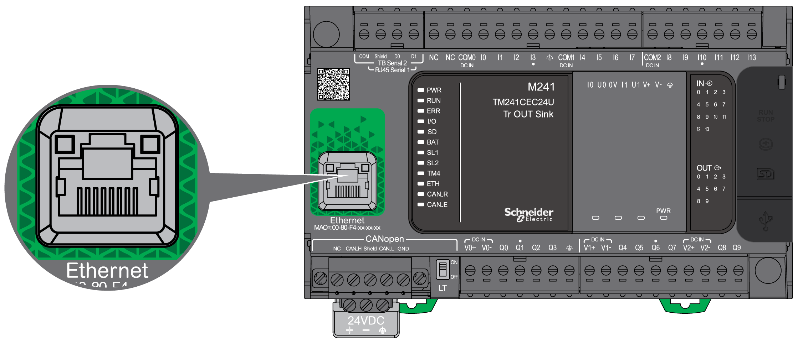
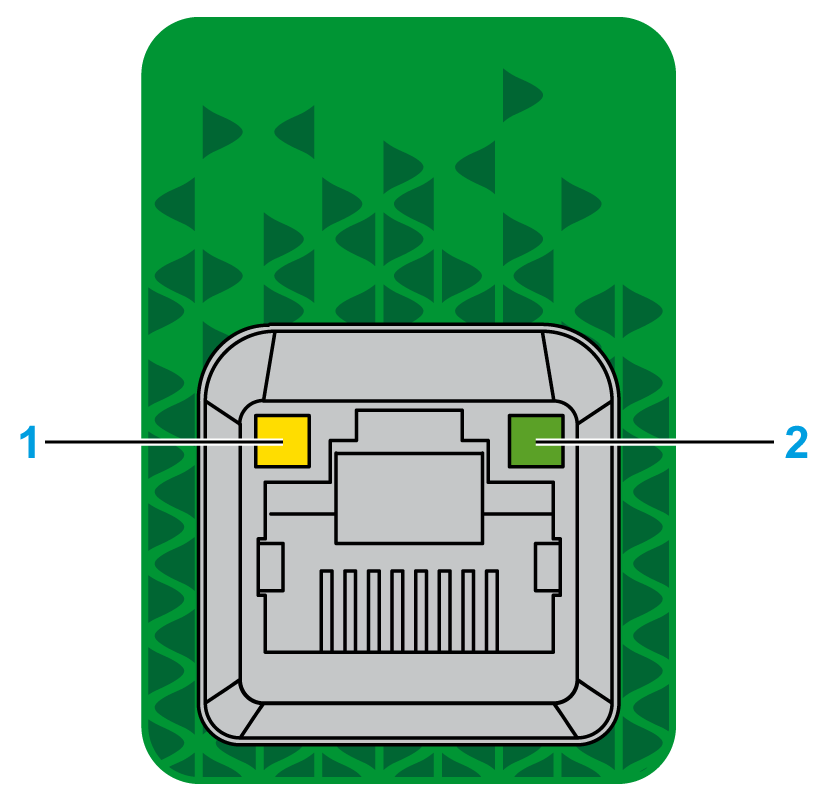

# Ethernet Port

## Overview

The TM241CE••• are equipped with an Ethernet communications port.

The following figure shows the location of the Ethernet port on the controller:

## Characteristics

The following table describes the Ethernet characteristics:

| Characteristic | Description |
| --- | --- |
| Function | Modbus TCP/IP |
| Connector type | RJ45 |
| Auto negotiation | From 10 Mbps half duplex to 100 Mbps full duplex |
| Cable type | Shielded |
| Automatic cross-over detection | Yes |

## Pin Assignment

The following figure shows the RJ45 Ethernet connector pin assignment:

The following table describes the RJ45 Ethernet connector pins:

| Pin N° | Signal |
| --- | --- |
| 1 | TD+ |
| 2 | TD- |
| 3 | RD+ |
| 4 | - |
| 5 | - |
| 6 | RD- |
| 7 | - |
| 8 | - |

NOTE: The controller supports the MDI/MDIX auto-crossover cable function. It is not necessary to use special Ethernet crossover cables to connect devices directly to this port (connections without an Ethernet hub or switch).

NOTE: Ethernet cable disconnection is detected every second. In case of disconnection of a short duration (< 1 second), the network status may not indicate the disconnection.

## Status LEDs

The following figure shows the RJ45 connector status LEDs:

The following table describes the Ethernet status LEDs:

| Label | Description | LED | | |
| --- | --- | --- | --- | --- |
| Color | Status | Description |
| 1 | Ethernet link/speed | Green/Yellow | Off | No link |
| Solid yellow | Link at 10 Mbps |
| Solid green | Link at 100 Mbps |
| 2 | Ethernet activity | Green | Off | No activity and no link |
| On | The link is detected, but there is no activity |
| Flashing | Transmitting or receiving data |

EIO0000003083.08