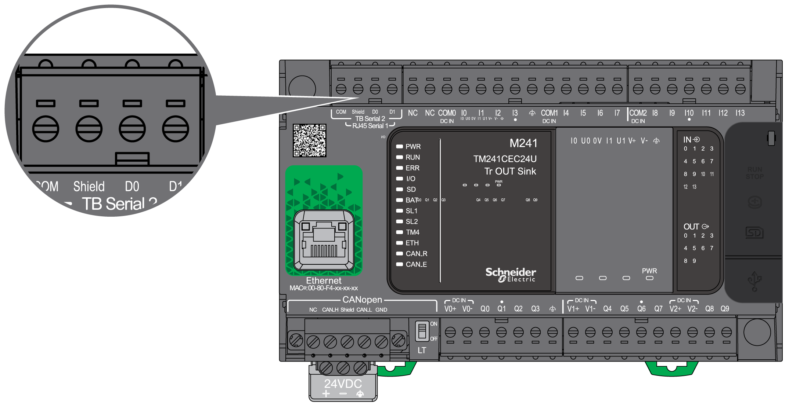
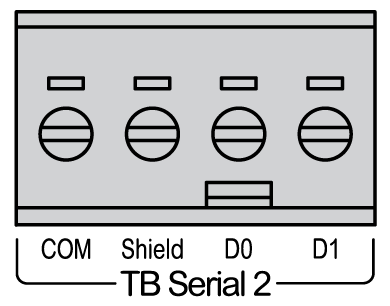
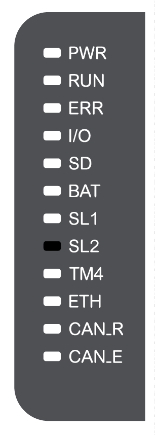

# Serial Line 2

## Overview

The serial line 2 is used to communicate with devices supporting the Modbus protocol as either a master or slave and ASCII Protocol (printer, modem...) and supports RS485 only.

## Characteristics

| Characteristic | | Description |
| --- | --- | --- |
| Function | | RS485 |
| Connector type | | Removable screw terminal block |
| Isolation | | Non-isolated |
| Maximum baud rate | | 1200 up to 115 200 bps |
| Cable | Type | Shielded |
| Maximum length | 15 m (49 ft) for RS485 |
| Polarization | | Software configuration is used to connect when the node is configured as a Master.  560 Ω resistors are optional. |
| 5 Vdc power supply for RS485 | | No |

## Pin Assignment

The following figure shows the pins of the removable terminal block:

| Pin | RS485 |
| --- | --- |
| **COM** | 0 V com. |
| **Shield** | Shield |
| **D0** | D0 (B-) |
| **D1** | D1 (A+) |

Refer to [Removing Terminal Block](D-SE-0025949.html#D-SE-0025949__D-SE-0025949.10).

## Status LED

The following graphic show the status LED:

The table below describes the serial line 2 status LED:

| Label | Description | LED | | |
| --- | --- | --- | --- | --- |
| Color | Status | Description |
| SL2 | Serial Line 2 | Green | Flashing | Indicates the activity of the serial line 2. |
| Off | Indicates no serial communication. |

EIO0000003083.08