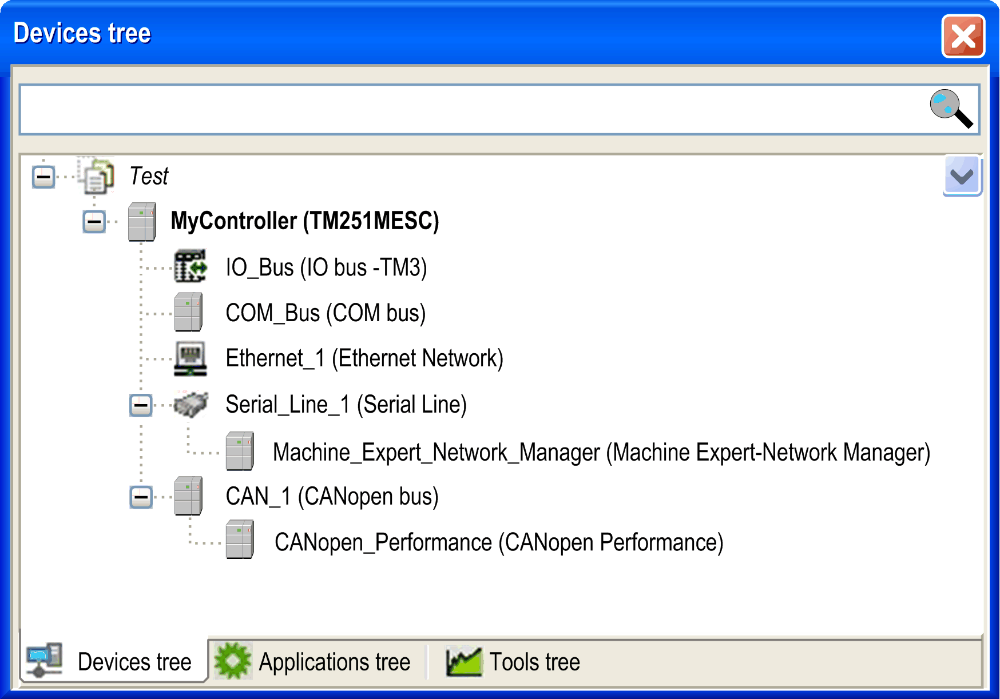

# How to Configure the Controller

## Introduction

First, create a new project or open an existing project in the EcoStruxure Machine Expert software.

Refer to the EcoStruxure Machine Expert Programming Guide for information on how to:

* add a controller to your project
* add expansion modules to your controller
* replace an existing controller
* convert a controller to a different but compatible device

## Devices Tree

The Devices tree presents a structured view of the hardware configuration. When you add a controller to your project, a number of nodes are added to the Devices tree, depending on the functions the controller provides.

| Item | Use to Configure... |
| --- | --- |
| IO\_Bus | Expansion modules connected to the logic controller |
| COM\_Bus | Communications bus of the logic controller |
| Ethernet\_x | Embedded Ethernet, serial line, or CANopen communications interfaces  NOTE: Ethernet and CANopen are only available on some references. |
| Serial\_Line\_x |
| CAN\_x |

## Applications Tree

The Applications tree allows you to manage project-specific applications as well as global applications, POUs, and tasks.

## Tools Tree

The Tools tree allows you to configure the HMI part of your project and to manage libraries.

EIO0000003089.10