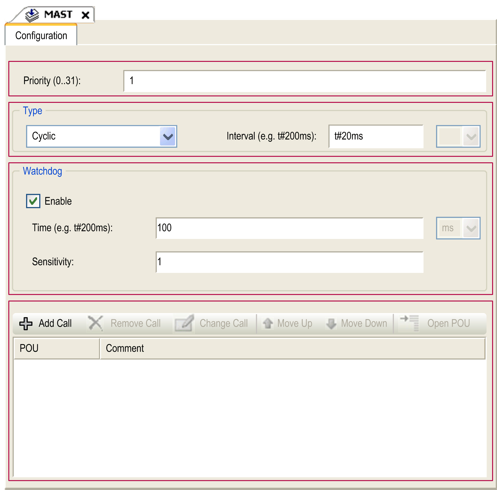

# Task Configuration Screen

## Screen Description

This screen allows you to configure the tasks. Double-click the task that you want to configure in the Applications tree to access this screen.

Each configuration task has its own parameters that are independent of the other tasks.

The Configuration window is composed of 4 parts:

The table describes the fields of the Configuration screen:

| Field Name | Definition |
| --- | --- |
| Priority | Configure the priority of each task with a number from 0 to 31 (0 is the highest priority, 31 is the lowest).  Only one task at a time can be running. The priority determines when the task runs: a higher priority task pre-empts a lower priority task.  NOTE: Do not assign tasks with the same priority. If there are yet other tasks that attempt to pre-empt tasks with the same priority, the result could be indeterminate and unpredictable. For important information, refer to [Task Priorities](D-SE-0008826.html#D-SE-0008826). |
| Type | These task types are available:   * [Cyclic](D-SE-0008842.html#D-SE-0008842__D-SE-0008842.3) * [Event](D-SE-0008842.html#D-SE-0008842__D-SE-0008842.16) * [External](D-SE-0008842.html#D-SE-0008842__D-SE-0008842.15) * [Freewheeling](D-SE-0008842.html#D-SE-0008842__D-SE-0008842.13) |
| Watchdog | To configure the [watchdog](D-RU-0004615.html#D-RU-0004615__D-RU-0004615.3), define these 2 parameters:   * Time: enter the timeout before watchdog execution. * Sensitivity: defines the number of expirations of the watchdog timer before the controller stops program execution and enters a HALT state. |
| POUs | The list of [POUs](../../../../../api/crossBook?lang=en-US&virtualBookName=SoMProg&topicID=D_SE_0083404) (Programming Organization Units) controlled by the task is defined in the task configuration window:   * To add a POU linked to the task, use the command Add Call and select the POU in the Input Assistant editor. * To remove a POU from the list, use the command Remove Call. * To replace the selected POU of the list by another one, use the command Change Call. * POUs are executed in the order shown in the list. To move the POUs in the list, select a POU and use the command Move Up or Move Down.   NOTE: You can create as many POUs as you want. An application with several small POUs, as opposed to one large POU, can improve the refresh time of the variables in online mode. |

EIO0000003089.10